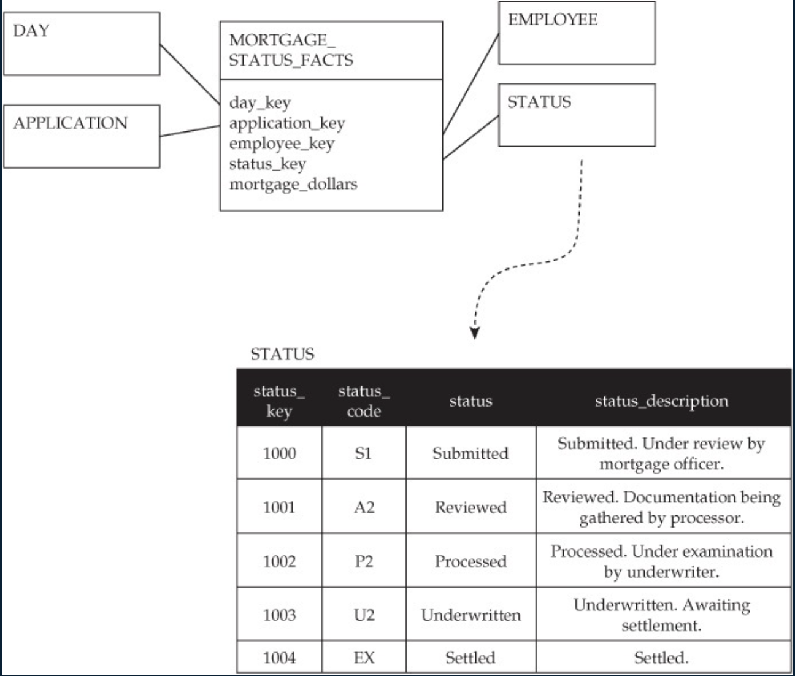
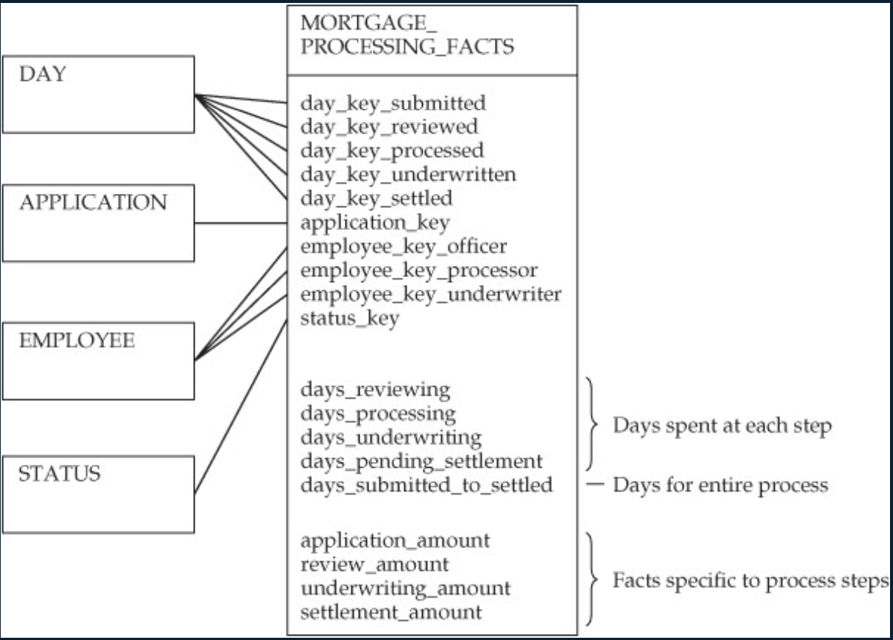
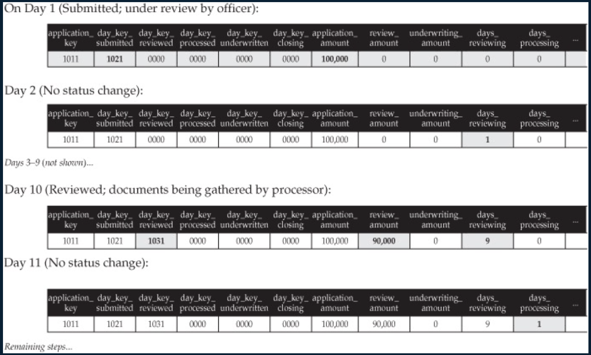

alias:: 累计快照事实表

- Definition
	- Elapsed (运行时间) time between events, 周期快照事实表记录的确定的周期数据, 而累计快照事实表记录的不确定的周期数据,
	- [[Transaction fact table]] can be used to **track status**
		- one row for each status change or milestone achieved
	- However, if we are interested in the time spent at each step, [[Transaction fact table]] is not sufficient
	- example
	  collapsed:: true
		- what is the average number of days spent reviewing the application? 
		  Does this vary by loan officer?
		- 
- Properties
	- One row for each instance of an entity (for example, mortgage application)
	- 可以对它进行**更新**来补充随后知道的日期信息.
	- The accumulating snapshot ==includes multiple day_keys==, each representing the achievement of an important milestone.
	- Facts record the elapsed time associated with each stage. Additional facts may be present that track significant values at the time of each milestone.
- Example
	- 快递动态跟踪信息表记录的形式就是累计快照事实表. 主要记录事务在主要里程碑节点的状态变化
	- 
	- 
-