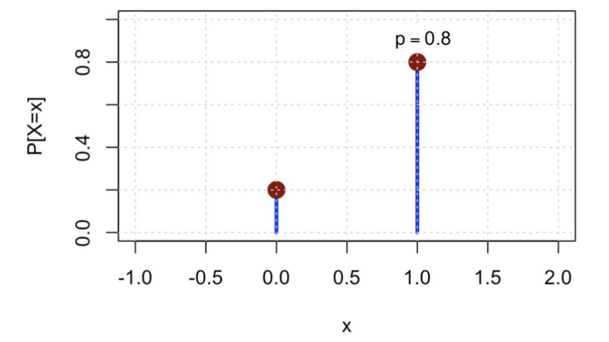

alias:: Bernoulli Random Variable, 伯努利随机变量

- Definition
	- Bernoulli: n. of successes in **1** trial
	- $X$: number of successes in 1 trial
	- $$X= \begin{cases}1 & \text { success } \\ 0 & \text { failure }\end{cases}$$
	  $$X= \begin{cases}1 &  p \\ 0 & 1-p\end{cases}$$
	- id:: 61f23283-1473-492c-b35d-6952253cb194
	  $$
	  X \sim B E R N(p) \quad\left\{\begin{array}{l}
	  E[X]=p \\
	  \operatorname{Var}[X]=p(1-p)
	  \end{array}\right.
	  $$
	- [[probability distribution function]] for bernoulli random variable
		- $$
		  P[X=x]=p^{x}(1-p)^{1-x} \quad x=0,1
		  $$
		- 
-