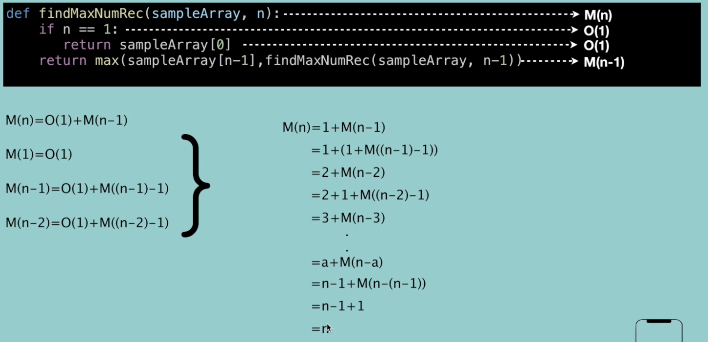

- Definition
  collapsed:: true
	- It is a complexity that is going to be less or equal to the worst case, 不可能超过的时间, 也就是最坏的时间
	- |Complexity|Name|sample|
	  |O(1)|Constant|Accessing a specific element in arras|
	  |O(N)|Linear|Loop through array elements|
	  |O(logN)|Logarithmic|Find an element in sorted array|
	  |O(N^2)|Quadratic|Looking at every index in the array twice|
	  |O(2^N)|Exponential|Double recursion in Fibonacci|
		- For O(logN)
		  collapsed:: true
			- also, binary search is O(logN)
			- ```python
			  array = [1,2,3,4,5]
			  for index in range(0, len(array), 3):
			    print(array[index])
			  # it is logarithmic time since it is visiting only some elements
			  ```
		- For O(N^2)
		  collapsed:: true
			- ```python
			  array = [1,2,3,4,5]
			  for x in array:
			    for y in array:
			      print(x, y)
			  ```
		- For O(2^N)
		  collapsed:: true
			- ```python
			  def fibonacci(n):
			    if n <= 1:
			      return n
			    return fibonacci(n-1) + fibonacci(n-2)
			  ```
- Big O complexity chart
  collapsed:: true
	- 
- Add vs Multiply
	- O(A+B) (do this, then when you are all done, do that) => add
	  collapsed:: true
		- ```python
		  for a in arrayA:
		    print(a)
		  for b in arrayB:
		    print(b)
		  ```
	- O(A*B) (do this for each time you do that) => multiply
	  collapsed:: true
		- ```python
		  for a in arrayA:
		    for b in arrayB:
		      print(a, b)
		  ```
- 5 rules to measure codes using big o
	- |Description|Complexity|
	  |--|--|
	  |Any ==assignment== statements and ==if== statements that are executed once regardless of the size of the problem|O(1)|
	  |A simple ==for== loop from 0 to n (with no internal loops|O(n)|
	  |A ==nested loop== of the sample type takes quadratic time complexity|O(n^2)|
	  |A loop, in which the controlling parameter is ==divided by two== at each step|O(logN)|
	  |When dealing with multiple statements, just add then up, drop the constants and non-dominants||
		- example for O(N)
		  collapsed:: true
			- 
		- example for recursive
		  collapsed:: true
			- assume recursive is M(N)
			- {:height 328, :width 661}
			- O(2^n)
			  
- Examples
	- for loop
	  collapsed:: true
		- ```python
		  def foo(array):
		    sum = 0
		    product = 1
		    for i in array:
		      sum += i
		    for i in array:
		      product *= i
		    print("sum = " + str(sum) + ", Product= " + str(product))
		  ```
			- 
			  O(N)
	- nested for loop 1
	  collapsed:: true
		- collapsed:: true
		  ```python
		  def printPairs(array):
		      for i in array:
		          for j in array:
		              print(str(i)+","+str(j))
		  ```
			- => O(n^2)
	- nested for loop 2
	  collapsed:: true
		- collapsed:: true
		  ```python
		  def printUnorderedPairs(array):
		      for i in range(0,len(array)):
		          for j in range(i+1,len(array)):
		              print(array[i] + "," + array[j])
		  ```
			- way 1: counting the iterations
				- 内循环:
				  1st run -> n-1 次
				  2nd run -> n-2 次
				  ...
				  (n-1) + (n-2) + ... + 2 + 1 = n(n-1)/2 
				  => n^2/2 + n
				  => O(n^2) (drop non-dominant)
			- way 2: average work
				- Outer loop -> N times
				  inner loop?
				  assume n = 10
				  1st -> 10
				  2st -> 9 
				  ...
				  1
				  average of them is 5 which is n/2 times
				  so n*n/2 => O(n^2)
	- nested for loop 3
	  collapsed:: true
		- collapsed:: true
		  ```python
		  def printUnorderedPairs(arrayA, arrayB):
		      for i in range(len(arrayA)):
		          for j in range(len(arrayB)):
		              if arrayA[i] < arrayB[j]:
		                  print(str(arrayA[i]) + "," + str(arrayB[j]))
		  
		  arrayA = [1,2,3,4,5]
		  arrayB = [2,6,7,8]
		  ```
			- b = len(arrayB), a = len(arrayA)
			  => O(ab)
			- 为什么不是O(n^2), 因为inner loop and outer loop 是两个不同的array!
	- nested for loop 4
	  collapsed:: true
		- collapsed:: true
		  ```python
		  def printUnorderedPairs(arrayA, arrayB):
		      for i in range(len(arrayA)):
		          for j in range(len(arrayB)):
		              for k in range(0,100000): # => O(1)
		                  print(str(arrayA[i]) + "," + str(arrayB[j]))
		  ```
			- b = len(arrayB), a = len(arrayA)
			  => O(ab)
			- 100000 units of work still constant
	-