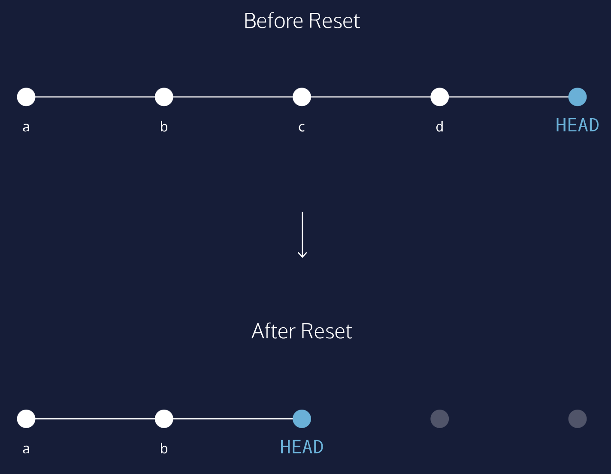
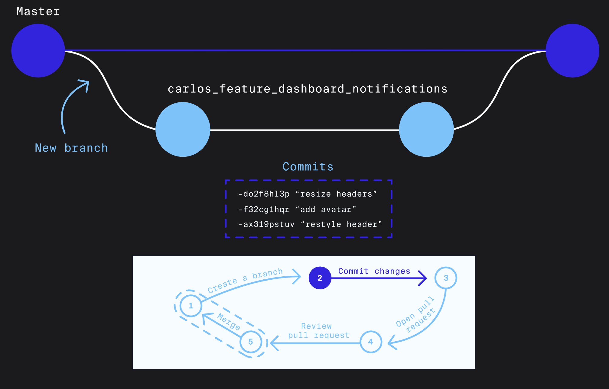
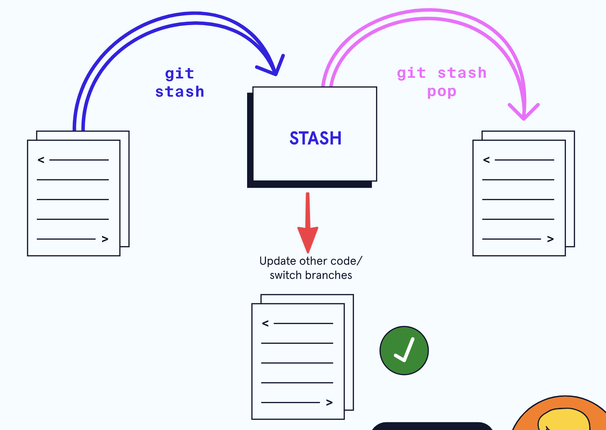
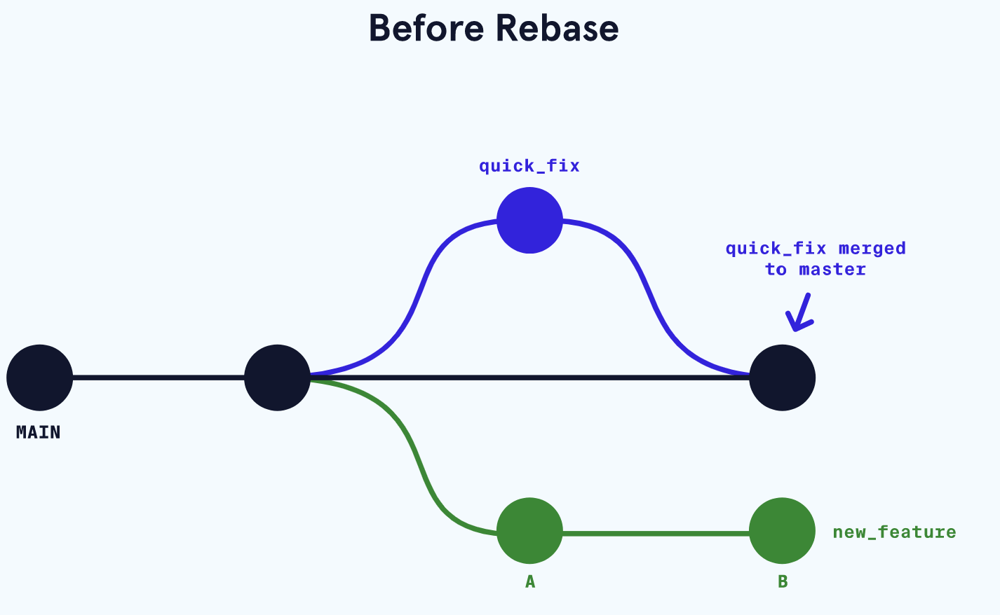
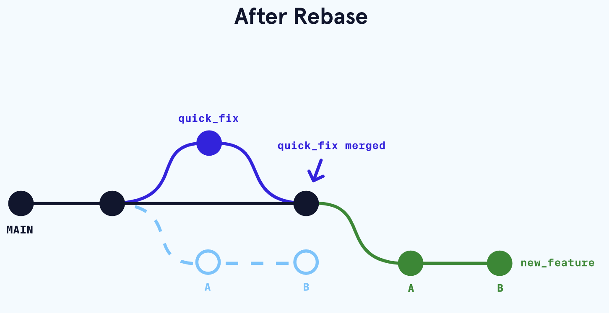

- Git workflow
  collapsed:: true
	- Fetch and merge changes from the remote
	  collapsed:: true
		- ```shell
		  git fetch
		  git merge origin/master
		  ```
	- Create a branch to work on a new project feature
	- Develop the feature on your branch and commit your work
	- Fetch and merge from the remote again (in case new commits were made while you were working)
	- Push your branch up to the remote for review
	  collapsed:: true
		- ```shell
		  git push origin <branch_name>
		  ```
- Basic
	- Reset
	  collapsed:: true
		- 回滚工作区文件 `git checkout`
		  collapsed:: true
			- 这条命令会重写工作区!!
			- Rolling Back to Last Commit
				- restore the file in the working directory to look exactly as it did when you last made a commit
				- ```shell
				  # restore the file
				  git checkout HEAD <filename>
				  # or shortcut:
				  git checkout -- <filename>
				  ```
		- ==Unstage== file
		  collapsed:: true
			- ```shell
			  git reset HEAD filename
			  ```
		- Git Reset Using [[SHA]], 回滚commit
		  collapsed:: true
			- HEAD 是 commit you currently on
			- ```shell
			  git reset commit_SHA
			  ```
			- can be used to set `HEAD` to the `comit_SHA` commit, argument is the first ==seven== digits of a previous commit’s [[SHA]]
			- diagram explanation
			  collapsed:: true
				- 
	- Merge
	  collapsed:: true
		- merge branch
		  collapsed:: true
			- ```shell
			  git merge branch_name
			  ```
		- merge fetched changes
		  collapsed:: true
			- merge fetched changes, stored in origin/branch-name to the current branch-name branch
			- ```shell
			  git merge origin/branch-name
			  ```
	- Branch
	  collapsed:: true
		- what is branch
		  collapsed:: true
			- 
		- create new branch
		  collapsed:: true
			- ```shell
			  git branch branch-name
			  ```
		- 切换分支, 切换到指定的快照
		  collapsed:: true
			- ```shell
			  git checkout branchName
			  # 切换的同时创建分支
			  git checkout -b newBranch
			  git checkout commitID
			  ```
		- list all branch
		  collapsed:: true
			- ```shell
			  git branch -a
			  ```
		- `git stash` 保存当前工作进度, 并且switch branch
		  collapsed:: true
			- example
			  collapsed:: true
				- 
			- 当workin on a file的时候, 想修改一下之前的commit
			- ```shell
			  git stash
			  ```
			- 然后switch branch to do wok elsewhere, then retrieve the code using
			- ```shell
			  git stash pop
			  ```
		- delete branch
		  collapsed:: true
			- ```shell
			  git branch -d branch_name
			  ```
	- Commit
	  collapsed:: true
		- 修改commit
		  collapsed:: true
			- 首先改动, 然后 `git add` 然后 `git commit --amend` to update previous commit
			- ```shell
			  git commit --amend --no-edit # keep the previous command message
			  ```
	- Remotes
		- list the remote repo
			- Git automatically names this remote origin, because it refers to the remote repository of origin. However, it is possible to safely change its name
			- ```shell
			  git remote -v
			  ```
	- Fetch
	  collapsed:: true
		- Fetching remote origin changes (download, not merge)
			- the git fetch command downloads objects from the origin remote repository. The changes, ==however, are not merged into the current branch-name branch==. Instead, they are stored in the origin/branch-name branch, waiting to be merged
			- ```shell
			  git fetch
			  ```
	- Push
	  collapsed:: true
		- pushing branch changes to remote
		  collapsed:: true
			- pushes the branch, and all committed changes, to the remote
			- ```shell
			  git push origin branch-name
			  ```
	- Cloning
	  collapsed:: true
		- cloning a remote repo
		  collapsed:: true
			- ```shell
			  git clone remote_location clone_name
			  ```
- Advance
	- Rebase
	  collapsed:: true
		- What is rebase?
		  collapsed:: true
			- 别人已经在main merge了其他的, 就是main更新了, 但是我分branch的时候main还没有那个更新, 所以用rebase更新我之前分branch的时候main没有的内容
			- 
			- 
- Other
	- linux 命令行下载github release 资源
	  collapsed:: true
		- ```shell
		  wget --no-check-certificate --content-disposition <address>
		  ```
	- Show the `HEAD` (first) commit
	  collapsed:: true
		- ```shell
		  git show HEAD
		  ```
	- `git log` 其他用法
	  collapsed:: true
		- ```shell
		  git log --oneline #shows th list o fcommits in one line format
		  git log -S "keyword" #displays a list of commits that contain the keyword in the message
		  git log --oneline --graph # visual显示
		  ```
	- 用 `aliases` 来缩写command
	  collapsed:: true
		- ```shell
		  git config --global alias.co "checkout"
		  git config --global alias.br "branch"
		  git config --global alias.glop "log --pretty=format:"%h %s" --graph"
		  ```