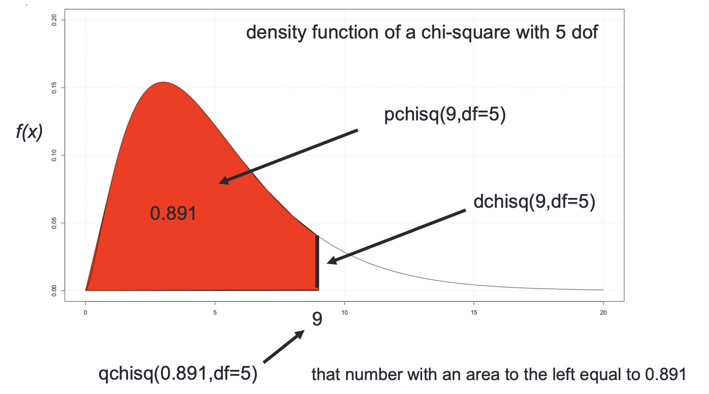

- **Rows**
	- **数含有na的row/col有多少行**
		- ```r
		  sum(apply(infants, 1, anyNA))
		  ```
- **Columns**
- **String**
	- **转换所有的chr type to factor**
	  collapsed:: true
		- ```r
		  factor_variable_names = colnames(VIT[,sapply(VIT, is.character)])
		  for (x in factor_variable_names) {
		    VIT[,x] = as.factor(VIT[,x])
		  }
		  # 必须用[,x]选择column
		  
		  # 或者
		  factor_names = c("country", "storeID") 
		  for (x in factor_names) {
		    store[,x] = as.factor(store[,x])
		    rm(x) 
		  }
		  ```
- **Others**
	- **Create formula for linear regression**
	  collapsed:: true
		- ```r
		  predictor = c("age","ed")
		  outcome = "bwt"
		  f = as.formula(paste(outcome, paste(predictor, collapse = "+"), sep = "~"))
		  ```
- **Probabilities**
  collapsed:: true
	- **R function for computing probabilities**
		- each function has a one-letter prefix followed by the root name of the function
		- ```r
		  # R function for the nomal random variable with mean a and standard deviation b are
		  dnorm(x,mean = a ,sd = b)# density f (x)
		  pnorm(x,mean = a ,sd = b) # distribution F (x).
		  qnorm(p,mean = a ,sd = b)# p -quantile
		  rnorm(n,mean = a ,sd = b)# get random observations
		  
		  # and for the binomial randomv variable are
		  # size: number of trials
		  # prob: probability of X
		  dbinom(x,size ,prob) #mass f(x)
		  pbinom(q,size ,prob) #distribution F (x).
		  qbinom(p,size ,prob) #p-quantile
		  rbinom(n,size ,prob) #get random observations
		  ```
			- |**Distribution**|**Root**|
			  |||
			  |--|--|
			  |Binomial|binom|
			  |Normal|norm|
			  |$F$|F|
			  |$t$|t|
			  |Poisson|pois|
			  |Chi-square|chisq|
			- |**Prefix**|**Continuous**|**Discrete**|
			  |r|random|random|
			  |d|density|probability (pdf)|
			  |p|probability (cdf)|probability (cdf)|
			  |q|quantile|quantile|
			- |**Variable**|**R label**|Parameter(s) name|
			  |Binomial|binom|size, prob|
			  |Poisson|pois|lambda|
			  |Uniform|uniform|lower limit, upper limit|
			  |Exponential|exp|lambda/rate|
			  |Normal|norm|mean, sd|
			  |Lognormal|lnorm|meanlog, sdlog|
			  |t|t|df|
			  |Chi-squared|chisq|df|
			- {:height 288, :width 523}