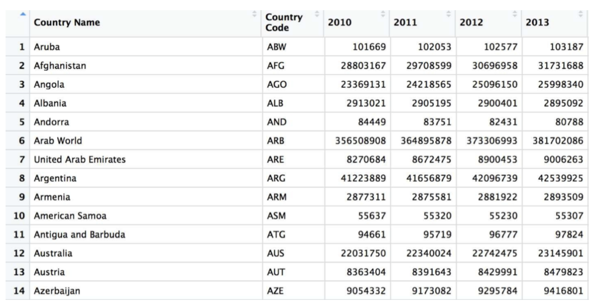
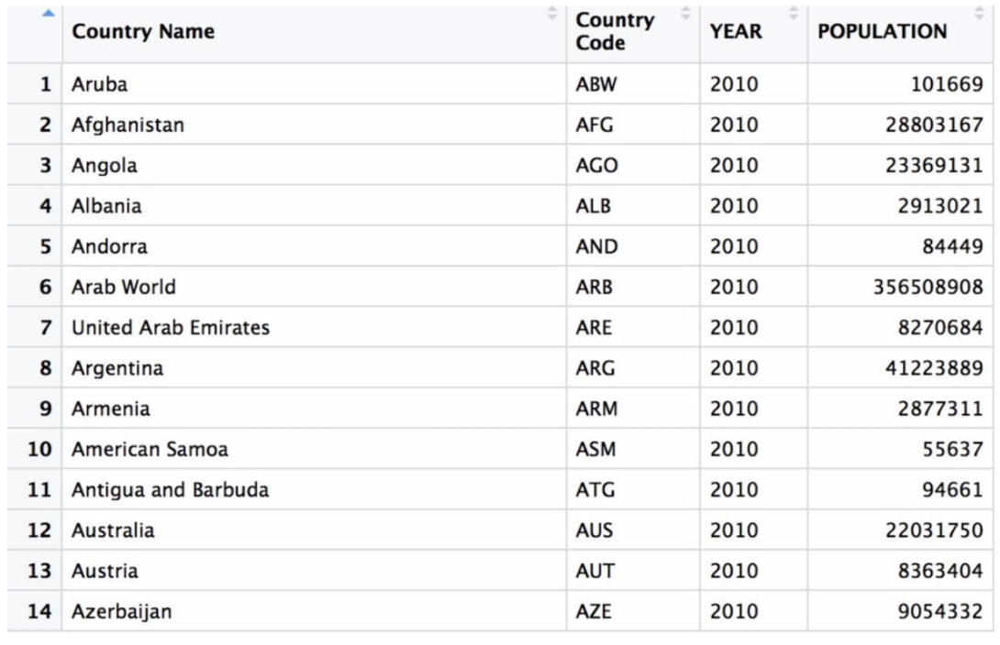

title:: CheatSheet/dplyr

- {{renderer :tocgen}}
- Tutorials
  collapsed:: true
	- [5 Data transformation | dplyr](https://r4ds.had.co.nz/transform.html)
	- [Introduction to dplyr](https://cran.r-project.org/web/packages/dplyr/vignettes/dplyr.html)
- Basic
	- Rows
	  collapsed:: true
		- `filter()` chooses rows based on column values
			- ```r
			  # hp列大于等于110, 小于等于150的行, 且gear列等于4
			  filter(df,between(df$hp,110,150)&(df["gear"]==4))
			  # 选择df中, hp列大于disp列的行
			  filter(df,df["hp"]>df["disp"])
			  
			  df2 = filter(d1, SEX == "male" & GPA > 3.0)
			  df2 = filter(d1, GPA > 3.5 | GPA <= 3.0)
			  
			  categs = c(“single”,”married”)
			  df2 = filter(df1,STATUS %in% categs)
			  ```
		- `slice()` chooses rows based on location
		  collapsed:: true
			- ```r
			  starwars %>% slice(5:10)
			  ```
		- `slice_min()`, `slice_max()` select rows with highest or lowest values of a variable
		  collapsed:: true
			- ```r
			  starwars %>%
			    filter(!is.na(height)) %>%
			    slice_max(height, n = 3)
			  #> # A tibble: 3 × 14
			  #>   name      height  mass hair_color skin_color eye_color birth_year sex   gender
			  #>   <chr>      <int> <dbl> <chr>      <chr>      <chr>          <dbl> <chr> <chr> 
			  #> 1 Yarael P…    264    NA none       white      yellow            NA male  mascu…
			  #> 2 Tarfful      234   136 brown      brown      blue              NA male  mascu…
			  #> 3 Lama Su      229    88 none       grey       black             NA male  mascu…
			  #> # … with 5 more variables: homeworld <chr>, species <chr>, films <list>,
			  #> #   vehicles <list>, starships <list>
			  ```
		- `arrange()` changes the order of the rows
		  collapsed:: true
			- ```r
			  starwars %>% arrange(desc(height))
			  df2 = arrange(df1, column names)
			  ```
	- Columns
	  collapsed:: true
		- `select()` changes whether or not a column is included
			- ```r
			  df2 = select(df1, column_name)
			  df2 = select(df1, new_name = column_name)
			  df2 = select(df1, helper_functions)
			  # helper functions
			  starts_with("string")
			  ends_with("string")
			  contains("string")
			  Mathces("string")
			  everything()
			  ```
			- ```r
			  starwars %>%
			    mutate(height_m = height / 100) %>%
			    select(height_m, height, everything())
			  #> # A tibble: 87 × 15
			  #>   height_m height name     mass hair_color skin_color eye_color birth_year sex  
			  #>      <dbl>  <int> <chr>   <dbl> <chr>      <chr>      <chr>          <dbl> <chr>
			  #> 1     1.72    172 Luke S…    77 blond      fair       blue            19   male 
			  #> 2     1.67    167 C-3PO      75 <NA>       gold       yellow         112   none 
			  #> 3     0.96     96 R2-D2      32 <NA>       white, bl… red             33   none 
			  #> 4     2.02    202 Darth …   136 none       white      yellow          41.9 male 
			  #> # … with 83 more rows, and 6 more variables: gender <chr>, homeworld <chr>,
			  #> #   species <chr>, films <list>, vehicles <list>, starships <list>
			  ```
			- ```r
			  select(df, 1:5)
			  select(df, c(1,2,3,4,5))
			  select(df,"mpg":"wt")
			  select(df,starts_with("d")|ends_with("p")) #d开头或者p结尾的列
			  select(df,starts_with("d")&contains("s"))
			  ```
			- `:` 该符号表示用于选择一系列的变量
			- `!` 表示取反操作的，类似于在df中不选择某列，比如df[,-1],表示不选择第一列
			- `&`表示逻辑运算符“与”, 表示“且”的意思. A&B，表示满足条件A，且满足条件B
			- `|`表示逻辑运算符“或”, 表示“或”的意思. A|B，表示满足条件A或者满足条件B就可以了, 通常具有短路操作。
			- `c()` 就是表示列的组合, 其实就是向量, 元素可为数字或者字符串
		- `rename()` changes the name of the column
		- `mutate` changes the values of columns and creates new columns
			- ```r
			  # wt = NULL 将值设置为NULL, 删除列
			  df %>% 
			  	select(cyl, gear, wt) %>%
			  	mutate(cyl2 = cyl*2, gear4 = gear*4, wt=NULL) %>%
			  	head()
			  ```
		- `relocate()` changes the order of the columns
		  collapsed:: true
			- ```r
			  starwars %>% relocate(sex:homeworld, .before = height)
			  #> # A tibble: 87 × 14
			  #>   name       sex   gender homeworld height  mass hair_color skin_color eye_color
			  #>   <chr>      <chr> <chr>  <chr>      <int> <dbl> <chr>      <chr>      <chr>    
			  #> 1 Luke Skyw… male  mascu… Tatooine     172    77 blond      fair       blue     
			  #> 2 C-3PO      none  mascu… Tatooine     167    75 <NA>       gold       yellow   
			  #> 3 R2-D2      none  mascu… Naboo         96    32 <NA>       white, bl… red      
			  #> 4 Darth Vad… male  mascu… Tatooine     202   136 none       white      yellow   
			  #> # … with 83 more rows, and 5 more variables: birth_year <dbl>, species <chr>,
			  #> #   films <list>, vehicles <list>, starships <list>
			  ```
		- `last_col()` select the last col
		- `starts_with()` 以什么开头的列
		- `ends_with()` 以什么结尾的列
		- `contains()` 包含什么的列
	- Groups of rows
	  collapsed:: true
		- `summaries()` collapses a group into a single row
			- ```r
			  starwars %>% summarise(height = mean(height, na.rm = TRUE))
			  #> # A tibble: 1 × 1
			  #>   height
			  #>    <dbl>
			  #> 1   174.
			  
			  # average numerical column by factor column
			  df2 = group_by(df1, factor column)
			  summarize(df2, numerical column)
			  
			  # count rows by categories, summary statistics by categories
			  df2 = group_by(df1, factor column)
			  summarize(df2, N = n() )
			  ```
		- `summaries()` 对数据框的使用
		  collapsed:: true
			- ```r
			  summarise(df,
			           n=n(),
			           sumdisp=sum(disp),
			           maxdisp=max(disp),
			           quantile=quantile(disp)[1])
			  # n		sumdisp		maxdisp		quantile
			  # 32		7000		400		71.1
			  ```
		- `group by`with `summarise`
			- ```r
			  province‹-c("湖南", "江苏","江苏","湖南")
			  city<-c("衡阳","镇江","常州","长沙")
			  grade<-c("A","B","B","A")
			  score<-c(10,5,8,9)
			  df1<-data.frame (province, city, grade, score)
			  
			  df1 %>% group_by(province) -> df2
			  # 此时print df2还是原来的未分组情况,但是其实已经分好组
			  ```
			- ```r
			  num_cs = function(x) {
			    return(lengthx[which(x=='长沙')]))
			  }
			  summarise(df,
			           n=n(),
			           sumdisp=sum(disp),
			           maxdisp=max(disp),
			           quantile=quantile(disp)[1],
			           num_cs=num_cs(city))
			  ```
	- Pipe
	  collapsed:: true
		- all of the `dplyr` functions take a dataframe or tibble as the first argument
		- `x %>% f(y)` turns into `f(x,y)`
		- `.` 是占位符, 将上一个结果放入下一个管道中的任意位置
			- ```r
			  df%>%select(mpg,wt)->df1 # work
			  df%>%select(mpg,wt,.) # does not work
			  ```
	- Combining functions with `%>%`
	  collapsed:: true
		- ```r
		  summarise(
		    select(
		      group_by(starwars, species, sex),
		      height, mass
		    ),
		    height = mean(height, na.rm = TRUE),
		    mass = mean(mass, na.rm = TRUE)
		  )
		  # or
		  starwars %>%
		    group_by(species, sex) %>%
		    select(height, mass) %>%
		    summarise(
		      height = mean(height, na.rm = TRUE),
		      mass = mean(mass, na.rm = TRUE)
		    )
		  #> Adding missing grouping variables: `species`, `sex`
		  #> `summarise()` has grouped output by 'species'. You can override using the
		  #> `.groups` argument.
		  #> # A tibble: 41 × 4
		  #> # Groups:   species [38]
		  #>   species  sex   height  mass
		  #>   <chr>    <chr>  <dbl> <dbl>
		  #> 1 Aleena   male      79    15
		  #> 2 Besalisk male     198   102
		  #> 3 Cerean   male     198    82
		  #> 4 Chagrian male     196   NaN
		  #> # … with 37 more rows
		  ```
	- `case_when` 针对vector, 对符合条件的做操作
	  collapsed:: true
		- ```r
		  y = -1:10
		  case_when(TRUE~'0') # ~ 赋值操作
		  case_when(TRUE~as.character(y))
		  
		  y = -1:5
		  z = -6:10
		  data.frame(y,z) = df3
		  mutate(df3, new_col = case_when(
		  y>4|z>8~0, 
		  z>8~1, # 这个没有被执行, 因为位置4,5已经被赋值了
		  z<7~NA_real_, #条件筛选赋值为NA, 会被当成bool, 
		  # NA_real_(数字类型的NA), NA_character_(字符型)
		  TRUE~250))
		  ```
	- `gather()` wide to long (non-tidy to tidy data)
	  collapsed:: true
		- non-tidy dataframe (df) to tidy
			- 
			- ```r
			  years = colnames(df)[3:6]
			  df2 = gather(df, years, YEAR, POPULATION)
			  # 注意, population 是新的表的colname
			  ```
			- 
- Example
	- New column (factor) based on current column
	  collapsed:: true
		- ```r
		  d6 = mutate (df, DECADE= ifelse (YEAR %in% 1980:1989, "1980-1989",
		  			ifelse (YEAR %in% 1990:1999, "1990-1999"
		  			ifelse (YEAR %in% 2000:2009, "2000-2009",
		  			ifelse (YEAR %in% 2010:2016, "2010-2016" , "-99")))))
		  
		  
		  ```
		- 
	- Shuffle the tibble
	  collapsed:: true
		- ```r
		  df = crabs %>%
		  	sample_n(nrow(.))
		  ```
-
-
-