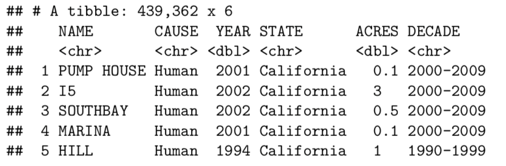

title:: CheatSheet/dplyr

- {{renderer :tocgen}}
- Column
	- New column (factor) based on current column
	  collapsed:: true
		- ```r
		  d6 = mutate (df, DECADE= ifelse (YEAR %in% 1980:1989, "1980-1989",
		  			ifelse (YEAR %in% 1990:1999, "1990-1999"
		  			ifelse (YEAR %in% 2000:2009, "2000-2009",
		  			ifelse (YEAR %in% 2010:2016, "2010-2016" , "-99")))))
		  
		  
		  ```
		- 
- Other
	- Shuffle the tibble
	  collapsed:: true
		- ```r
		  df = crabs %>%
		  	sample_n(nrow(.))
		  ```