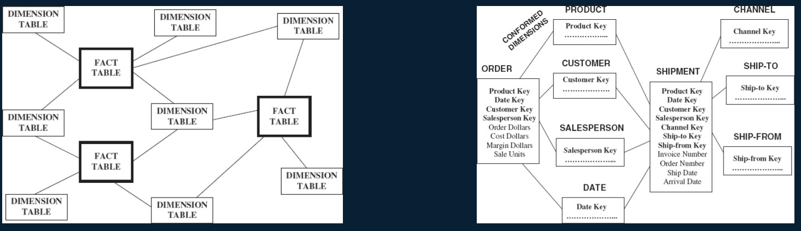

alias:: 一致性维度, conformed dimensions

- Definition
	- Data warehouses generally consist of multiple data marts. The key integration task is the use of **conformed dimensions that are shared by multiple fact tables**
- Example
	- Date dimension usually conformed dimensions
	- 