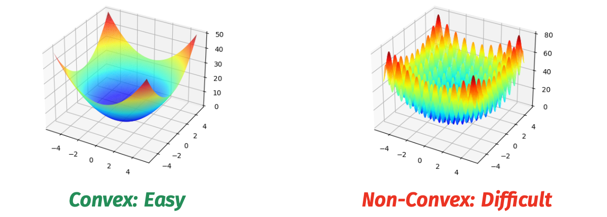
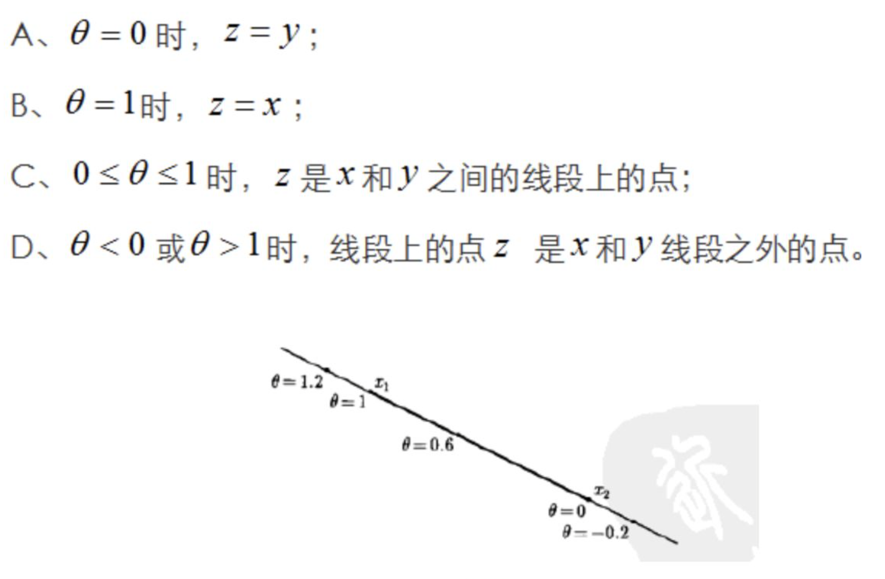

alias:: Convex, convex function, convex optimization, 凸函数, 凸优化

- Example
	- 
	-
- Convexity (凸性)
- Convex set (凸集)
	- **Definition**
		- A set X is convex if the line segment between **any** two points $$x, y \in X$$ remains in $$X$$.
		  $$\forall \boldsymbol{x}, \boldsymbol{y} \in X, 0 \leq \alpha \leq 1, \alpha \boldsymbol{x}+(1-\alpha) \boldsymbol{y} \in X$$
		- 也就是说边界是凸的, 为什么 $$\alpha \boldsymbol{x}+(1-\alpha) \boldsymbol{y} \in X$$是**穿越x,y的直线**几何理解见下图
			- 
		- 两个凸集的并集不一定是凸的, 中间可能有空隙
- Convex Hull (凸包)
	-