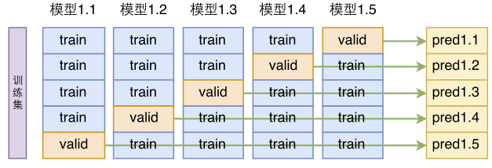

alias:: 交叉验证

- k-fold cross validation
	- Definition
		- 因为如果直接划分训练集和测试集, 测试集完全不参与训练, 被浪费掉, 但是K-fold多次划分可以利用全部数据
	- Procedure
		- 将数据集分为K份 (大小基本一致), 第一份作为验证集, 然后在剩下的 K-1 份上拟合每一个模型(不同的超参数), [[mse]] 由保留折计算. 重复k次, 每一次把不同的观测组作为验证集, 整个过程会得到K个测试误差的估计, K折CV由这些值的平均得到
	- Example
		- 
		- [0.1, 0.2, 0.3, 0.4, 0.5, 0.6]
		  分为K=3组后
		  Fold1: [0.5, 0.2] Fold2: [0.1, 0.3] Fold3: [0.4, 0.6]
		  交叉验证的时会使用如下三个模型，分别进行训练和测试，每个测试集误差MSE加和平均就得到了交叉验证的总评分
		  Model1: Trained on Fold1 + Fold2, Tested on Fold3
		  Model2: Trained on Fold2 + Fold3, Tested on Fold1
		  Model3: Trained on Fold1 + Fold3, Tested on Fold2