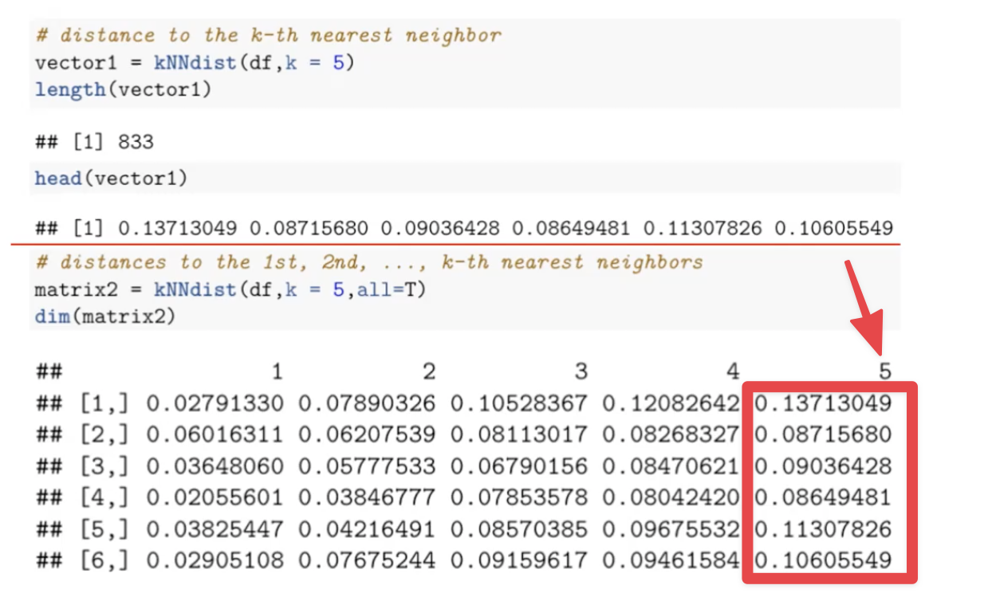

- {{renderer :tocgen,[[]],1}}
- Definition
	- Also called: Density-based spatial clustering of applications with noise
	- 将具有足够密度的区域划分为簇, 并在具有噪声的空间数据库中发现==任意形状==的簇, 它将簇定义为密度相连的点的最大集合
- Algorithm
	- Feature space is split into high-density areas and low density areas
	  collapsed:: true
		- regions with many observations are high-density
		- Regions with few or no observations are low-density
		- High-density regions are separated by low density regions
		- Finding observations in high-density areas
		- Eliminating observations in very low density areas
	- Density based methods assign a density measure to each observation (row)
	- Classify the observations as members of a cluster
	- If not, the observation is assumed to be **noise** and ignored
- What is the density
	- The density of a data point is found by counting the number of points within a radius $Eps$, this includes the point itself
	  collapsed:: true
		- _(page_8_35)_20220311_1647067258110_0.png){:height 306, :width 456}
- [[Hyperparameter]]
	- $Eps(\epsilon)$: define the density of the points
		- if $\epsilon$ small, too many clusters
		- if $\epsilon$ large, too feww clusters
	- $MinPts(M)$: define if point is core point
	- ==A data point is a Core point if there are at least M neighbor points around the data point==
	- Procedure
		- Scale the data set
		- Set k = MinPts(M)
		- Find the distance from each data point to its $k^{th}$ nearest neighbor
		- Sort the data points by distance
		- Plot the distance in ascending order
		- Best $Eps$ is found at the elbow of the elbow chart
- Core point, Border point, Noise point
	- 图示
	  collapsed:: true
		- _(page_10_35)_20220311_1647067549476_0.png){:height 306, :width 470}
	- ==Core point== (C)
		- In the interior of a dense region (cluster)
		- If there is at least $M$ $Pts$ within distance $\epsilon$
	- ==Border point== (B)
		- On the edge of a dense region (cluster)
		- Not C but lying within neighborhood of a core point
	- ==Noise point==
		- In a sparse region (in no cluster)
		- any other point
- Properties
	- A cluster may have many ==core points==
	- Two ==core points== are connected if they are not farther than $\epsilon$
	- Connected ==core points== belong to the same cluster
	- example
	  collapsed:: true
		- _(page_14_35)_20220311_1647067876304_0.png)
- [[CheatSheet/R]] DBSCAN
	- scaling is needed
	- Find cluster use [[k-mean]] to compare
	  collapsed:: true
		- dataset
		  collapsed:: true
			- ```r
			  df = read.csv("circles.csv")
			  plot(y~x, df, pch=19, cex=0.4)
			  ```
			- _(page_20_35)_20220311_1647068031422_0.png)
		- ```r
		  set.seed(123)
		  kmodel2 = kmeans(df,centers 2,nstart 25)
		  fviz_cluster(kmodel2,df,geom "point",show.clust.cent F,ellipse=F,
		  	palette "jco",ggtheme theme_classic())
		  ```
			- output
			  collapsed:: true
				- _(page_21_35)_20220311_1647068192633_0.png)
	- Find cluster use DBSCAN (`fpc` library)
	  collapsed:: true
		- ```r
		  library('fpc') # dbscan()
		  set.seed(123)
		  db = dbscan(df, eps = 0.15, MinPts = 5)
		  print(db)
		  ```
			- output and meanings (class 0 is noise)
			  collapsed:: true
				- _(page_24_35)_20220311_1647068539021_0.png)
	- Plot result of DBSCAN
	  collapsed:: true
		- ```r
		  fviz_cluster(db, data = df, geom "point", show.clust.cent = F,
		  	ellipse = F,stand = F,palette ="jco",
		      ggtheme = theme_classic())
		  ```
			- output for eps = 0.15
			  collapsed:: true
				- _(page_25_35)_20220311_1647068698769_0.png)
			- output for eps = 0.17
			  collapsed:: true
				- _(page_27_35)_20220311_1647068724932_0.png)
			- output for eps = 0.13
			  collapsed:: true
				- _(page_28_35)_20220311_1647068755620_0.png)
- [[CheatSheet/R]] DBSCAN Best epsilon given k = 5
	- scaling is needed
	- Distance to the k-th nearest neighbor
	  collapsed:: true
		- ```r
		  library(dbscan)
		  vector1 = kNNdist(df, k=5)
		  length(vector1) #833
		  head(vector1)
		  ```
			- output
			  collapsed:: true
				- ##[1]0.13713049 0.08715680 0.09036428 0.08649481 0.11307826 0.10605549
				- 0.13713049 是第一个数据点到 k-th = 5 的 nearest neighbor 的距离
	- Distance to the 1st, 2nd, ..., k-th nearest neighbors
	  collapsed:: true
		- ```r
		  matrix2 = kNNdist(df, k = 5, all=T)
		  ```
			- output
			  collapsed:: true
				- 
	- Elbow chart to find the eps
	  collapsed:: true
		- ```r
		  kNNdistplot(df, k=5)
		  ```
			- output
			  collapsed:: true
				- _(page_33_35)_20220313_1647211379712_0.png)