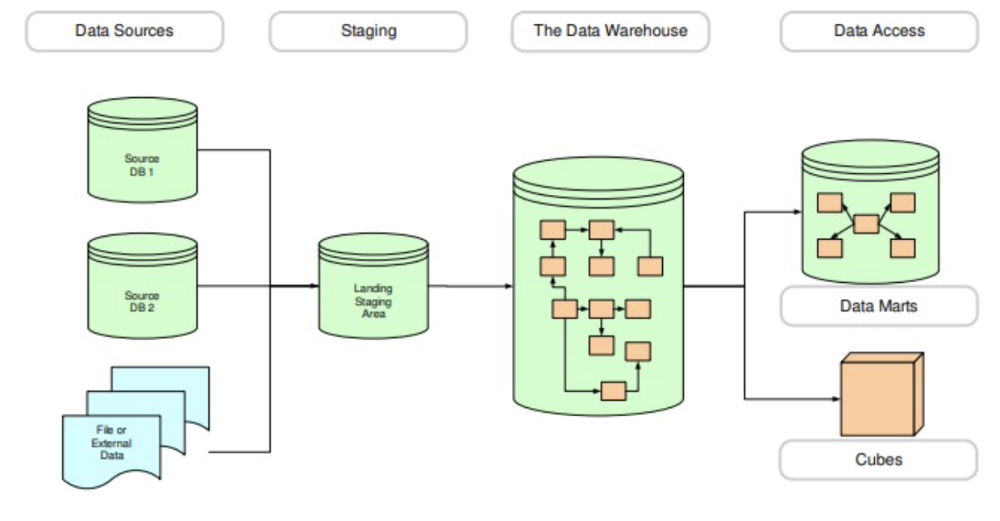

topic:: data warehousing architecture, data warehousing dimensional model
date:: [[2022-02-22 Tuesday]], [[2022-02-24 Thursday]] , [[2022-03-01 Tuesday]]

- # Note
	- What is Data Warehouse?
	  collapsed:: true
		- A database filled with large volumes of cross-indexed historical business info that users can access with various analytical tools
	- What is the difference between **operational** and **analytical** data stores?
	  collapsed:: true
		- ||**Operational**|**Analytical**|
		  |--|--|--|
		  |Data Content|Current values|Archived, derived, summarized|
		  |Data Structure|Optimized for transaction|Optimized for complex queries|
		  |Access Frequency|High|Medium to Low|
		  |Access Type|Read, Update, Delete|Read Only|
		  |Usage|Predictable, repetitive|Ad hoc, Unpredictable|
	- **Defining features for data warehouse**
	  collapsed:: true
		- Subject-Oriented
		  collapsed:: true
			- Organized around major subjects, such as customer, product, sales...
			- Focused on modeling and analysis of data for decision makers, not on daily operations or transaction processing
			- provides a simple and concise view around subject issues by excluding data that are not useful in analytics processes.
			- 
		- Integrated
		  collapsed:: true
			- Constructed by integrating multiple, heterogeneous data sources
				- relational databases, flat files, online transaction records
			- Data cleaning and data integration techniques are applied
				- Ensure consistency in naming conventions, encoding structures, attribute measures, etc. among different data sources
				- When data is moved to the warehouse, it is converted.
			- 
		- Time-Variant
		  collapsed:: true
			- The time horizon for the data warehouse is significantly longer than that of operational systems
			- Operational database: current value data
			- Data warehouse data: provide information from a historical perspective (e.g., past 5-10 years)
		- Nonvolatile
		  collapsed:: true
			- Physically separate store of data transformed from the operational environment
			- Requires only two operations in data accessing: initial loading of data and access of data
			- 
	- What is [[Data Mart]] (数据市集)
	  collapsed:: true
		- 如果说数据仓库是建立在企业级的数据模型之上的话, 那么数据集市就是企业级数据仓库的一个子集. 他主要面向部门级业务, 并且只是面向某个特定的主题, 数据集市可以在一定程度上缓解访问数据仓库的瓶颈.
	- Kimball architecture and Inmon architecture
	  collapsed:: true
		- #+BEGIN_QUOTE
		  Kimball: The data warehouse is nothing more than the union of all the data marts
		  Inmon: You can catch all the minnows in the ocean and stack them togther and they still do not make a whale
		  #+END_QUOTE
		- Kimball (top-down approach), 所有东西都放进data warehouse
		  collapsed:: true
			- 
		- Inmon (bottom up)
		  collapsed:: true
			- 
		- Lnmon VS Kimball
			- ||Inmon|Kimball|
			  |--|--|--|
			  |Architectural structure|Enterprise-wide DW feeds departmental databases|Data marts model a business process, enterprise is achieved with conformed dimensions|
			  |Complexity|High|Low|
			  |Data Orientation|Subject or data driven|Process orientated|
			  |Primary audience|IT|End Users|
	- **What is the business Dimensions**
	  collapsed:: true
		- Automobile manufacturer example
			- The factors (numbers) might want to measure
			  collapsed:: true
				- Actual sales price, MSRP, options price, full price, dealer add-on price, invoice...
			- What are the possible ways we might want to categorize and sub-total these facts? (Dimensions)
			  collapsed:: true
				- Products, Dealers, Customer demographics, payment method, time
			- 
		- Hotel Occupancy example
		  collapsed:: true
			- 
	- [[fact table]] (and types) and [[dimension table]] (and types)
	  collapsed:: true
		- Example
			- 
			- 
	- **What are the types of [[fact table]]**
	- **How to resolve [[multi-valued dimension]] with [[bridge table]]**
	  collapsed:: true
		- Simple approach: decompose the ((622022a6-270c-4332-93d9-30ddc76b14e1)) into two or more ((622022a6-3905-416d-96cd-63de998ad049))
		  collapsed:: true
			- 
			- 
		- Issues with simple approach
		  collapsed:: true
			- certain forms of reporting are much more complicated
				- total order_dollars for a particular salesperson
			- Only supports a fixed number of relationships
		- use bridge table
		  collapsed:: true
			- 
	- **How to resolve [[multi-valued attribute]]**
	  collapsed:: true
		- example
		  collapsed:: true
			- 
		- simple approach
			- add a fixed number of attributes to the dimension table (with issue: complex reporting and fixed maximum number of values)
			  collapsed:: true
				- 
		- flexible approach (create an attribute table)
			- The multi-valued attributes are not stored in the dimension table. Instead, they are stored in a separate table with its own [[surrogate key]] (referred to as an "outrigger"
			- A [[bridge table]] is set up with two columns: a group_key and a second column referring to the outrigger
			- When a dimension row refers to a specific combination of values in the outrigger, a group is set up for those values in the bridge table
			- The dimension table and bridge can be joined using the group_key
			- Example (also has danger of double-counting)
				- 
	- **[[bridge table]] and double counting problem**
	  collapsed:: true
		- By allowing a fact to refer to multiple rows in a dimension table, the possibility of double (or multiple) counting
		- For example, if a query is calculating total orders by region, the same order will be counted twice (因为有两个EAST region的人)
		  collapsed:: true
			- 
		- ==Solutions==
		  collapsed:: true
			- group query results by individual members of the dimension table. Grouping results at any other level of summarization may result double counting. Example:
				- ```sql
				  SELECT
				      SALESREP.region,
				      SUM(ORDER_FACTS.order_dollars)
				  FROM
				      SALESREP,
				      SALES_GROUP,
				      ORDER_FACTS
				  WHERE
				      ORDER_FACTS.sales_group_key = SALES_GROUP.sales_group_key
				      AND SALES_GROUP.salesrep_key = SALESREP.salesrep_key
				  GROUP BY
				      SALESREP.region
				  ```
			- It is possible to eliminate double-counting dangers by adding an **allocation factor** to the bridge table:
				- 
	- **What is the [[star schema]] and examples**
	  collapsed:: true
		- Order analysis example
			- You work for a manufacturing company and the marketing department is interested in determining how they are doing with orders received by the company
			- Choosing the process
			  collapsed:: true
				- Order handling process
			- Choosing the Grain
			  collapsed:: true
				- Select lowest grain of data available, ==each row in the== [[fact table]] ==will represent a single product on a single order==
			- Choosing the Dmensions
			  collapsed:: true
				- Customer, Salesperson, Order date, Product
			- Choosing the facts (key metrics we want to use for analytics)
			  collapsed:: true
				- Order dollars, cost, margin dollars, quantity sold
			- Produce the [[Star Schema]]
				- 
			- Standard Query of the [[star schema]]
				- Quantity sold and order dollars for product **bigpart-1**, relating to customers in the state of **Maine**, obtained by salesperson **Jane Doe**, during the month of **June**
					- 
				- Drill Down (增加维度)
					- 
					- What was total quantity sold of product brand **big parts** to customers in the northeast region for the year **2008**?
					- How did those sales break down by **quarter**?
					- How did those sales break down by **specific products** in the brand big parts?
					- How did those sales break down by **states** in the northeast region?
				- [[dimension table]] (Categories)
					- {:height 236, :width 145}
					- **Primary key uniquely identifies each row in the table**
					- Tables are usually **wide**
					- Values are usually **text**
					- **Frequently attributes are not directly related to each other** (e.g. package size and product brand in the same product table)
					- Not normalized (flattened)
					- May contain multiple hierarchies
					- Fewer rows than the fact table
				- [[fact table]] (Measures)
					- {:height 249, :width 215}
					- Concatenated fact table key: **each row is uniquely identified by the combination of the foreign keys into the dimension tables**
					- Data grain: the level of detail for the measurements
					- Table is usually **deep** and not **wide**
					- Table may have **gaps** (combinations of foreign keys with no measures)
					- may contain degenerative dimensions - attributes that don't logically belong with any of the dimensions (order_number, order_line in this example)
	- **Retail Sales Example**
	  collapsed:: true
		- Overview
		  collapsed:: true
			- Large grocery store chain that has 100 stores spread across five states
			- Each store has multiple departments (grocery, frozen foods, dairy, meet, product, bakery, floral, health/beauty aids)
			- Each store has approximately 60,000 individual products, called stock keeping units (SKUS), on its shelves
		- Data
		  collapsed:: true
			- data is collected by two primary mechanism
				- POS stations (barcode scanned)
					- Product, store, promotion, date, cashier, payment method
				- receiving department where vendors make deliveries
		- Objectives
		  collapsed:: true
			- Management is concerned with the logistics of ordering, stocking, and selling products while maximizing profit. Key management decisions include:
				- Pricing, promotions (temporary price reductions, advertisements, in-store displays, coupons, etc)
		- Dimensional Model Design
		  collapsed:: true
			- Choose the business process
				- for an initial project, we will model customer purchases as captured by the POS system
			- Choose the grain
				- Each row on the fact table will represent an individual product on a POS transaction
		- Identify the Facts
		  collapsed:: true
			- What types of information are directly available in the POS data for each individual product line item (our selected grain)?
				- Sales quantity (number of units)
				- Per unit regular, discount, and net paid prices
			- What types of "derived facts" might be useful to calculate when loading the fact table?
				- "Extended" amounts (per unit measures times sales quantity for discount dollar amount, sales dollar amount, cost dollar amount (if available), gross profit dollar amount (if available)
			- [[Star Schema]] and identifying additive and non-additive facts
				- 
					- fully additive facts
						- Sales quantity
						- extended discount, sales, and cost amounts
					- Non-additive facts
						- Regular and discount unit prices
			-
	- **How to change [[dimension table]] and update process?**
	- **What is the [[snowflake schema]] ?**
	- **What is [[aggregate fact table]]**
	- [[surrogate key]] VS [[natural key]] (pros and cons)
	- **Cruise Line Example**
	  collapsed:: true
		- You work for a large cruise line company that operates many cruises around the world.
		  collapsed:: true
			- Ships offer cruises
			- Staff are employed on cruises
			- Passengers buy tickets for cruises
			- Passengers are allocated places (cabins) on cruises
			- Cruises have origins, destinations, and durations
		- Task 1
		  collapsed:: true
			- Develop a data mart to answer questions like:
				- What are the most popular cruises?
				  Which cruises produce the most revenue?
				  Which place do we visit most often?
				  How many passengers did we have in the first three months of the year?
				  Which cruises appealed mostly to older customers?
				  Which cruises received the highest Trip Advisor customer ratings? Which cabin types generate the most revenue?
			- What is the grain?
				- each row represents a single passenger on a single cruse
			- What are the dimensions?
				- Date, cruise type (location, duration, etc), ship, passenger, cabin type
			- What are the facts?
				- Revenue, Customer rating
			- [[Star Schema]] For the Cruise Line task 1
				- 
		- Task 2
		  collapsed:: true
			- the operations department is interested in creating another data mart to report on its on-ship staff.
				- Staff are assigned to specific cruises with specific roles (captain, navigator, restaurant staff, engineer, etc.)
				- The marketing department is also interested in the possibility of understanding how specific ship staff (especially the captain or the head chef) influence customer ratings.
			- What is the grain?
				- Each row represents a single staff assigned to a single cruise
			- What are the dimensions?
			  collapsed:: true
				- Date, cruise type (location, duration, etc), ship, assignment, staff information
			- What are the facts?
			  collapsed:: true
				- None ([[Factless Fact table]])
			- [[Star Schema]] For Cruise Line task 2
				- 
		- Task 3
		  collapsed:: true
			- [[Data Mart]] decreases due to the size of fact table too large, Design [[aggregate fact table]] enable queries have better performance:
				- What are the most popular cruises?
				- Which cruises produce the most revenue?
				- Which place do we visit most often?
				- How many passengers did we have in the first three months of the year?
			- What is the grain?
				- Each row represents a single cruise
			- What are the dimensions?
				- Date, cruise type (location, duration, etc), ship, passenger, cabin type
			- What are the facts?
				- Revenue
				- Number of passengers
				- Total revenue
			- [[Star Schema]] For Cruise Line task 3 (lost passenger dimensions)
				- 