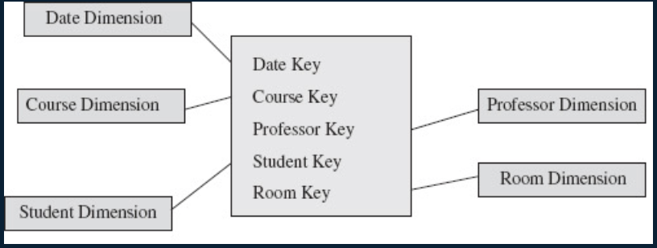

alias:: 非事实事实表

- Example
	- Some fact tables may have no measures
	- These generally represent "events". for example an attendance table represents the fact that a student attended a specific class
	- 