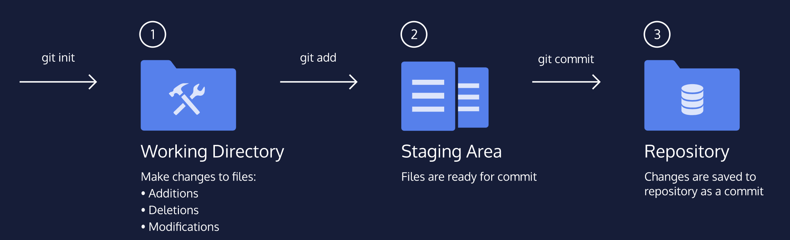

- Basic workflow
	- Diagram
	  collapsed:: true
		- 
	- Initializing
	  collapsed:: true
		- ```shell
		  git init
		  ```
		- This command only needs to be used once per project (**current folder**) to complete the initial setup
	- Check status (check changes)
	  collapsed:: true
		- ```shell
		  git status
		  ```
		- `untracked files` means that git sees the file but has not started tracking changes yet
	- Add changed file to staging area
	  collapsed:: true
		- ```shell
		  git add filename
		  ```
	- See changes (staged file and local saved file)
	  collapsed:: true
		- ```shell
		  git diff filename
		  ```
	- Git commit will stores changes from staging area inside the repository
	  collapsed:: true
		- ```shell
		  git commit -m "xxxxx"
		  ```
		- `-m` followed by a message, must use "", less than 50 characters
	- See the log
	  collapsed:: true
		- ```shell
		  git log
		  ```
		- A 40 character code called [[SHA]], uniquely identifies the commit