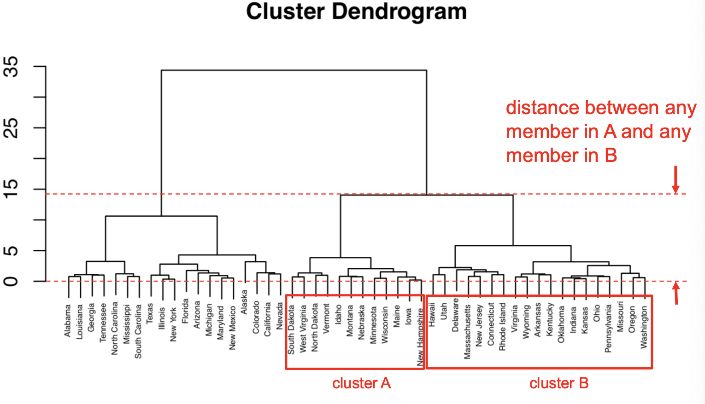
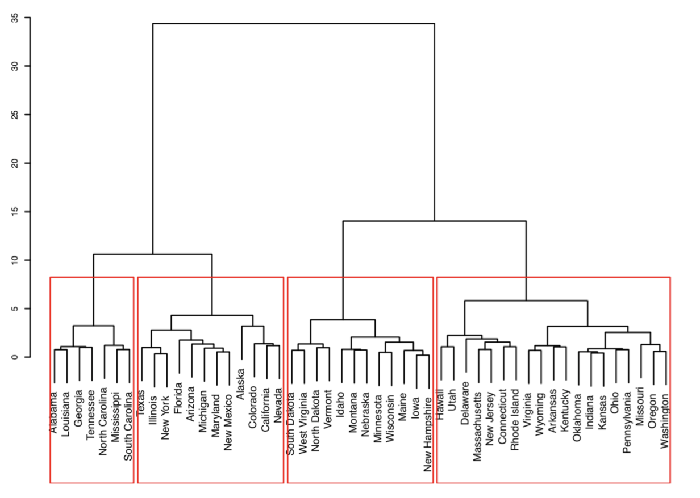

topic:: hierarchical clustering, clustering, agglomerative methods, divisive methods, cophenetic distance, dendrogram

- # Notes
	- **Recall different types of hierarchical clustering**
	  		collapsed:: true
	  collapsed:: true
		- Agglomerative clustering is the most common type of hierarchical clustering
		- {{embed ((620ac899-c18f-4859-9ff7-2b76fa540b06))}}
	- **What is the difference between [[k-mean]] and hierarchical clustering?** #recall
	  collapsed:: true
		- K-means clustering requires us to pre-specify the number of clusters K (需要提前指定k)
		- Hierarchical clustering 不需要提前指定k
	- **What is dendrogram?** #recall
	  collapsed:: true
		- tree plot of hierarchical clustering
		- data points are shown as the leaves
		- based on a distance measure (dissimilarity)
		- cut the dendrogram to choose the number of clusters
		  			collapsed:: true
		  collapsed:: true
			- {:height 334, :width 644}
		- Example
		  			collapsed:: true
		  collapsed:: true
			- n = 9 datapoints, p = 2 variables
				- 
			- Vertical axis shows the **distance** separating observations/clusters
			- It indicates how **dissimilar** the points are
			- 1 and 6 dissimilarity is small(0.4), since they are close
			- Once the points are fused, they are **treated as a single observation** and the algorithm continues
	- **Hierarchical Agglomerative clustering algorithm** #recall
	  collapsed:: true
		- Start with points as separate clusters (n clusters)
		- Calculate the [[distance]] (or dissimilarity between all points/clusters)
		- Fuse the two clusters that are most similar so that there are now _n-1_ clusters
		- Fuse next two most similar clusters so there are now _n-2_ clusters
		- Continue until there is only 1 cluster with all points
	- **What is linkage?** #recall
	  collapsed:: true
		- Hierarchical clustering requires defining a **dissimilarity measure**, also called **Linkage**
	- **Types of linkage** #recall
	  collapsed:: true
		- Complete linkage (most common)
		  			collapsed:: true
		  collapsed:: true
			- **Max** of all pairwise distances between 2 clusters
			- yield **evenly sized clusters**
			- {:height 263, :width 169}
		- Single linkage
		  			collapsed:: true
		  collapsed:: true
			- **Min** of all pairwise distances between 2 clusters
			- single linkage yield extended clusters to which single leaves are fused one by one
			- {:height 259, :width 145}
		- Average linkage
		  			collapsed:: true
		  collapsed:: true
			- **Avg** of all pairwise distances between 2 clusters
			- yield **evenly sized clusters**
			- {:height 296, :width 165}
		- Centroid linkage
		  			collapsed:: true
		  collapsed:: true
			- Distance between **centroids**
		- Ward linkage
		  			collapsed:: true
		  collapsed:: true
			- At each step, the pair of clusters with the smallest between cluster distance are merged
		- Ward.D2 linkage
		  			collapsed:: true
		  collapsed:: true
			- At each step, the pair of clusters with the smallest between cluster squared-distance are merged
	- **Example of complete linkage** #recall
	  collapsed:: true
		- 
		- 
		- Then, merge obs 2 and 4 into cluster (24) and repeat
		- 
		- Then, merge (24) with 1, finally merge clusters (124) with (35) into a single cluster (12345)
		- 
		-
	- **Distances in dendrogram (Cophenetic distances)** #recall
	  collapsed:: true
		- **Dendrogram distances (cophenetic distance) are not equal to true distances**
		  			collapsed:: true
		  collapsed:: true
			- 
		- The distance between points 3 and 5 is 2
		  			collapsed:: true
		  collapsed:: true
			- 
		- The distance between cluster (2,4) and point 1 is 9, **9 means the distance between any obs in set A and any obs in set B is 9**
		  			collapsed:: true
		  collapsed:: true
			- 
		- Similarly, the distance between cluster (1,2,4) and cluster (3,5) is 11
	- **How to evaluate the clusters are good or not?** #recall
	  collapsed:: true
		- If Dendrogram distances are close to true distances, the hierarchical clusters are a good solution (if not, try different linkage or clustering method). **Compute the cophenetic correlation coefficient (CPCC) > 0.7 is good**
		  collapsed:: true
			- 
	- **Example of hierarchical clustering** #recall
	  collapsed:: true
		- Hierarchical clustering example 1 [[CheatSheet/R]]
			- Create matrix
				- ```r
				  matrix1 = matrix(c(0,9,3,6,11,
				  					9,0,7,5,10,
				  					3,7,0,9,2,
				  					6,5,9,0,8,
				  					11,10,2,8,0), nrow=5)
				  ```
				- {:height 186, :width 477}
			- Convert the matrix to distance and hierarchical clusters
				- ```r
				  dist1 = as.dist(matrix1)
				  #	  1 2 3 4
				  #	2 9
				  #	3 3 7
				  #	4 6 5 9
				  #	5 11 10 2 8
				  h1 = hclust(dist1, method="complete")
				  plot(h1, ylab = "distance", xlab = "")
				  # or
				  plot(as.dendrogram(h1), xlab = "", ylim=c(0,12),
				      ylab = "cophenetic distance")
				  co1 = cophenetic(h1)
				  co1
				  #1 2 3 4
				  #2 9
				  #3 11 11
				  #4 9 5 11
				  #5 11 11 2 11
				  ```
			- Compute the cophenetic distancd
				- 
			- Compute the cophenetic correlation coefficient (CPCC). This coefficient is used to compare how similar are the cophenetic distances to the true distances
			  If CPCC > 0.7, is good enough
				- ```r
				  cor(co1, dist1) #0.652179
				  ```
		- Hierarchical clustering example 2 [[CheatSheet/R]]
			- 
			- {{embed ((620b3f27-dc28-4327-8c67-62c5355a36e6))}}
			- Scale the data and compute the distance
				- ```r
				  df0 = USArrests
				  df = scale(df0)
				  distance = dist(df)
				  ```
			- Show distance in matrix form
				- ```r
				  distmat = as.matrix(distance)
				  dim(distmat) # 50 50
				  ```
			- Build the dendrogram
				- ```r
				  h1 = hclust(distance, method="ward.D")
				  plot(h1, cex=0.4, xlab="",sub="",ylab="")
				  # or fancy plot
				  fviz_dend(h1,k=4,cex = 0.5, main="Ward linkage",
				            k_colors = "jco", rect = T, rect_fill = T)
				  ```
				- {:height 241, :width 426}
				- ```r
				  plot(h1, cex=1.2)
				  # cut to 4 clusters
				  rect.hclust(h1, k=4, border="red")
				  ```
				- {:height 306, :width 432}
			- Plot the clusters
				- ```r
				  # cut the dentrogram to 4 clusters
				  cut1 = cutree(h1,k=4)
				  fviz_cluster(list(data = df, cluster = cut1),main="Ward linkage",
				  palette = "Set2",show.clust.cent = F, labelsize = 10, repel = T, # Avoid label overplotting (slow)
				  ggtheme = theme_minimal()
				  )
				  ```
				- 
			- Compute the cophenetic correlation coefficient (CPCC)
				- ```r
				  # cophenetic distance
				  c1 = cophenetic(h1)
				  c1mat = as.matrix(c1)
				  
				  # true distances
				  distmat
				  
				  # CPCC, you can produce this cpcc for different linkage methods
				  cor(distance,c1)
				  ```
-