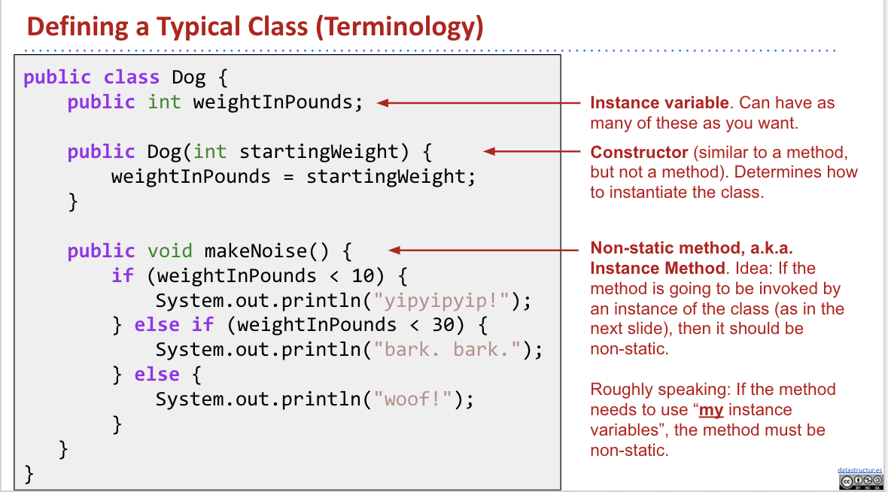
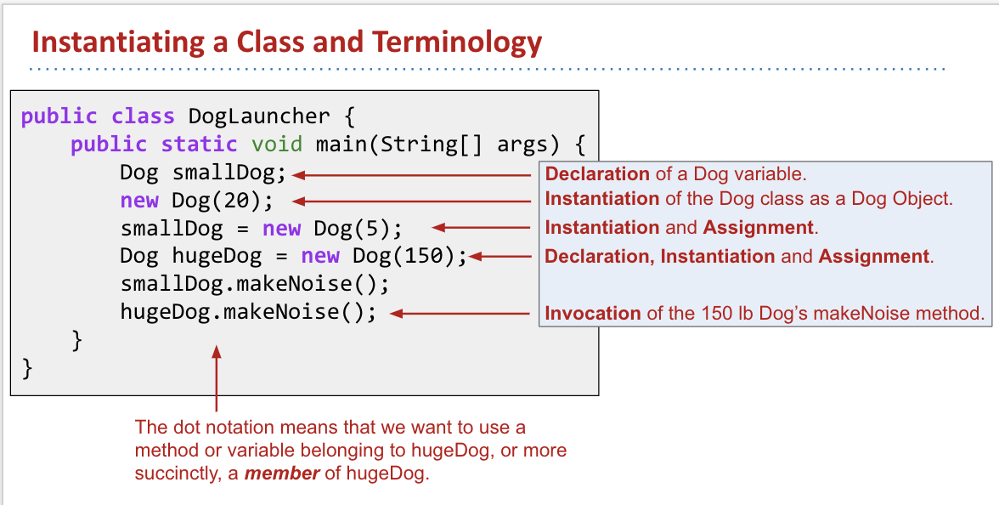

- 基本语法 & 注意事项
	- 注意事项
	  background-color:: #793e3e
	  collapsed:: true
		- All code in Java must be part of a class.
		- We delimit the beginning and end of segments of code using { }.
		- All statements in Java must end in a semi-colon.
		- To run a java program, typically define a main method using public static void main(String[] args)
		- ```java
		  class HelloWorld {
		      public static void main(String[] args) {
		          System.out.println("helloworld");
		      }
		  }
		  ```
		- **Declared variables can never change**
		- Java **variables** and **expressions** must have a specific **type**
		- **Types are verified before the code even runs** (difference between Java and python)
		- ```java
		  // 输出 0~9
		  public class HelloNumbers {
		      public static void main(String[] args) {
		          int x = 0;
		          while (x < 10) {
		              System.out.println(x);
		              x = x + 1;
		          }
		      }
		  }
		  ```
	- 基本语法
	  background-color:: #793e3e
	  collapsed:: true
		- Conditionals
			- ```java
			  public class ClassNameHere {
			      public static void main(String[] args) {
			          int x = 5;
			  
			          if (x < 10)
			              x = x + 10;
			  
			          if (x < 10)
			              x = x + 10;
			  
			          System.out.println(x);
			      }
			  }
			  ```
			- ```java
			  public class ConditionalsWithBlocks {
			     public static void main(String[] args) {
			        int x = 5;
			  
			        if (x < 10) {
			           System.out.println("I shall increment x by 10.");
			           x = x + 10;
			        }
			  
			        if (x < 10) {
			           System.out.println("I shall increment x by 10.");
			           x = x + 10;
			        }
			  
			        System.out.println(x);
			     }
			  }
			  ```
			- ```java
			  int dogSize = 20;
			  if (dogSize >= 50) {
			      System.out.println("woof!");
			  } else if (dogSize >= 10) {
			      System.out.println("bark!");
			  } else {
			      System.out.println("yip!");
			  }
			  ```
		- While
			- ```java
			  int bottles = 99;
			  while (bottles > 0) {
			      System.out.println(bottles + " bottles of beer on the wall.");
			      bottles = bottles - 1;
			  }
			  ```
		- Defining Functions
			- ```java
			  public static int max(int x, int y) {
			      if (x > y) {
			          return x;
			      }
			      return y;
			  }
			  
			  public static void main(String[] args) {
			      System.out.println(max(10, 15));
			  }
			  ```
		- Arrays
			- ```java
			  int[] numbers = new int[3];
			  numbers[0] = 4;
			  numbers[1] = 7;
			  numbers[2] = 10;
			  System.out.println(numbers[1]);
			  ```
			- ```java
			  int[] numbers = new int[]{4, 7, 10};
			  System.out.println(numbers[1]);
			  ```
		- For loops
			- ```java
			  for (initialization; termination; increment) {
			      statement(s)
			  }
			  ```
			- ```java
			  public class ClassNameHere {
			      /** Uses a basic for loop to sum a. */
			      public static int sum(int[] a) {
			        int sum = 0;
			        for (int i = 0; i < a.length; i = i + 1) {
			          sum = sum + a[i];
			        }
			        return sum;
			      }
			  }
			  ```
			- ```java
			  public class EnhancedForBreakDemo {
			      public static void main(String[] args) {
			          String[] a = {"cat", "dog", "laser horse", "ketchup", "horse", "horbse"};
			  
			          for (String s : a) {
			              for (int j = 0; j < 3; j += 1) {
			                  System.out.println(s);
			                  if (s.contains("horse")) {
			                      break;
			                  }                
			              }
			          }
			      }
			  }
			  ```
			- [try this code online](https://goo.gl/wmhVPM)
	- 函数
	  background-color:: #793e3e
	  collapsed:: true
		- Functions must be declared as part of a class in Java
		- A function that is part of a class is call a **method**. **all function are methods**
		- All **parameters** of a function must have a declared type, and the **return value** of a function must have a **declared type**.
		- **Function in Java only return one value**
		- ```java
		  // function define
		  /**
		   * LargerDemo
		   */
		  public class LargerDemo {
		      public static int larger(int x, int y) {
		          if (x > y) {
		              return x;
		          }
		          return y;
		      }
		      public static void main(String[] args) {
		          System.out.println(larger(-5, 10));
		      }
		  }
		  ```
		- Every method (a.k.a. function) is associated with some class
		- **to run a class, we must define a main method**, not all class have a main method
		- ```java
		  /*创建函数为一个文件, 不能直接run, 因为没有main方法*/
		  public class Dog {
		    public static void makeNoise() {
		      System.out.println("bark!");
		    }
		  }
		  /*以下为调用函数另一个文件, 调用其他class的函数*/
		  /*也叫test drive class*/
		  public class DogLauncher {
		    public static void main(String[] args) {
		      Dog.makeNoise();
		    }
		  }
		  ```
		-
	- Defining a typical Class (static & nan-static method)
	  collapsed:: true
		- 
		- 
		- ```java
		  /*不好的例子*/
		  public class MayaTheDog {
		    public static void makeNoise() {
		      System.out.println("arooo");
		    }
		  }
		  public class YapsterTheDog {
		    public static void makeNoise() {
		      System.out.println("wwawwaawwa");
		    }
		  }
		  
		  /*好的例子*/
		  /*Dog.java*/
		  public class Dog {
		    public int weightInPounds;
		    
		    /*One integer constructor for dogs.
		    similar to __init__ method in python*/
		    public Dog(int w) {
		      weightInPounds = w;
		    }
		  
		    public void makeNoise() {
		      if (weightInPounds < 10) {
		        System.out.println("yip!");
		      } else if (weightInPounds < 30) {
		        System.out.println("bark.");
		      } else {
		        System.out.println("wooof!");
		      }
		    }
		  }
		  /*DogLauncher.java*/
		  /** The DogLauncher 
		  class will 'test drive' the Dog class*/
		  public class DogLauncher {
		    public static void main(String[] args) {
		      Dog d = new Dog(50);
		      d.makeNoise();
		    }
		  }
		  ```
		- **classes 可以包含 function (methods) 也可以包含数据 (data)**
			- classes can be instantiated as objects
				- 先create一个Dog class然后create instances of this Dog
				- 然后class给了一个不同Dog的蓝图
	- Arrays of objects
	  collapsed:: true
		- ```java
		  Dog[] dogs = new Dog[2]; //创建一个Dog的array, size=2
		  dogs[0] = new Dog(8); //该数组包含了之前创建的dog类
		  dogs[1] = new Dog(20);
		  dogs[0].makeNoise();
		  ```
	- **Static & Non-static**
	  collapsed:: true
		- static methods **should be** invoked using the class name, e.g. Dog.makeNoise() where Dog is the class name
		- Instance methods are invoked using an instance name, e.g. maya.makeNoise()
		- static methods can't access 'my' instance variables, (**just the idea of the Dog**)
		- **如果invoke using the class name, class 前面要加 static**
		- example
			- ```java
			  // static
			  public static void makeNoice() {
			    System.out.println("bark!");
			  }
			  // this method cannot access weightinPounds
			  // invocation: Dog.makeNoice();
			  
			  // Non-static
			  public void makeNoice() {
			    if (weightInPounds < 10) {
			      System.out.println("yipyipyip!");
			    } else if (weightInPounds < 30) {
			      System.out.println("Bark. bark.");
			    } else {System.out.println("woof!");}
			  }
			  // invocation: maya = newDog(100);maya.makeNoise()
			  ```
		- class that both static and non-static
			- Dog.java
				- ```java
				  public class Dog {
				    public int weightInPounds;
				    
				    /*One integer constructor for dogs.
				    similar to __init__ method in python*/
				    public Dog(int w) {
				      weightInPounds = w;
				    }
				  
				    public void makeNoise() {
				      if (weightInPounds < 10) {
				        System.out.println("yip!");
				      } else if (weightInPounds < 30) {
				        System.out.println("bark.");
				      } else {
				        System.out.println("wooof!");
				      }
				    }
				  
				    // Dog checker的法官, 静态方法, 同时检查两只狗
				    public static Dog maxDog(Dog d1, Dog d2) {
				      if (d1.weightInPounds > d2.weightInPounds) {
				        return d1;
				      }
				      return d2;
				    }
				    // 其中一只狗做dog checker, 动态方法, 使用一只狗检查零一只狗
				    public Dog maxDog(Dog d2) {
				      if (this.weightInPounds > d2.weightInPounds) {
				        return this;
				      }
				      return d2;
				    }
				  }
				  ```
			- DogLauncher.java
				- ```java
				  public class DogLauncher {
				    public static void main(String[] args) {
				      Dog d = new Dog(10);
				      Dog d2 = new Dog(100)
				        
				      //静态方法, 使用检察官, 也就是一个概念
				      //Dog bigger = Dog.maxDog(d, d2);
				  
				      //动态方法, 使用其中一只狗来检查另一只
				      Dog bigger = d.maxDog(d2);
				      bigger.makeNoise();
				    }
				  }
				  ```
			- class 可以拥有static的变量
				- ```java
				  public class Dog{
				    public int weightIntpounds; //Non-static
				    public static String color = "black"
				  }
				  ```
- [[Bugs]]
	- Index 1 out of bounds for length
	  collapsed:: true
		- `for (int i = 0; i < args.length; i++)`
		  这是为了使得`int i = args.length-1` 因为是从0开始计数