alias:: 线性判别分析, LDA, gaussian maximum likelihood classification, LDA分类器
type:: supervised, classification

- Definition
  collapsed:: true
	- A statistical learning method for classification that transforms the features into new variables that best discriminate the categories, the new variables are called discriminants
	- the number of LDs is the smallest between
		- number of predictors
		- number of categories - 1
- LDA how to do dimension reduction?
  collapsed:: true
	- LDA transforms the data that separates the center of each category while ==keeping the variance in each category to a minimum== (LD2 orthogonal to LD1)
	- for features $X_1$ and $X_2$, this is down by ==finding a line through the origin (always)==, when the data points are projected onto this line it
		- maximize the distance between the class centers
		- minimize the variance within each class
	- example 1
	  collapsed:: true
		- _20220403@2x_1649027128932_0.png)
	- example 2
	  collapsed:: true
		- projects the data onto this new axis in a way to maximize the separation of the two categories
		  collapsed:: true
			- 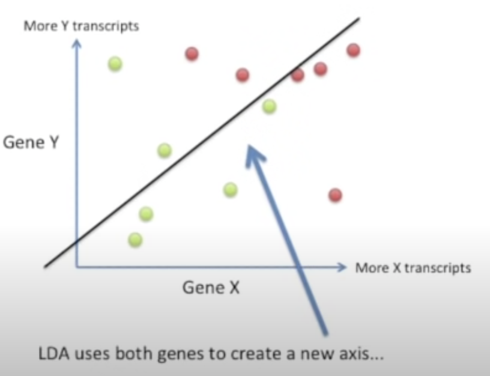
			- 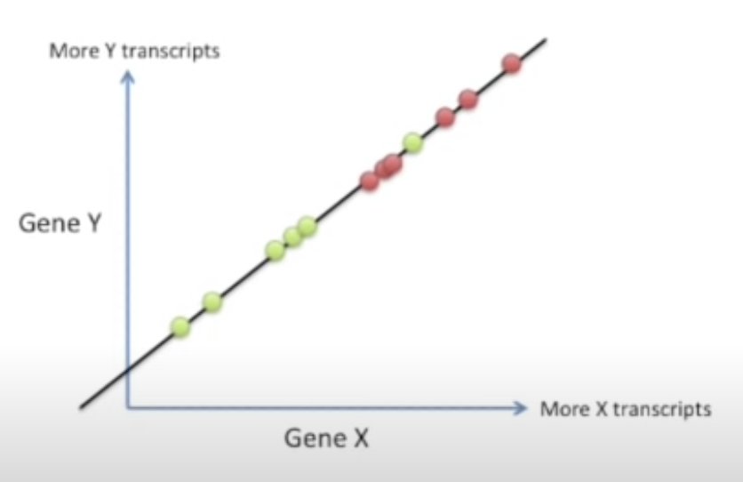{:height 411, :width 621}
			-
		- collapsed:: true
		  1. ==maximize the distance between means==. 2. ==Minimize the variation== (LDA calls 'scatter' and is represented by $s^2$) within each category
		  collapsed:: true
			- $$
			  \frac{(\mu-\mu)^{2}}{s^{2}+s^{2}}
			  $$
			- 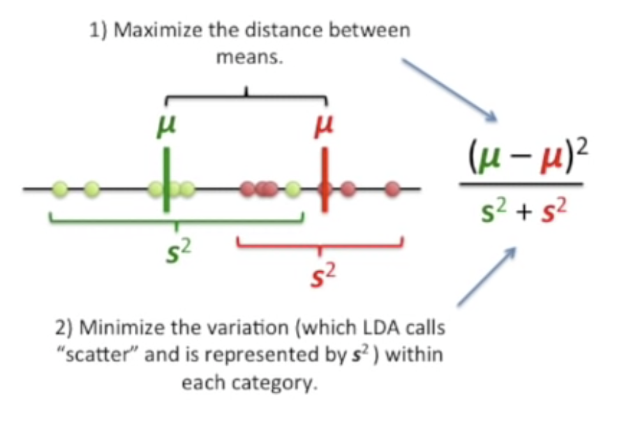
			- 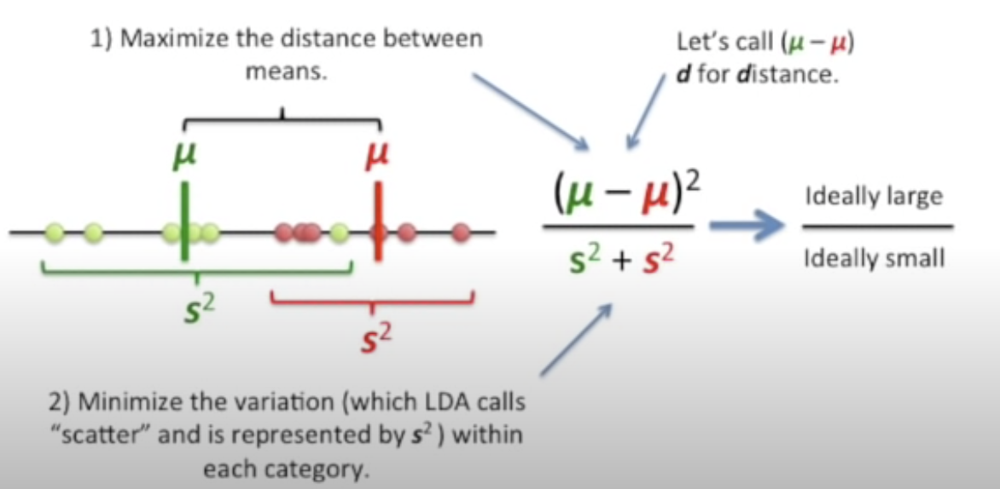
- [[assumption]] of [[LDA]] and [[QDA]]
  collapsed:: true
  id:: 6247a8cf-17cd-47c0-b3cb-58bca404aefa
	- Predictors are [[MVN distribution]] within each response category
	- LDA: 每个category的 $\mu$ 不一样, $\sigma$ (也就是[[Covariance Matrix]] $\Sigma$)一样
	  collapsed:: true
		- $$
		  \begin{aligned}
		  f_{k}(\underline{x}) & \text { is } N_{p}\left(\underline{\mu}_{k}, \Sigma\right) \quad k=1,2,3... \\
		  {[\underline{X} \mid Y=k] } & \sim N_{p}\left(\underline{\mu}_{k}, \Sigma\right) \\
		  f_{k}(\underline{X} \mid Y=k)=& \frac{1}{(\sqrt{2 \pi})^{p}|\Sigma|^{1 / 2}} e^{-\frac{1}{2}\left(\underline{x}-\underline{\mu}_{k}\right)^{T} \Sigma^{-1}\left(\underline{x}-\underline{\mu}_{k}\right)}
		  \end{aligned}
		  $$
	- QDA: 每个category的 $\mu$ 不一样, $\sigma$ (也就是[[Covariance Matrix]] $\Sigma$)也不一样
	  collapsed:: true
		- $$
		  \begin{aligned}
		  f_{k}(\underline{x}) & \text { is } N_{p}\left(\underline{\mu}_{k}, \Sigma_{k}\right) \quad k=1,2,3... \\
		  {[\underline{X} \mid Y=k] } & \sim N_{p}\left(\underline{\mu}_{k}, \Sigma_{k}\right) \\
		  f_{k}(\underline{X} \mid Y=k)=& \frac{1}{(\sqrt{2 \pi})^{p}\left|\Sigma_{k}\right|^{1 / 2}} e^{-\frac{1}{2}\left(\underline{x}-\underline{\mu}_{k}\right)^{T} \Sigma_{k}^{-1}\left(\underline{x}-\underline{\mu}_{k}\right)}
		  \end{aligned}
		  $$
		- estimate p-dimensional [[density function]] is challenging, because it must consider not only the [[marginal distribution]] of each predictor, but also the [[joint distribution]]
- Linear discriminant analysis when $p = 1$ (只有一个预测变量)
  collapsed:: true
	- ==Procedure==
		- dataset (3 categories, 1 feature)
		  collapsed:: true
			- distribution for each category is normal with the ==same variance==
			- _20220403@2x_1649030650885_0.png){:height 276, :width 520}
		- [[CheatSheet/MathNotation]] for [[bayes theorem]]
		  id:: 624a35fb-6413-4819-b374-1953165cece4
		  collapsed:: true
			- Probability that an observation comes from category k
				- $$P[Y = k]$$
				- [[prior probability]] that an observation comes from category k
					- $$\pi_k = P[Y=k]$$
			- [[probability density function]] of X for observations from category k
				- $$f_k(x) = P[X=x \mid Y=k]$$
			- probability that an observation comes from category k given that we know its feature value x
				- $$P[Y=k \mid X = x]$$
				- [[posterior probability]] that an observation comes from category k given that we know its feature value X
					- $$P_k(x) = P[Y=k \mid X=x]$$
		- Use [[bayes theorem]] in [[LDA]] (bayes theorem for classification)
		  collapsed:: true
			- $$
			  P(Y=k \mid X = x)= P_k(x) =\frac{P(X = x \mid Y=k) P(Y=k) }{\sum_{i} P(X = x \mid Y=i) P(Y=i)} = \frac{\pi_kf_k(x)}{\sum^k_{l=1} \pi_i f_i(x)}
			  $$
				- 这里 $i = 3$, 因为有3个category. 一般来说 $f_k(x)$的估计要复杂一些, 除非假设他们的[[密度函数]] 形式 (这里用 [[MVN distribution]] (p>1), normal distribution p = 1), Note that $f_k$ 对每个class k 都不一样
		- according to ((6247a8cf-17cd-47c0-b3cb-58bca404aefa))
		  collapsed:: true
			- $$
			  p_{k}(x)=\frac{\frac{1}{\sqrt{2 \pi} \sigma} e^{-\frac{1}{2 \sigma^{2}}\left(x-\mu_{k}\right)^{2}} \pi_{k}}{\sum_{i=1}^{i=3} \frac{1}{\sqrt{2 \pi} \sigma} e^{-\frac{1}{2 \sigma^{2}}\left(x-\mu_{i}\right)^{2}} \pi_{i}} = 
			  \frac{e^{-\frac{1}{2 \sigma^{2}}\left(x-\mu_{k}\right)^{2}} \pi_{k}}{\sum_{i=1}^{i=3} e^{-\frac{1}{2 \sigma^{2}}\left(x-\mu_{i}\right)^{2}} \pi_{i}}
			  $$
			- 因为分母都一样, 都是全加起来, 所以只看 numerator, 选分子最大的那个 
			  $$
			  n_{k}(x)=e^{-\frac{1}{2 \sigma^{2}}\left(x-\mu_{k}\right)^{2}} \pi_{k}
			  $$
			- 化简numerator, 两边取ln, 得到 discriminant function $\delta_{k}(x)$, 也就是 [[decision boundary]]
				- $$
				  \begin{aligned}
				  \delta_{k}(x) = \ln n_{k}(x) &=-\frac{1}{2 \sigma^{2}}\left(x-\mu_{k}\right)^{2}+\ln \pi_{k} \\
				  &=-\frac{1}{2 \sigma^{2}}\left(x^{2}-2 x \mu_{k}+\mu_{k}^{2}\right)+\ln \pi_{k} \\
				  &=-\frac{x^{2}}{2 \sigma^{2}}+\frac{x \mu_{k}}{\sigma^{2}}-\frac{\mu_{k}^{2}}{2 \sigma^{2}}+\ln \pi_{k}
				  \end{aligned}
				  $$
			- 又因为每个 $\sigma$ 都一样, 所以可以进一步化简为
				- $$
				  \begin{aligned}
				  &\delta_{k}(x)=\frac{x \mu_{k}}{\sigma^{2}}-\frac{\mu_{k}^{2}}{2 \sigma^{2}}+\ln \pi_{k} \\
				  &\hat{\delta}_{k}(x)=x \frac{\bar{x}_{k}}{s^{2}}-\frac{\bar{x}_{k}^{2}}{2 s^{2}}+\ln \hat{\pi}_{k}
				  \end{aligned}
				  $$
					- $\sigma_k$, $\mu_k$ from population (unknowable world)
					  $s$, $\bar{x}_k$ from data set (knowable world)
			- calculate $\hat{\delta_k}(x)$ for each k, then assign the obs. to the class with largest $\hat{\delta_k}(x) \quad k = 1,2,3$
			- [[bayes decision boundary]] in this case is
			  collapsed:: true
				- $$
				  x=\frac{\mu_{1}^{2}-\mu_{2}^{2}}{2\left(\mu_{1}-\mu_{2}\right)}=\frac{\mu_{1}+\mu_{2}}{2}
				  $$
	- example from ISLR
	  collapsed:: true
		- 该例中实现知道每一类$X$ 都符合高斯分布, 且分布中参数都已知, 因此能直接计算贝叶斯分类器, 但是实际情况中不能, 就算确定每一类$X$都服从正态分布, 仍然需要估计参数 $\mu$ $\pi$ $\sigma^2$
			- 估计参数用$\hat{\mu}$估计$\mu$, 用$\hat{\sigma}$估计$\sigma$ (plug-in estimate), 放入判别函数中
			- $$
			  \begin{aligned}
			  \hat{\mu}_{k} &=\frac{1}{n_{k}} \sum_{i: y_{i}=k} x_{i} \\
			  \hat{\sigma}^{2} &=\frac{1}{n-K} \sum_{k=1}^{K} \sum_{i: y_{i}=k}\left(x_{i}-\hat{\mu}_{k}\right)^{2} \\
			  \hat{\pi}_{k} &= n_k / n
			  \end{aligned}
			  $$
			- 得到
			  $$
			  \hat{\delta}_{k}(x)=x \cdot \frac{\hat{\mu}_{k}}{\hat{\sigma}^{2}}-\frac{\hat{\mu}_{k}^{2}}{2 \hat{\sigma}^{2}}+\log \left(\hat{\pi}_{k}\right)
			  $$
		- 左图:k = 2, $\pi_1 = \pi_2 = 0.5$, 右图: k = 2, $\pi_1 = 0.3$ , $\pi_2 = 0.7$
		- 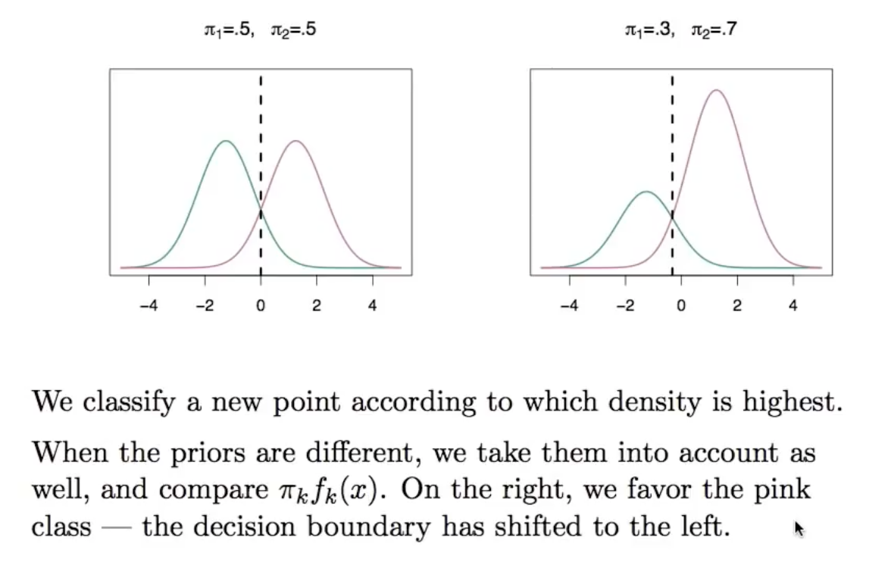
			- 绿色的线和红色的线都是 [[probability density function]] , 中间
			  中间的虚线是 [[decision boundary]], x轴为 $x$
			  如果 class1 $\pi_1$ 的 [[先验概率]] 和 class2 $\pi_2$ 都为0.5, 那么决策边界就在中间, 决策边界左边的classify as blue, 右边的classify as purple
		- 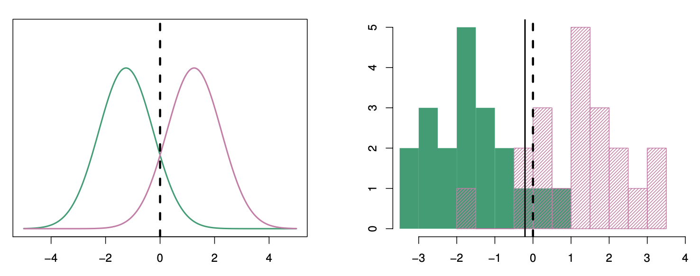
			- 左: 两个一维的正态密度函数, 坚直的虚钱代表贝叶斯决策边界. 
			  右: 分别来自两类 20 个观测的直方图
			  竖直的虚线为贝叶斯决策边界 [[decision boundary]] 
			  竖直的实线为且训练数据得到的 LDA决策估计边界, 说明分类效果相当不错
- Linear discriminant analysis when $p>1$ (多个预测变量)
  collapsed:: true
	- ==Procedure==
		- dataset (3 categories, 2 feature)
		  collapsed:: true
			- _20220403@2x_1649034993865_0.png){:height 253, :width 480}
			- _20220403@2x_1649035475629_0.png){:height 302, :width 479}
				- $\Sigma$: [[Covariance Matrix]] for variable 1 and 2
				  $\mu_{11}$: mean for variable 1 for category 1
				  $\mu_{12}$: mean for variable 1 for category 2 ...
			- use plugin method (因为unknowable world的数据不知道, 只能用dataset的数据去估计, 也就是加hat)
				- _20220403@2x_1649035661388_0.png){:height 283, :width 442}
				- $\bar{X}$, $S$ : from sample dataset (knowable world)
				  $\mu$, $\Sigma$ : from population (unknowable world)
		- ((624a35fb-6413-4819-b374-1953165cece4))
		- according to ((6247a8cf-17cd-47c0-b3cb-58bca404aefa))
			- 下划线是 vector 是 dataset 里面的 row
			- $$
			  p_{k}(\underline{x})=
			  \frac{f_{k}(\underline{x}) \pi_{k}}{\sum_{i=1}^{i=3} f_{i}(\underline{x}) \pi_{i}} =
			  \frac{\frac{1}{(\sqrt{2 \pi})^{p}|\Sigma|^{1 / 2}} e^{-\frac{1}{2}\left(\underline{x}-\underline{\mu}_{k}\right)^{T} \Sigma^{-1}\left(\underline{x}-\underline{\mu}_{k}\right)} \pi_{k}}{\sum_{i=1}^{i=3} \frac{1}{(\sqrt{2 \pi})^{p}|\Sigma|^{1 / 2}} e^{-\frac{1}{2}\left(\underline{x}-\underline{\mu}_{i}\right)^{T} \Sigma^{-1}\left(\underline{x}-\underline{\mu}_{i}\right)} \pi_{i}}
			  $$
			- cancel common terms
			- $$
			  p_{k}(\underline{x})=\frac{e^{-\frac{1}{2}\left(\underline{x}-\underline{\mu}_{k}\right)^{T} \Sigma^{-1}\left(\underline{x}-\underline{\mu}_{k}\right)} \pi_{k}}{\sum_{i=1}^{i=3} e^{-\frac{1}{2}\left(\underline{x}-\underline{\mu}_{i}\right)^{T} \Sigma^{-1}\left(\underline{x}-\underline{\mu}_{i}\right)} \pi_{i}}
			  $$
			- $$
			  n_{k}(\underline{x})=e^{-\frac{1}{2}\left(\underline{x}-\underline{\mu}_{k}\right)^{T} \Sigma^{-1}\left(\underline{x}-\underline{\mu}_{k}\right)} \pi_{k}
			  $$
			- then normalize $n_{k}(\underline{x})$ (add up to 1, mean 可以不是 0, sd可以不是1), 取最大的
			- 判别函数 (discriminant function) (也是linear function)
				- $$
				  \delta_{k}(x)=x^{T} \boldsymbol{\Sigma}^{-1} \mu_{k}-\frac{1}{2} \mu_{k}^{T} \boldsymbol{\Sigma}^{-1} \mu_{k}+\log \pi_{k}
				  $$
	- example from ISLR
	  collapsed:: true
		- The dashed lines is the [[bayes decision boundary]], which would yield the ==fewest== misclassification errors among all possible classifiers
		- 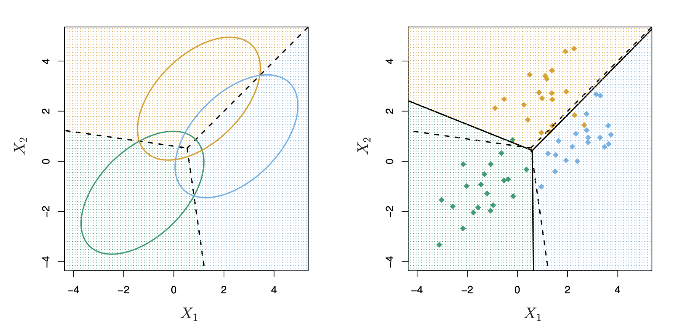
			- p = 2, K = 3, $\pi_1 = \pi_2 = \pi_3 = 1/3$, 每一类的观测服从一个均值不同, [[协方差矩阵]] 相同的多元高斯分布
			  左图: Ellipses that contain 95 % of the probability for each of the three classes are shown, 虚线是 [[bayes decision boundary]]
			  右图: 黑色实线表示LDA决策边界, 错误率很低, 说明LDA 准确率很高
- [[CheatSheet/R]] LDA example 1 (without `lda()`)
  collapsed:: true
	- dataset
	  collapsed:: true
		- admission.csv, predict if a new applicant with GPA 3.21 and GMAT 497 points should be admitted
	- read the data
	  collapsed:: true
		- collapsed:: true
		  ```r
		  library(MASS) #lda(), qda()
		  d0 = read.csv("admission.csv", header=T)
		  str(d0)
		  n = 85
		  d1 = d0
		  d1$decision = factor(d1$decision)
		  levels(d1$decision) = c("admit", "deny", "border")
		  head(d1)
		  ```
			- _20220403@2x_1649036968294_0.png)
			- _20220403@2x_1649037042168_0.png)
	- plot the data
	  collapsed:: true
		- collapsed:: true
		  ```r
		  # new applicant
		  newval = data.frame (gpa = 3.21, gmat = 497)
		  #
		  plot(gmat~gpa, d0,col=decision,pch=19,cex=0.7)
		  points(gmat~gpa, newval,col="blue" ,cex = 1,pch=19)
		  legend(2.1,700, legend=c ("admit", "deny", "border"),
		  		col=c("black", "green", "red"), lty = rep(1,3),cex=0.5)
		  ```
			- _20220403@2x_1649037129591_0.png)
	- produce the mean, category number count, and [[Covariance Matrix]]
	  collapsed:: true
		- means and number
		  collapsed:: true
			- collapsed:: true
			  ```r
			  dmeans = aggregate(cbind(gpa,gmat) ~ decision,data=d1,mean)
			  dmeans
			  ```
				- _20220403@2x_1649037657912_0.png)
				- _20220403@2x_1649037672198_0.png)
		- covariance matrix for each category
		  collapsed:: true
			- ```r
			  admit = d1[d1$decision=="admit",c(2,3)]
			  s1 = cov(admit)
			  deny = d1[d1$decision=="deny",c(2,3)]
			  s2 = cov(deny)
			  border = d1[d1$decision=="border",c(2,3)]
			  s3 = cov(border)
			  ```
		- pooled (average) covariance matrix (because each category has different counts)
		  collapsed:: true
			- collapsed:: true
			  ```r
			  v=((n1-1)*s1+(n2-1)*s2+(n3-1)*s3)/(n1+n2+n3-3)
			  vinv = solve(v) # inverse of the matrix
			  ```
				- _20220403@2x_1649037971627_0.png)
	- compare different groups
	  collapsed:: true
		- distance to center of admitted students
		  collapsed:: true
			- _20220403@2x_1649038185936_0.png)
		- distance to center of denied students
		  collapsed:: true
			- _20220403@2x_1649038232398_0.png)
	- produce posterior probabilities
	  collapsed:: true
		- _20220403@2x_1649038283016_0.png)
- [[CheatSheet/R]] LDA example 1 (with `lda()`)
  collapsed:: true
	- Build the model
	  collapsed:: true
		- collapsed:: true
		  ```r
		  prop.table(table(d1$decision))
		  m1 = lda(decision~., d1)
		  ```
			- _20220403@2x_1649038765717_0.png)
	- Predict
	  collapsed:: true
		- collapsed:: true
		  ```r
		  pred1 = predict(m1, d1)
		  pred1$posterior[1:5, ]
		  pred1$class
		  ```
			- _20220403@2x_1649038947501_0.png)
	- Confusion matrix
	  collapsed:: true
		- _20220403@2x_1649039015252_0.png)
	- predict new data
	  collapsed:: true
		- _20220403@2x_1649039034524_0.png)
- [[CheatSheet/R]] LDA and QDA example 2
  collapsed:: true
	- dataset
	  collapsed:: true
		- wine dataset: 13 constituents on 3 categories of 178 wines
	- read the data
	  collapsed:: true
		- collapsed:: true
		  ```r
		  #install. packages("HDclassif")
		  library (HDclassif) # wine dataset
		  library(ggplot2)
		  library (tibble)
		  library (tidyr)
		  library (dplyr)
		  #
		  data (wine)
		  names (wine) ‹- c ("Class", "Alco", "Malic", "Ash", "Alk", "Mag",
		  "Phe", "Flav" "Non_flav", "Proan", "Col",
		  "Hue", "OD", "Prol")
		  d0 = wine
		  wine$Class <- as.factor (wine$Class)
		  wineTib = as.tibble(wine)
		  ```
			- _20220403@2x_1649040385730_0.png)
			- _20220403@2x_1649040505774_0.png)
	- convert to lone (untidy formate)
	  collapsed:: true
		- collapsed:: true
		  ```r
		  wineUntidy < - gather (wineTib,
		  		"Variable", "Value" - Class)
		  wineUntidy
		  ```
			- _20220403@2x_1649040476294_0.png)
	- plot the data
	  collapsed:: true
		- ```r
		  ggplot(wineUntidy, aes(Class, Value)) +
		  	facet_wrap(~ Variable,
		  				scales = "free_y") +
		  		geom_boxplot()+
		  		theme_bw()
		  ```
			- _20220403@2x_1649040572494_0.png)
	- LDL
	  collapsed:: true
		- build model
		  collapsed:: true
			- _20220403@2x_1649040650658_0.png)
			- _20220403@2x_1649040665208_0.png)
			- _20220403@2x_1649040689733_0.png)
		- Predict
		  collapsed:: true
			- _20220403@2x_1649040747773_0.png)
			- _20220403@2x_1649040757491_0.png)
		- plot LD1 and LD2
		  collapsed:: true
			- _20220403@2x_1649040794498_0.png)
			- _20220403@2x_1649040810315_0.png)
			- _20220403@2x_1649040846461_0.png)
	- QDA
	  collapsed:: true
		- build model
		  collapsed:: true
			- _20220403@2x_1649040876485_0.png)
			- _20220403@2x_1649040886379_0.png)
- [[LDA]] VS [[QDA]]
  collapsed:: true
	- 图解
	  collapsed:: true
		- 左图中, 两个类 $X_1, X_2$ 有相同的相关系数 0.7, 并服从高斯分布, 因此 [[bayes decision boundary]] 是线性的, 并且被LDA的决策边界逼近, 而QDA次之, 因为其方差较大而偏差没有得到相应的减小
		- 右图中, 橙色部分是变量之间相关系数为0.7的类, 蓝色部分是变量之间的相关系数为-0.7的类, 此时的 [[bayes decision boundary]] 是二次的, QDA更接近
		- 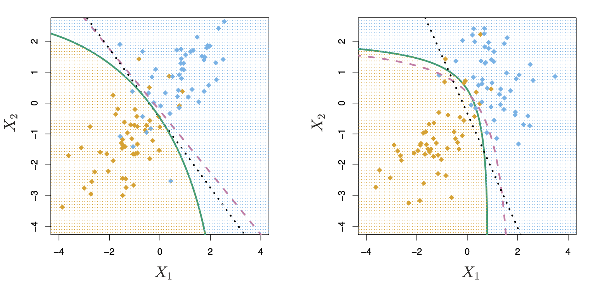{:height 311, :width 627}
			- 左: $\Sigma_1 = \Sigma_2$ 时两类分类问题的贝叶斯 (紫色虚线) LDA (黑色点线), QDA (绿色实线) 的决策边界
			  右: $\Sigma_1 \neq \Sigma_2$
	- When we use [[LDA]], when we use [[QDA]]?
	  collapsed:: true
		- This is a [[bias-variance tradeoff]] problem
			- 当有p个预测变量的时候, [[Covariance Matrix]] 需要 $p(p+1)/2$个参数, 
			  QDA需要对每一类分别估计协方差, 需要 $Kp(p+1)/2$ 个参数 (K为class个数)
			  LDA 有 $Kp$ 个线性系数需要估计
			- LDA 没有 QDA 分类器光滑, 有更低的方差
			- 训练集大用QDA, 观测数据方差大用QDA
	- ==For both method, scaling is not needed, only numerical predictors, and no hyperparameters==
	- [[LDA]]
		- 需要 assume $(p*p)$ dimensional [[Covariance Matrix]]
		- 判别函数LDA是线性
		- only learn linear decision boundaries
	- [[QDA]]
		- 需要 assume $K(p*p)$ dimensional [[Covariance Matrix]]
		- 判别函数QDA是二次函数
		- able to learn nonlinear decision boundaries
- [[LDA]] VS [[logistic regression]]
  collapsed:: true
	- Difference between [[logistic regression]] and [[LDA]]
	  collapsed:: true
		- In [[logistic regression]] , we model $P(Y= class_k|X = data_x)$ (the probability of each class, given a data point), 也就是给定预测变量X下, 建立响应变量Y的条件分布模型
		- In LDA, we model $P(X = data_x| Y = class_k)$ . 也就是分别对每种响应分类 (给定的Y) 建立预测变量X的分布模型, 然后运用 [[bayes theorem]] 反过来估计 
		  $P(Y= class_k|X = data_x)$
		- 逻辑回归: 二分类
		  LDA: 多分类
	- Why LDA?
	  collapsed:: true
		- 类别区分度高的时候, [[logistic regression]] 的参数估计不够稳定, 这点在 [[LDA]] 中不存在
		- 如果样本量n比较小, 而且在每一类响应分类中预测变量 X 近似服从正态分布, 那么LDA比logistic regression模型更稳定
		- 响应分类Y多于两类的时候, LDA更普遍
- [[PCA]] VS [[LDA]]
  collapsed:: true
	- LDA是一种监督学习的降维技术, PCA focuses with the variance, The LDA is like PCA, but focuses on maximizing the seperatibility among known categories
	- Both rank the new axes in order of importance
		- PC1 (the first new axis that PCA creates) accounts for the most variation ==in the data==.
		  collapsed:: true
			- PC2 (the second new axis) does the second best job...
		- LD1 (the first new axis that LDA creates) accounts for the most variation ==between the categories==.
		  collapsed:: true
			- LD2 (the second new axis) does the second best job...
			- 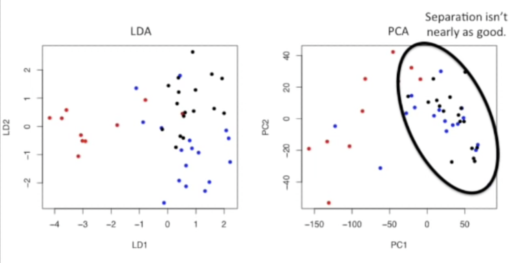
	- _20220403@2x_1649027238396_0.png)
- [[naive bayes classifier]] VS [[LDA]] and [[QDA]]?
  collapsed:: true
	- No scaling is needed
	- for naive bayes
		- features may be categorical variables
		- features are conditionally independent
	- for LDA and QDA
		- All features are numeric
		- features are [[MVN distribution]]
		- features are not independent
- ---
- What is [[sensitivity]] and [[specificity]] (class-specific preformance)
  collapsed:: true
	- Confusion matrix
		- 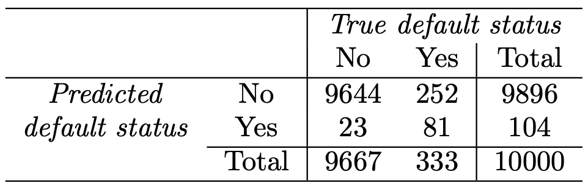
		- LDA预测了104个人会发生违约, 但是事实上只有81人违约, 23人并没有违约, 信用卡公司的目标是辨别出高风险人群, 但是违约人群 252/333 = 75.7% 的错误率太高了
		- sensitivity = 81/(81+252) = 24.3%, specificity = 9644/(9644+23) = 99.8%
	- 为什么 LDA的[[sensitivity]] 那么低?
		- 因为LDA和所有分类器中错误率最低的贝叶斯分类器 (前提是高斯分布假设) 很相似, 也就是说贝叶斯分类是在不考虑错误来源时, 产生的被错误分类的观测数是最少的.
		- 如何改进?
		  collapsed:: true
			- [[贝叶斯分类器]] 的原理是将观测分入后验概率 $p_k(x)$ 最大的一类中, 在两类情况中, 如果 $Pr(default = Yes | X = x)>0.5$ 那么就将观测分入违约的一组, 这里采用的是 50% 作为后验违规概率的阈值, 
			  如果现在关心的是错误的将违约者判为未违约的概率, 可以考虑降低阈值, 比如可以将后验违约概率在 20%以上的人纳入违约的一组, 也就是说 
			  $Pr(default = Yes | X = x)>0.2$
			- 改进之后的 confusion matrix
				- 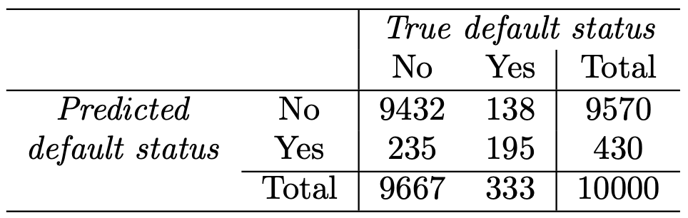
				- 此时sensitivity = 195/(138+195) = 58.6%, specificity = 9432/(9432+235) = 97.6%
				- sensitivity 有所增长, 但是代价是 235个人错误分类, 总的错误率增涨了3.73%
		- Threshold VS Error Rate
		  collapsed:: true
			- 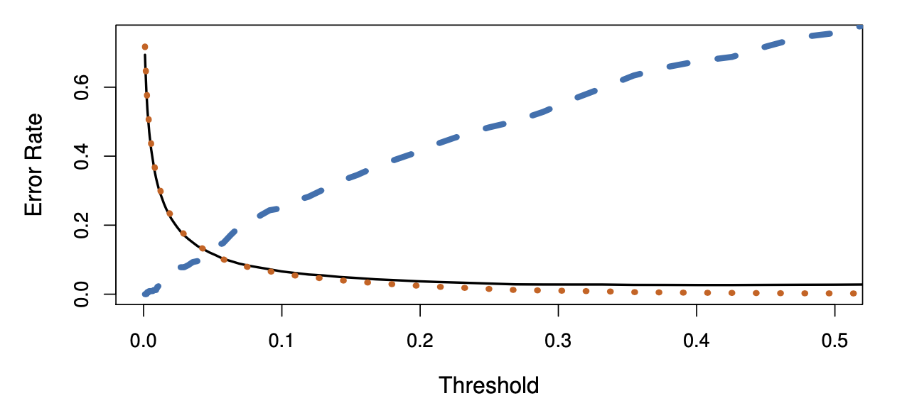
			- 黑色实线: 总的错误率, 蓝色虚线: 违约者被错误分类的比例, 橙色的点: 没有违约者被错误分类的比例
			- 因为 [[贝叶斯分类器]]所用的阈值为0.5, 所以错误率最低, 但是阈值为0.5时, 违约者的错误率是最高的
- What is [[ROC]] ?
- What is [[quadratic discriminant analysis]] ?