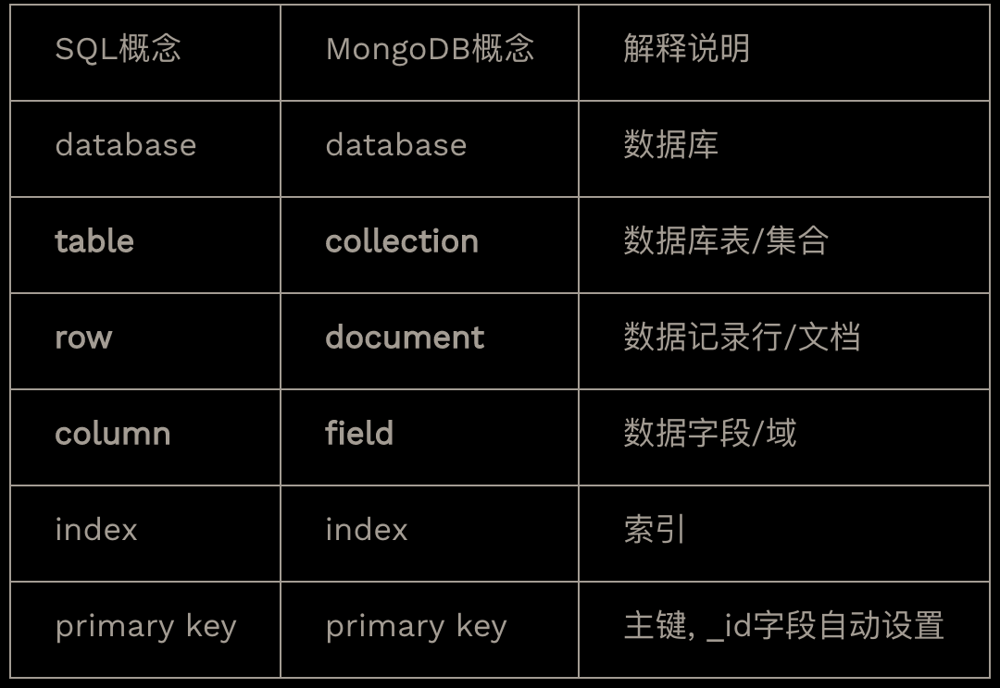

- # Fucking Pitfalls
	- 需要安装pymongo[srv]
	- 密码和用户名不能有特殊字符, 需要用urllib解析
		- ```python
		  import urllib
		  password = urllib.parse.quote('YOUR PASS WORD')
		  
		  ```
	- pymongo.errors.ServerSelectionTimeoutError: connection closed
		- `Your Mongo cluster -> Security -> Network Access -> IP Whitelist -> Add IP Address` 添加ip地址, 0.0.0.0/0 为所有人
	- OperationFailure: bad auth : Authentication failed.,
		- 新创建一个user, 给admin, 再试一下
- 和SQL概念对比
	- {:height 251, :width 527}
	-