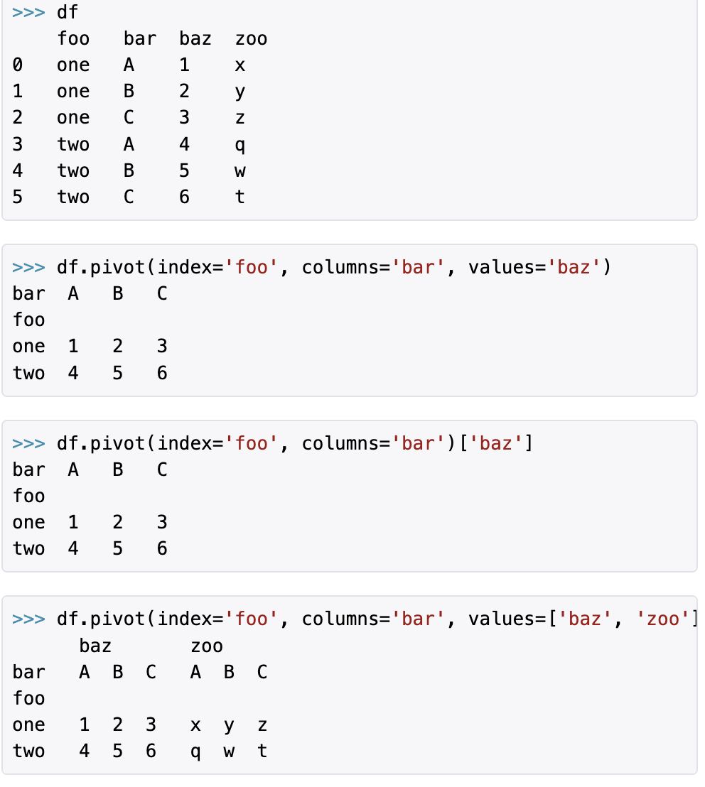

language:: Python
type:: package

-
- Median
	- `melt` multiple columns -> single column
	  collapsed:: true
		- syntax
			- ```python
			  df.melt(id_vars=None, value_vars=None,
			  		var_name=None, value_name='value', col_level=None)
			  
			  id_vars = None # ID columns (not to be modified)
			  value_vars = None # Columns to unpivot (if not specified, all columns secept ID columns will be used)
			  var_name = None # Name for new variable column
			  value_name = 'value', # Name for new value column
			  col_level = None #used for multiIndex columns
			  ignore_index = True # retain original index
			  ```
		- example
		  collapsed:: true
			- _20220403@2x_1649025427333_0.png)
	- `pivot` key-value rows -> columns
	  collapsed:: true
		- syntax
		  collapsed:: true
			- ```python
			  df.pivot(index=None, columns=None, values=None)
			  
			  index # column to use for new df index
			  columns # columns to use to get new column names
			  values # columns to use to get new values
			  ```
		- example
		  collapsed:: true
			- 
	- `groupby` aggregation
	  collapsed:: true
		- example
			- _20220403@2x_1649026238813_0.png)
	- `split` split a single variable into multiple
	- `combine` merge two columns into one