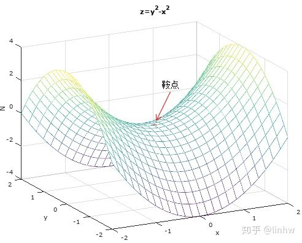

alias:: Partial Derivatives, 偏导数

- $z = f(x, y)$(一个面)
  偏导数为函数在每个位置处沿着自变量 (x或者y) 坐标轴方向上的导数, 也就是固定x或者y, 把曲面切开之后那一点的切线斜率.
  note: 
  $\frac{\partial f}{\partial x}$ **y为常数**
  $\frac{\partial f}{\partial y}$ **x为常数**
  [偏導數 - YouTube](https://www.youtube.com/watch?v=JQ4lSc48QCw)
- 当函数在某点的所有偏导数为0时, 该点为函数的极值点或者鞍点
	- 