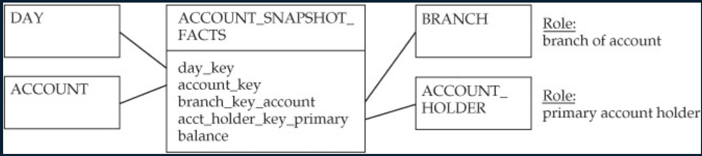

alias:: 周期快照事实表, periodic fact, periodic facts, periodic fact table, snapshot fact table

- **Definition**
	- Periodic updates on the status of events (balance statement type structure), 周期快照事实表以具有规律性的, 可预见的时间间隔来记录事实.
	- Capture the **effect** of a series of time
		- Effects are called status measurements
		- Account balances, inventory levels, etc.
- **Grain**
	- 时间间隔如每天, 每月, 每年 of individual transactions and records
- **Properties**
	- If there are no transactions in a given period, a new row ==must== be inserted into
	  table, even if it is a null
	- 一旦插入不能更改, 增量更新
	- unlike [[Transaction fact table]], a snapshot tends to be very dense
	- Balance or level measurements in a periodic snapshot are usually ==semi-additive==; it does not make sense to sum them across snapshot periods. In some cases, they may be non-additive.
- **Usage**
	- Status measurements can often be constructed from transaction history, but that is often inefficient and impractical
	- Storing status measurements in a transaction table is generally not a good practice
	- Sometimes transactions are not stored at all (due to size or long date history)
	- Some status-oriented measurements do not correspond to transactions at all
	- Facts are usually [[Semi-Additive fact table]] ==(cannot be aggregated across time)==
- example
	- 仓库每天会定时进行数据快照, 用以统计目前仓库的货物存量记录, 销售日快照表, 库存日快照表等.
	- cash on had, inventory levels, accounts payable metrics, etc.
	- 