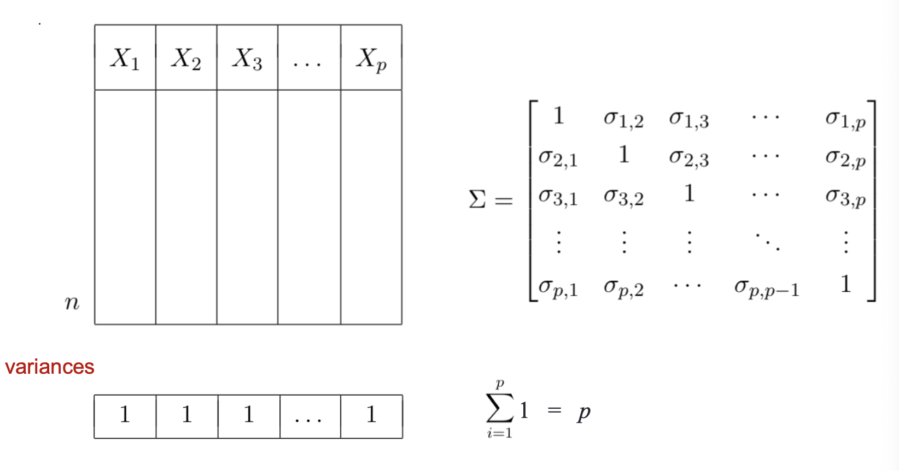

alias:: PCA, principal components, principal components applications, 主成分分析, principal component analysis

- # Note
	- **What is principal components?** #recall
	  collapsed:: true
		- The set of original variables are transformed into a set of new variables called principal components, 将原来高维的数据投影到某个低维的空间上并使得其方差尽量大, also called dimensional reduction. 数据降维, 在不丢失很多信息 (variance) 的情况下.
		- It is the **transformation** to explain the variance-covariance structure of the variables, The transformation is a set of **linear combinations** of the variables
		- **A linear combination of a set of variables or a new set of variables**
			- original variables:
			  $$
			  X =[X_{1}, X_{2}, \ldots, X_{p}]
			  $$
			- new set of variables
				- $$
				  \begin{aligned}
				  Z_{1} &=a_{11} X_{1}+a_{12} X_{2}+\cdots+a_{1 p} X_{p} \\
				  Z_{2} &=a_{21} X_{1}+a_{22} X_{2}+\cdots+a_{2 p} X_{p} \\
				  \vdots & \\
				  Z_{p} &=a_{p 1} X_{1}+a_{p 2} X_{2}+\cdots+a_{p p} X_{p}
				  \end{aligned}
				  $$
	- **What is the preparation of PCA?** #recall
	  collapsed:: true
		- Centered data (_vector with mean zero_)
		  background-color:: #793e3e
			- Principal components always on centered data (**也就是每列加起来的平均值是0**)
			- 找到各个特征的平均值(质心 center), 把数据整体平移至质心(center)与坐标原点重合, 整体平移之后, 样本之间的相对位置不变
			- center $x$
				- $x_{new} = x - \bar{x}$
				- ```r
				  z = scale(df, center = T, scale = F)
				  ```
		- Scaled data (_vector with sdev one_)
		  background-color:: #793e3e
			- 如果其中某一个特征的数值特别大, 那么它在整个误差计算的比重上就很大, 投影到低维空间后会丧失很多信息(比较小的数据). 中心化的目的是防止过分捕捉数值大的特征, 使得大小都在相同的范围内
			- scale $x$
				- $x_{new} = \frac{x}{\sigma}$
				- ```r
				  z = scale(df, center = F, scale = T)
				  ```
			- center and scale $x$
				- $x_{new} = \frac{x-\hat{x}}{\sigma}$
				- ```r
				  z = scale(df)
				  ```
		- Total variability of a data set
			- the total variability of a data set is the same no matter what coordinate system is used
	- **What are the two ways to define total variability?** #recall
	  collapsed:: true
		- Total variability (X, Y)
			- 1. Variance of X + variance of Y
			- 2. [[Determinant]] of [[Covariance Matrix]] of (X, Y)
		- Total variability $(X_1, X_2,...,X_p)$
			- 1. Variance of $X_1$ + ... + Variance of $X_p$
			- 2. Determinant of covariance matrix
	- **How to compute principal components? (linear algebra)** #recall
	  collapsed:: true
		- 1. First of all, the data should be centered
		- 2. Secondly, compute the variance of each column
		- 3. Thirdly, compute the [[covariance matrix]] (sum of the variance is the sum of diagonal axis)
		- 4. Then, compute the [[Eigenvalue]] $\lambda_1,...,\lambda_p$ and [[Eigenvector]] $\overrightarrow{e_1}, ..., \overrightarrow{e_p}$ (size of each eigenvector is p) of the [[covariance matrix]], 下图右边的又叫 [[rotation matrix]] ($R$)
			- also, total variance is sum of the eigenvalues
			  $$
			  \sum_{i=1}^{p} \sigma_{i}^{2} = \sum_{i=1}^{p} \lambda_{i}
			  $$
			- 
				- 特征值, 特征向量性质: 
				  $$
				  \begin{gathered}
				  (\sum-\lambda_i I) \overrightarrow{e_i}=\overrightarrow{0}
				  \end{gathered}
				  $$
		- id:: 61ff865b-9579-463c-b4ae-0a5ed47d234a
		  5. The principal component can be found by using $$PC = XR$$, $R$ is the rotational matrix
			- 
			- The PC in the row i can be found using [[Eigenvalue]]
				- {:height 325, :width 330}
				- $$
				  \begin{aligned}
				  P C_{1 i} &=e_{11} X_{1 i}+e_{12} X_{2 i}+\cdots+e_{1 p} X_{p i} \\
				  P C_{2 i} &=e_{21} X_{1 i}+e_{22} X_{2 i}+\cdots+e_{2 p} X_{p i} \\
				  \vdots & \\
				  P C_{p i} &=e_{p 1} X_{1 i}+e_{p 2} X_{2 i}+\cdots+e_{p p} X_{p i}
				  \end{aligned}
				  $$
		- The Covariance Matrix of PCs
		  id:: 62005790-7627-4b8a-a903-63e98e88dadf
			- {:height 213, :width 197}
			- $$
			  \Lambda=\left[\begin{array}{lll}
			  \lambda_{1} & & 0 \\
			  & \ddots & \\
			  0 & & \lambda_{p}
			  \end{array}\right]
			  $$
			- id:: 62005b4f-65a0-4827-815d-d4757023b485
			  $$
			  S \text{(total variability)}=\sum_{i=1}^{p} \sigma_{i}^{2}=\sum_{i=1}^{p} \lambda_{i}
			  $$
			- id:: 620076fd-7987-49f6-b7c3-2f434989855d
			  $$PVE \text{(proportion of variance explained by PCs)} = \frac{\lambda_i}{S}$$
			-
		- If the data is centered and scaled
			- {:height 245, :width 448}
			- {:height 283, :width 452}
			-
	- **How to compute principal components (optimization)?** #recall
	  collapsed:: true
		- for each [[Eigenvector]] $\overrightarrow{e_i}$, $e_{i 1}^{2}+e_{i 2}^{2}+\cdots+e_{i p}^{2}=1$
			- 
		- To find the first PC, solve
			- $$
			  \max _{e_{11}, \ldots, e_{1 p}} \frac{1}{n} \sum_{i=1}^{n} P C_{1 i}^{2} \quad \text { st. } \sum_{i=1}^{p} e_{1 j}^{2}=1
			  $$
			- 也就是
			- $$
			  \begin{array}{r}
			  \max _{e_{11}, \ldots, e_{1 p}} \frac{1}{n} \sum_{i=1}^{n}\left(e_{11} X_{1 i}+e_{12} X_{2 i}+\cdots+e_{1 p} X_{p i}\right)^{2} \\
			  \text { st. } \sum_{i=1}^{p} e_{1 j}^{2}=1
			  \end{array}
			  $$
		- 前提条件
			- Data X must be centered
			- centering does not change data variance
			- A data vector X ia
				- centered if $\bar{X} = 0$
				- scaled if $Var(X) = 1$
	- **Facts of principal components** #recall
	  collapsed:: true
		- principal components are found from centered dataset X, **always**.
		- [[Eigenvalue]] and principal components are sorted **descending** always.
		- Should scale the dataset if individual columns have different range
		- Principal components from scaled and unscaled dataset X are different
		- Principal components _finds new axes that max the variance_ in the data
		- $PC_1$ captures the most total variance
		- $PC_2$ captures the most of the remaining variance while orthogonal to $PC_1$
		- [[Eigenvalue]] are the variance of the PCs
	- **Example of Forbes data (simple)** #recall
	  collapsed:: true
		- [[CheatSheet/R]] [[PCA]]
			- 
			- Principal components - centered only
				- use `read.table` 因为不是csv
					- ((62006402-e21f-46a3-8f8a-88e3bb943bea))
					- ((620068b7-6fc0-4768-b56f-eec471de5774))
				- use `prcomp` (默认不scale) to perform [[PCA]], 各个参数意义
					- ((620064f1-cea0-496d-b3fc-ee95d7988be5))
					- matrix with [[Eigenvector]], 也就是 [[rotation matrix]], 这里列出了$\overrightarrow{e_1}, \overrightarrow{e_2}$
						- ((62006778-8ec2-4123-83ab-2777073b6c0f))
					- transformed data set (score vectors) $Z_{ij}$ (也就是[[principal component]]) (包含$PC_1, PC_2$)
					  id:: 62006760-81e9-4395-a528-7ed5d40155c3
						- ((620067a0-3db6-47fb-83b9-482670704a53))
					- square root of [[Eigenvalue]]
						- `pr1$sdev`
					- [[Eigenvalue]] of [[Covariance Matrix]] of centered data
						- ((620066d3-46a8-46ea-8cab-21e7903d2b4e))
					- center: col means of original -uncentered- data
						- ((62006836-d94e-400d-b622-ac5c1e9dd6d6))
				-
			- original data VS centered data, compare column variance (same!)
				- 
			- multiply centered data by matrix of [[eigenvectors]], 也就是 [[rotation matrix]], 得到 ((62006760-81e9-4395-a528-7ed5d40155c3))
			  ref: ((61ff865b-9579-463c-b4ae-0a5ed47d234a))
				- 
			- covariance matrix of $PC_1, PC_2$ ($\Lambda$) is diagonal matrix with eigenvalues lambda in main diagonal, showing that $PC_1, PC_2$ are uncorelated
				- ((62005790-7627-4b8a-a903-63e98e88dadf))
				- 
					- ((62005b4f-65a0-4827-815d-d4757023b485))
			-
	- **Principal components applications** #recall
	  collapsed:: true
		- Data Visualization
		- Principal components regression
		- Clustering
		- [[Multicollinearity]] prevention, (因为降维了)
		- Outliers identification
	- **Example of Banknotes data (use for cluster)** #recall
	  collapsed:: true
		- [[CheatSheet/R]] [[PCA]]
			-  from R library `mclust`, 
			  100 banknotes are genuine, 100 are counterfeit
			  required libraries: `mcclust`, `GGally` `factoextra`
			- Data summary
				- ((62007a74-7715-43ec-a0d2-5b79fb34f446))
			- Plot `ggpairs`, 对角线是 [[kernel density estimator]], see which variables are good estimator (Diagonal, Bottom...), see overlapping scatter plot (Top & Diagonal, Right & Diagonal, Bottom & Top...)
				- ((62007aa7-904a-4ead-a332-85108b1cbb7d))
			- Use `prcomp`
				- ((62007bcb-7fa3-4679-aca0-1265254a073b))
				- ((62008323-be45-405a-a61b-b4e7affed8b6)) is the square root of [[eigenvalues]]
			- [[Eigenvalue]] can be produced by ((620081e0-a9c4-44f0-9b83-ce7b2931067c))
				- Plot [[eigenvalues]]
					- {:height 280, :width 371}
					- or
					- {:height 294, :width 372}
			- [[Eigenvector]] can be produced by ((62008206-c59b-4eb7-944d-a23d67df05dc)) ([[rotation matrix]])
				- ((6200839d-5087-4766-b194-10e658b14525))
				- this is the **PC Defining equations**
					- $$
					  \begin{aligned}
					  P C_{1} &=0.007 \text { Length }-0.47 \text { Left }+\cdots+0.493 \text { Diagonal } \\
					  P C_{2} &=-0.815 \text { Length }-0.34 \text { Left }+\cdots-0.27 \text { Diagonal } \\
					  \vdots & \\
					  P C_{6} &=0.03 \text { Length }-0.297 \text { Left }+\cdots-0.63 \text { Diagonal }
					  \end{aligned}
					  $$
			- [[transformed data]] can be produced by ((620082dc-3919-4e37-9d34-926597bb83c7))
			- variance ratios can be produced by ((62008417-d28f-4d9a-9771-29aa0ce614bf)) (summary 让pca增加了一个 _importance_ list)
			  ((620076fd-7987-49f6-b7c3-2f434989855d))
				- 
				- 
			- compute the [[Covariance Matrix]] between transformed variables $PC_s$ and original variables $X_s$ ((62008742-5fe6-403f-b379-4b62cd8951a8)) ((6200872a-6645-4977-a53e-841df3f07284))
			- use [[Covariance Matrix]] 作图
				- 
				-
			- use [[Eigenvector]] 作图(arrow) with [[transformed data]] (scatter) (Biplot)
				- 
				- 
				-
			- Plot PC scores
				- ((62008d1e-4e92-4a6e-949d-a30b116f2524))
				- ((62008d40-2017-4cad-a0c2-dc285df1bcf2))