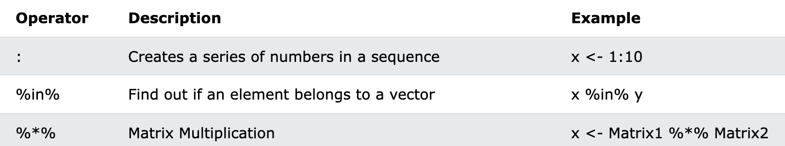
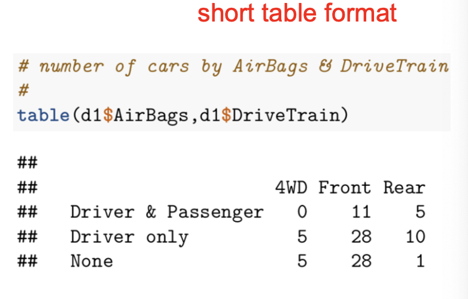
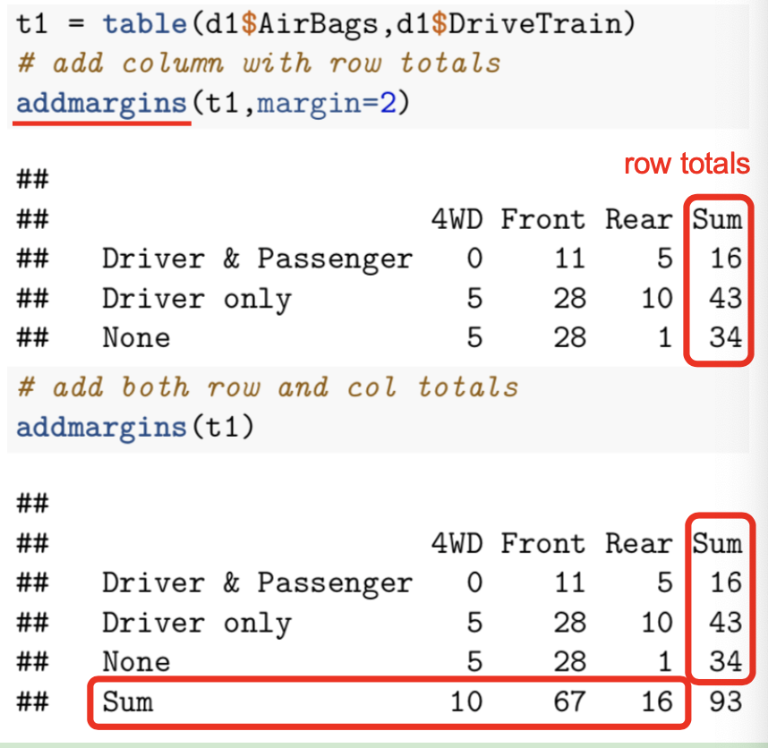
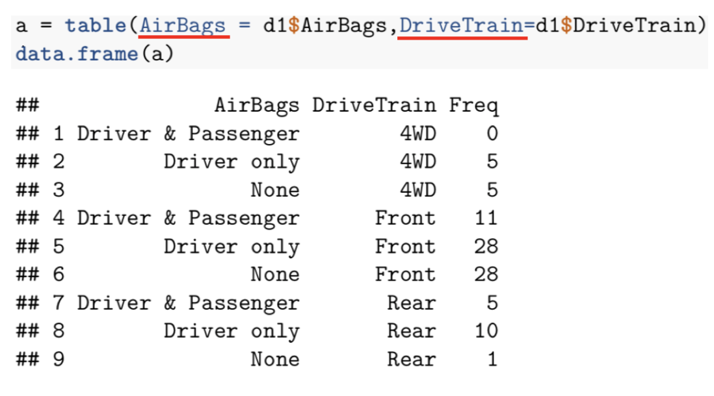
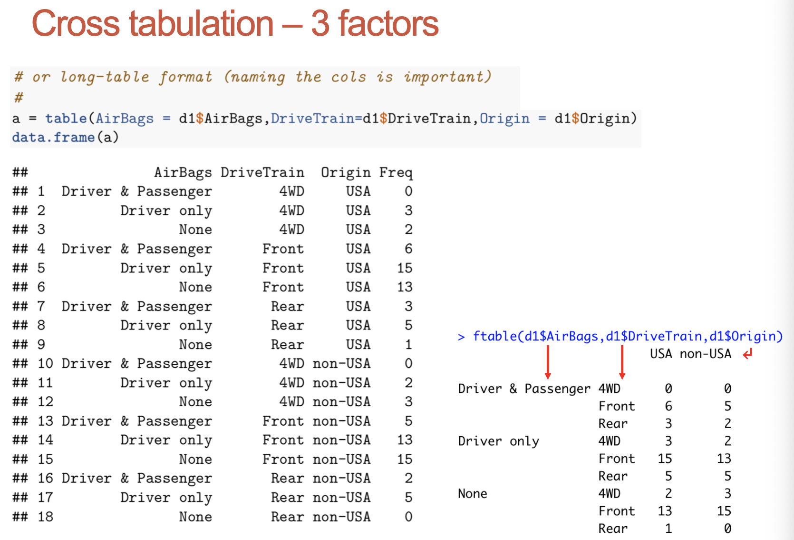
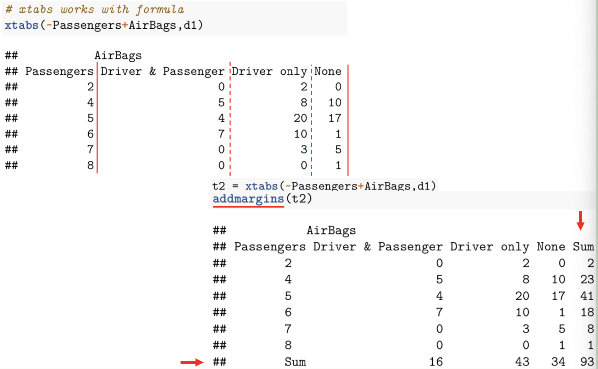
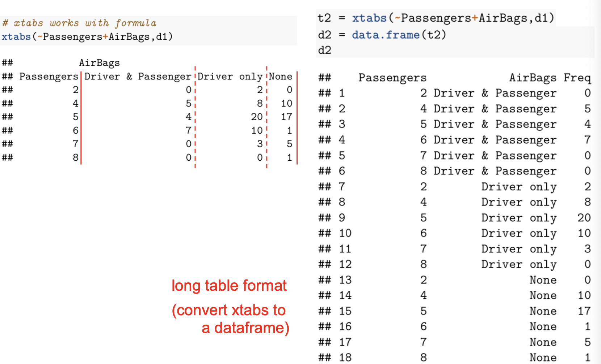
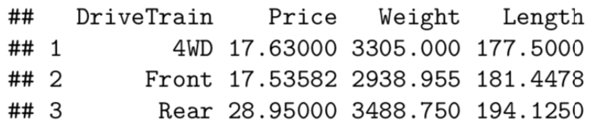
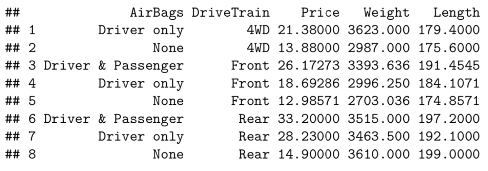

- {{renderer :tocgen, [[]], 2}}
-
- Packages
	- [[tidyverse]]
	- [[CheatSheet/data.table]]
	- [[CheatSheet/tibble]]
- basic
	- 基本语法
	  collapsed:: true
		- ## **Data Types**
		  collapsed:: true
			- numeric - (10.5, 55, 787)
			- integer - (1L, 55L, 100L, where the letter "^^L^^" declares this as an integer)
			- complex - (9 + 3i, where "i" is the imaginary part)
			- character (a.k.a. string) - ("k", "R is exciting", "FALSE", "11.5")
			- logical (a.k.a. boolean) - (TRUE or FALSE)
		- ## **Type Conversion**
		  collapsed:: true
			- `as.numeric(), as.interger(), as.complex()`
		- ## **Round up and Round down**
		  collapsed:: true
			- The `ceiling()` function rounds a number upwards to its nearest integer, and the `floor()` function rounds a number downwards to its nearest integer
		- ## **特殊操作符**
		  collapsed:: true
			- 
		- ## **IF**
		  collapsed:: true
			- ```r
			  a <- 33
			  b <- 33
			  
			  if (b > a) {
			    print("b is greater than a")
			  } else if (a == b) {
			    print ("a and b are equal")
			  }
			  ```
		- ## **While**
		  collapsed:: true
			- ```r
			  i <- 1
			  while (i < 6) {
			    print(i)
			    i <- i + 1
			    if (i == 4) {
			      break
			    }
			  }
			  ```
		- ## **For**
		  collapsed:: true
			- ```r
			  fruits <- list("apple", "banana", "cherry")
			  
			  for (x in fruits) {
			    if (x == "cherry") {
			      break
			    }
			    print(x)
			  }
			  ```
		- ## **Functions**
		  collapsed:: true
			- ```r
			  my_function <- function(x) {
			    return (5 * x)
			  }
			  
			  ```
	- 数据结构
	  collapsed:: true
		- ## **改变数据结构**
		  collapsed:: true
			- ```r
			  # 转换factor为numeric
			  data$x6=as.numeric(as.character(data$x6))
			  ```
		- ## **Vectors**
		  collapsed:: true
			- Create Vectors
				- ```r
				  # Vector of strings
				  fruits <- c("banana", "apple", "orange")
				  # Vector of numerical values
				  numbers <- c(1, 2, 3)
				  # Vector with numerical values in a sequence
				  numbers <- 1:10
				  # Vector of logical values
				  log_values <- c(TRUE, FALSE, TRUE, FALSE)
				  ```
			- Vector length
				- ```r
				  # find out how many items a vector has
				  fruits <- c("banana", "apple", "orange")
				  length(fruits)
				  ```
			- Repeat Vectors
				- ```r
				  repeat_each <- rep(c(1,2,3), each = 3)
				  # 111222333
				  repeat_times <- rep(c(1,2,3), times = 3)
				  # 123123123
				  numbers <- seq(from = 0, to = 100, by = 20)
				  # 0  20  40  60  80 100
				  ```
			- Access Vectors
				- ```r
				  fruits <- c("banana", "apple", "orange", "mango", "lemon")
				  # Access the first item (banana)
				  fruits[1]
				  # Access the first and third item (banana and orange)
				  fruits[c(1, 3)]
				  # Access all items except for the first item
				  fruits[c(-1)]
				  # Change "banana" to "pear"
				  fruits[1] <- "pear"
				  ```
		- ## **Lists**
		  collapsed:: true
			- Create Lists
				- ```r
				  # List of strings
				  thislist <- list("apple", "banana", "cherry")
				  ```
			- Check is item exists
				- ```r
				  thislist <- list("apple", "banana", "cherry")
				  
				  "apple" %in% thislist
				  ```
			- Append List
				- ```r
				  thislist <- list("apple", "banana", "cherry")
				  append(thislist, "orange", after = 2)
				  #Add "orange" to the list after "banana" (index 2):
				  ```
			- Remove Item
				- ```r
				  thislist <- list("apple", "banana", "cherry")
				  
				  newlist <- thislist[-1]
				  ```
			- Join Tow Lists
				- ```r
				  list1 <- list("a", "b", "c")
				  list2 <- list(1,2,3)
				  list3 <- c(list1,list2)
				  ```
		- ## **Matrices**
		  collapsed:: true
			- Create Matrices
				- ```r
				  # Create a matrix
				  thismatrix <- matrix(c(1,2,3,4,5,6), nrow = 3, ncol = 2)
				  #     [,1] [,2]
				  #[1,]    1    4
				  #[2,]    2    5
				  #[3,]    3    6
				  
				  thismatrix <- matrix(c("apple", "banana", "cherry", "orange"), nrow = 2, ncol = 2)
				  ```
			- Access Matrices
				- ```r
				  thismatrix <- matrix(c("apple", "banana", "cherry", "orange"), nrow = 2, ncol = 2)
				  #     [,1]     [,2]    
				  #[1,] "apple"  "cherry"
				  #[2,] "banana" "orange"
				  thismatrix[1, 2] #cherry
				  thismatrix[2,] #banana, orange
				  thismatrix[,2] #cherry, orange
				  
				  ### 选择多行
				  thismatrix <- matrix(c("apple", "banana", "cherry", "orange","grape", "pineapple", "pear", "melon", "fig"), nrow = 3, ncol = 3)
				  #     [,1]     [,2]        [,3]   
				  #[1,] "apple"  "orange"    "pear" 
				  #[2,] "banana" "grape"     "melon"
				  #[3,] "cherry" "pineapple" "fig" 
				  thismatrix[c(1,2),]
				  #     [,1]     [,2]     [,3]   
				  #[1,] "apple"  "orange" "pear" 
				  #[2,] "banana" "grape"  "melon"
				  ```
			- Add/Remove Rows and Columns
				- ```r
				  thismatrix <- matrix(c("apple", "banana", "cherry", "orange","grape", "pineapple", "pear", "melon", "fig"), nrow = 3, ncol = 3)
				  
				  newmatrix <- cbind(thismatrix, c("strawberry", "blueberry", "raspberry"))
				  #     [,1]     [,2]        [,3]    [,4]        
				  #[1,] "apple"  "orange"    "pear"  "strawberry"
				  #[2,] "banana" "grape"     "melon" "blueberry" 
				  #[3,] "cherry" "pineapple" "fig"   "raspberry"
				  newmatrix <- rbind(thismatrix, c("strawberry", "blueberry", "raspberry"))
				  #     [,1]         [,2]        [,3]       
				  #[1,] "apple"      "orange"    "pear"     
				  #[2,] "banana"     "grape"     "melon"    
				  #[3,] "cherry"     "pineapple" "fig"      
				  #[4,] "strawberry" "blueberry" "raspberry"
				  
				  #Remove the first row and the first column
				  thismatrix <- thismatrix[-c(1), -c(1)]
				  ```
			- Check if an Item Exists
				- ```r
				  thismatrix <- matrix(c("apple", "banana", "cherry", "orange"), nrow = 2, ncol = 2)
				  
				  "apple" %in% thismatrix
				  ```
			- Combine two matrices
				- ```r
				  # Combine matrices
				  Matrix1 <- matrix(c("apple", "banana", "cherry", "grape"), nrow = 2, ncol = 2)
				  Matrix2 <- matrix(c("orange", "mango", "pineapple", "watermelon"), nrow = 2, ncol = 2)
				  
				  # Adding it as a rows
				  Matrix_Combined <- rbind(Matrix1, Matrix2)
				  Matrix_Combined
				  #     [,1]     [,2]        
				  #[1,] "apple"  "cherry"    
				  #[2,] "banana" "grape"     
				  #[3,] "orange" "pineapple" 
				  #[4,] "mango"  "watermelon"
				  
				  # Adding it as a columns
				  Matrix_Combined <- cbind(Matrix1, Matrix2)
				  Matrix_Combined
				  #     [,1]     [,2]     [,3]     [,4]        
				  #[1,] "apple"  "cherry" "orange" "pineapple" 
				  #[2,] "banana" "grape"  "mango"  "watermelon"
				  ```
		- ## **Arrays**
		  collapsed:: true
			- Create Arrays
				- ```r
				  # arrays can have more than two dimensions.
				  # An array with one dimension with values ranging from 1 to 24
				  thisarray <- c(1:24)
				  thisarray
				  
				  # An array with more than one dimension
				  multiarray <- array(thisarray, dim = c(4, 3, 2))
				  multiarray
				  #, , 1
				  #     [,1] [,2] [,3]
				  #[1,]    1    5    9
				  #[2,]    2    6   10
				  #[3,]    3    7   11
				  #[4,]    4    8   12
				  
				  #, , 2
				  #     [,1] [,2] [,3]
				  #[1,]   13   17   21
				  #[2,]   14   18   22
				  #[3,]   15   19   23
				  #[4,]   16   20   24
				  ```
			- Access Array Items
				- ```r
				  thisarray <- c(1:24)
				  multiarray <- array(thisarray, dim = c(4, 3, 2))
				  #, , 1
				  #     [,1] [,2] [,3]
				  #[1,]    1    5    9
				  #[2,]    2    6   10
				  #[3,]    3    7   11
				  #[4,]    4    8   12
				  #, , 2
				  #     [,1] [,2] [,3]
				  #[1,]   13   17   21
				  #[2,]   14   18   22
				  #[3,]   15   19   23
				  #[4,]   16   20   24
				  multiarray[2, 3, 2] # 22
				  #首先列, 然后行, 然后表
				  
				  # Access all the items from the first row/col from matrix one
				  multiarray[c(1),,1] #1 5 9
				  multiarray[,c(1),1] #1 2 3 4
				  ```
			- Loop Through an Array
				- ```r
				  thisarray <- c(1:24)
				  multiarray <- array(thisarray, dim = c(4, 3, 2))
				  
				  for(x in multiarray){
				    print(x)
				  }
				  ```
		- ## **DataFrame**
		  collapsed:: true
			- Summarize Data
				- ```r
				  Data_Frame <- data.frame (
				    Training = c("Strength", "Stamina", "Other"),
				    Pulse = c(100, 150, 120),
				    Duration = c(60, 30, 45)
				  )
				  Data_Frame
				  summary(Data_Frame)
				  ```
			- Access Items
				- ```r
				  Data_Frame <- data.frame (
				    Training = c("Strength", "Stamina", "Other"),
				    Pulse = c(100, 150, 120),
				    Duration = c(60, 30, 45)
				  )
				  
				  # 三种方法
				  Data_Frame[1]
				  Data_Frame[["Training"]]
				  Data_Frame$Training
				  ```
			- Add/Remove Rows/Columns
				- ```r
				  # Add a new row
				  New_row_DF <- rbind(Data_Frame, c("Strength", 110, 110))
				  # Add a new column
				  New_col_DF <- cbind(Data_Frame, Steps = c(1000, 6000, 2000))
				  # Remove the first row and column
				  Data_Frame_New <- Data_Frame[-c(1), -c(1)]
				  ```
			- Combining Data Frames
				- ```r
				  Data_Frame1 <- data.frame (
				    Training = c("Strength", "Stamina", "Other"),
				    Pulse = c(100, 150, 120),
				    Duration = c(60, 30, 45)
				  )
				  
				  Data_Frame2 <- data.frame (
				    Training = c("Stamina", "Stamina", "Strength"),
				    Pulse = c(140, 150, 160),
				    Duration = c(30, 30, 20)
				  )
				  # rbind: vertically
				  New_Data_Frame <- rbind(Data_Frame1, Data_Frame2)
				  #  Training Pulse Duration
				  #1 Strength   100       60
				  #2  Stamina   150       30
				  #3    Other   120       45
				  #4  Stamina   140       30
				  #5  Stamina   150       30
				  #6 Strength   160       20
				  
				  # cbind: horizontally
				  New_Data_Frame1 <- cbind(Data_Frame3, Data_Frame4)
				  #  Training Pulse Duration Steps Calories
				  #1 Strength   100       60  3000      300
				  #2  Stamina   150       30  6000      400
				  #3    Other   120       45  2000      300
				  ```
		- ## **Factors**
		  collapsed:: true
			- Create Factors
				- ```r
				  music_genre <- factor(c("Jazz", "Rock", "Classic", "Classic", "Pop", "Jazz", "Rock", "Jazz"))
				  #[1] Jazz    Rock    Classic Classic Pop     Jazz    Rock    Jazz
				  #Levels: Classic Jazz Pop Rock
				  ```
			- Change Factor item value
				- Note: cannot change the value of a specific item if it is ^^not^^ already in the factor.
				- ```r
				  music_genre <- factor(c("Jazz", "Rock", "Classic", "Classic", "Pop", "Jazz", "Rock", "Jazz"))
				  music_genre[3] <- "Pop"
				  # music_genre[3] <- "Opera" 是不可以的, 因为本身factor中没有opera
				  
				  # 这种情况只能这样
				  music_genre <- factor(c("Jazz", "Rock", "Classic", "Classic", "Pop", "Jazz", "Rock", "Jazz"), levels = c("Classic", "Jazz", "Pop", "Rock", "Opera"))
				  music_genre[3] <- "Opera"
				  ```
	- 基本函数
	  collapsed:: true
		- ## ^^subset()^^
		  collapsed:: true
			- ```r
			  Datafra <- data.frame(name=c(1,2,4,NA,4,5,7),family=c("xiao","ming",NA,NA,"zhou","zheng","li"))
			  #  name family
			  #1    1   xiao
			  #2    2   ming
			  #3    4   <NA>
			  #4   NA   <NA>
			  #5    4   zhou
			  #6    5  zheng
			  #7    7     li
			  
			  #由于family中有NA，因此去掉有NA的行
			  subset(Datafra,name >= 1&family != "NA")
			  #  name family
			  #1    1   xiao
			  #2    2   ming
			  #5    4   zhou
			  #6    5  zheng
			  #7    7     li
			  
			  #使用select参数
			  subset(Datafra, select=c(name,family))
			  
			  # subset使用函数
			  subset(d1,Price,subset=Manufacturer=="Ford")
			  ```
		- ## order() 排序
		  collapsed:: true
			- ```r
			  # Sorting column
			  d3 = d2[order(d2$Width, decreasing=TRUE),]
			  ```
	- cross tabulation (交叉表)
	  collapsed:: true
		- ## table()
		  collapsed:: true
			- ^^short table^^
				- ```r
				  # categories (factor leverl)
				  levels(d1$DriveTrain)
				  # "4WD" "Front" "Rear"
				  
				  # number of cars
				  table(d1$DriveTrain)
				  # "4WD" "Front" "Rear"
				  #   10     67      16
				  
				  ```
				- 2 factors and add margins
					- {:height 334, :width 437}
					- {:height 445, :width 427}
			- ^^long table^^
			  collapsed:: true
				- Long table format (convert table to a dataframe)
				- {:height 281, :width 470}
				- {:height 382, :width 468}
				-
			- table with proportion
			  collapsed:: true
				- ```r
				  t1 = table(segment$ownHome, segment$subscribe)
				  addmargins(t1, margin = 2)
				  # compute the proportion table
				  t1 = cbind(t1, prop.table(t1, 1))[,-3]
				  colnames(t1) = c("subNo","subYes","proportion")
				  t1
				  #       subNo subYes proportion
				  #ownNo    137     22  0.1383648
				  #ownYes   123     18  0.1276596
				  ```
		- ## **xtabs()**
		  collapsed:: true
			- xtabs works with formula
			- {:height 365, :width 514}
			- {:height 320, :width 510}
		- ## prop.table()
		  collapsed:: true
			- 和table()一样, 只是显示百分比
		- ## Two categorical vars
		  collapsed:: true
			- ftable()
	- pivot table
	  collapsed:: true
		- ## **apply()**
		  collapsed:: true
			- applying a function to numeric columns
			- ```r
			  applying a function to numeric columns
			  ```
		- ## **tapply()** (Pivot table)
		  collapsed:: true
			- One factor
				- ```r
				  tapply(d1$Weight, d1$DriveTrain, median)
				  # 4WD  Front  Rear
				  # 3720  2910  3520
				  ```
			- Two factors
				- ```r
				  aux = list(d1$AirBags, d1$DriveTrain) # list(x, y)
				  tapply(d1$Weight, aux, median) # 数据表内容
				  #                   4WD      Front      Rear
				  #Driver & Passenger  NA      3490.03     515
				  #Driver only         37352    970.0     3510
				  #None                2640     2552.5    3610
				  
				  ```
		- ## **aggregate()**
		  collapsed:: true
			- ```r
			  # average(price, weight and length) of cars by DriveTrain
			  aggregate(cbind(Price,Weight,Length)~DriveTrain, data=d1,mean,na.rm=TRUE)
			  ```
				- 
			- ```r
			  # Average(Price, weight and length) of cars by Airbags, DriveTrain
			  aggregate(cbind(Price,Weight,Length) ~ AirBags + DriveTrain, data=d1,mean,na.rm=TRUE)
			  ```
				- 
		- ## **sapply()**
		  collapsed:: true
			- applies a function to a dataframe. sapply(dataframe, function)
			- ```r
			  # select numeric columns 只选择factor的列
			  dfactors = d4[,sapply(d4, is.factor)]
			  # find levels of all factor columns
			  sapply(dfactors, levels)
			  ```