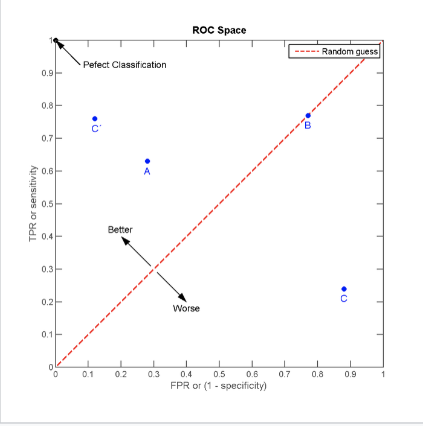

alias:: receiver operating characteristic curve, 接收者操作特征曲线, AUC

- [[confusion matrix]]
- Definition
	- 多个 [[confusion matrix]] 的结果组合
	- ==分类器的性能是通过ROC曲线下面的面积 (AUC) 来表示的==
	- ROC空间将伪阳性率(FPR. [[specificity]] )定义为 X 轴, 真阳性率(TPR [[sensitivity]] )定义为 Y 轴。
	- 当阈值设置为最高时, 亦即所有样本都被预测为阴性, 没有样本被预测为阳性
	- 当阈值设置为最低时, 亦即所有样本都被预测为阳性, 没有样本被预测为阴性, 当阈值设置为最低时,必得出ROC坐标系右上角的点 (1, 1)
	- ==随着阈值调低, ROC点往右上(或右, 或上)移动, 或不动, 但绝不会往左下(或左, 或下)移动==
	- {:height 419, :width 415}
		- 点与随机猜测线的距离, 是预测力的指针: 离左上角越近的点预测准确率越高. 离右下角越近的点, 预测越不准.
		- 在A, B, C三者当中，最好的结果是A方法
		- B方法的结果位于随机猜测线(对角线)上,  在例子中我们可以看到B的准确度ACC是50%。
		- C虽然预测准确度最差, 甚至劣于随机分类, 也就是低于0.5(低于对角线). 
		  然而, 当将C以 (0.5, 0.5) 为中点作一个镜像后, C'的结果甚至要比A还要好. 
		  简单说, 不管C (或任何ROC点低于对角线的情况) 预测了什么, 就做相反的结论