topic:: database, relational database, ER diagram

- # Notes
	- what is database system (DBS)? 数据库系统 (统称)
	  collapsed:: true
		- a database system (DBS) is a computerized record keeping system with the overall purpose of organizing information and making it available when required
	- What is the main components of DBS?
	  collapsed:: true
		- computer hardware and operating system
		- DBMS and users
		- related software systems and/or applications
	- What is database management system (DBMS)?
	  collapsed:: true
		- DBMS is a set of software program that allow for the management of a database
		- RDBMS
		  id:: 61fc7d34-3789-429a-8fd7-a90189a9ed1a
			- Relational Database Management System
	- What is Data Modeling?
	  collapsed:: true
		- 一个数据elements的抽象模型, 并且解释了他们如何互相联系 (how they related)
		- data model 确定了data的structure, operations, constrains
	- Steps in building a database application
	  collapsed:: true
		- Pick an application domain
			- course management, car rental data..
		- Conceptual design
			- Decide on what to model in application domain
				- cars, customers, contracts...
			- Need a modeling language to express the model
				- [[entity-relationship model]] -> ER diagram of application domain
			- Pick a type of DBMS
			- Translate ER design into a relational schema
				- use set of rules to translate ER to schema
	- **What is** [[entity-relationship model]] **and notaton**
	- **Example of** [[entity-relationship model]] **for Car Rental Company**
	  collapsed:: true
		- read left to right, (reverse direction can be inferred)
		- Two entities
			- specific vehicles, and rental aggrements
		- We wish to express the following relationship
			- every time a vehicle is rented, there is a rental agreement created
			- every rental agreement is for one and only one vehicle (no multi-vehicle) agreements and no agreements that don't specify a vehicle
			- Thus, over time there could be multiple agreements for the same vehicle (for different time periods)
			- Or, it is possible that a specific vehicle has never been rented in the timeframe captured  by our database.
		- 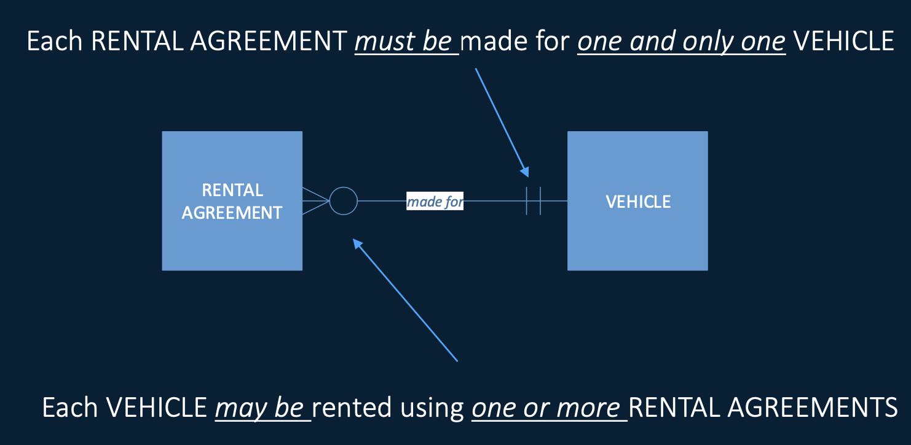
	- **What is two characteristics of a relationship?**
	  collapsed:: true
		- **Cardinality** (关联基数): number of elements in a set
			- ER diagram generally specify a cardinality of 1 or many
			- Other techniques specify an upper bound (at most)
		- **Optionality** (可选性): ^^whether an entity type can exist without being linked to an instance of the related entity type^^
			- Mandatory
				- 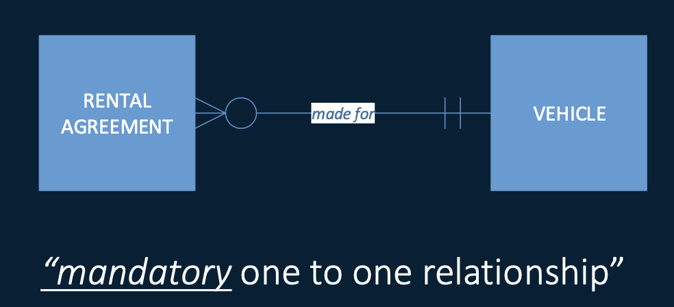
			- Optional
				- 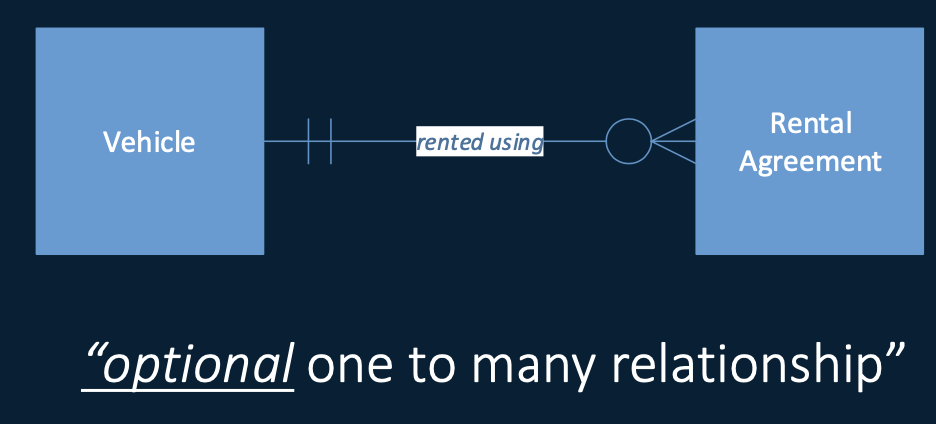
			-
	- **Crow's foot notation, relationships, attributes**
	  collapsed:: true
		- 带圈的optional, 不带的mandatory
	- **Entity or Attribute (diff)?**
	  card-last-score:: 3
	  card-repeats:: 1
	  card-next-schedule:: 2022-01-30T02:04:58.587Z
	  card-last-interval:: 4
	  card-ease-factor:: 2.36
	  card-last-reviewed:: 2022-01-26T02:04:58.590Z
	  collapsed:: true
		- What entities can have, attributes cannot?
		  card-last-interval:: 10.24
		  card-repeats:: 3
		  card-ease-factor:: 2.56
		  card-next-schedule:: 2022-03-01T03:55:21.554Z
		  card-last-reviewed:: 2022-02-18T22:55:21.555Z
		  card-last-score:: 5
			- ^^Entities can have smaller subparts, attributes cannot^^
			- ^^Entities can have relationships, attributes cannot^^
			- ^^Entity set should at least one non-key attribute or "many" in a many-one or many-many relationships^^
		- example
			- 比如, department就不能被作为attribute, 因为department可能有自己的attributes, 比如size, 比如chair, 并且可能department可能和其他entity有联系
			- 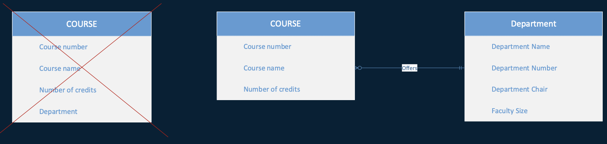
	- **Relationships with Attributes**
	  collapsed:: true
		- we want to specify that a person buys a product from a vendor at a specific price
		- How do we treat price?
			- Not a property of vendor
			- Not a property of product (the same product may be sold by different vendors at different prices)
			- Not a property of person
			- Approach 1
				- 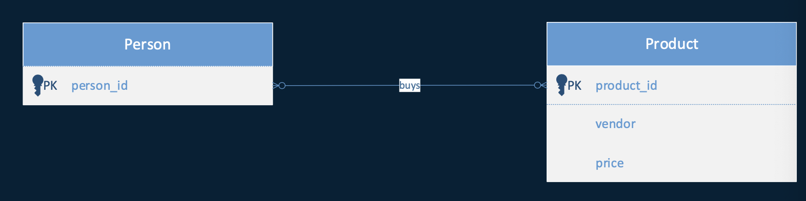
			- Approach 2
				- 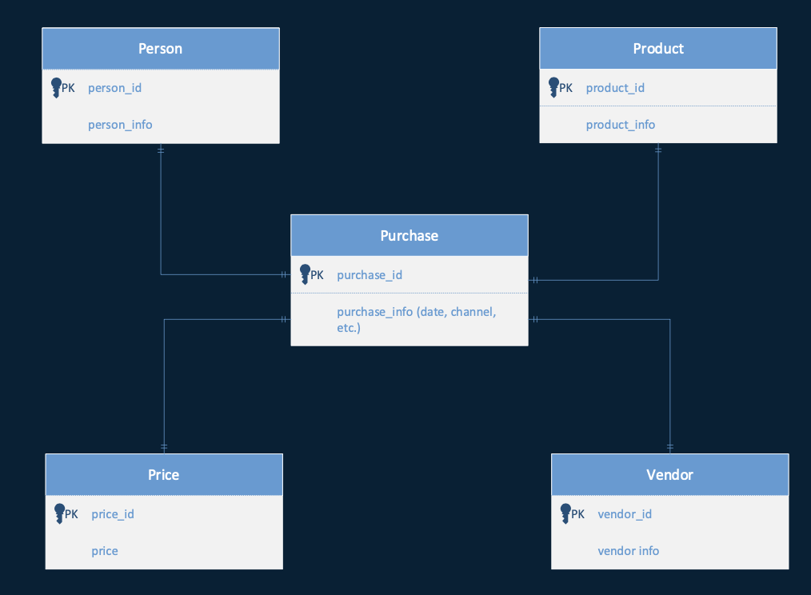
			- Approach 3
				- 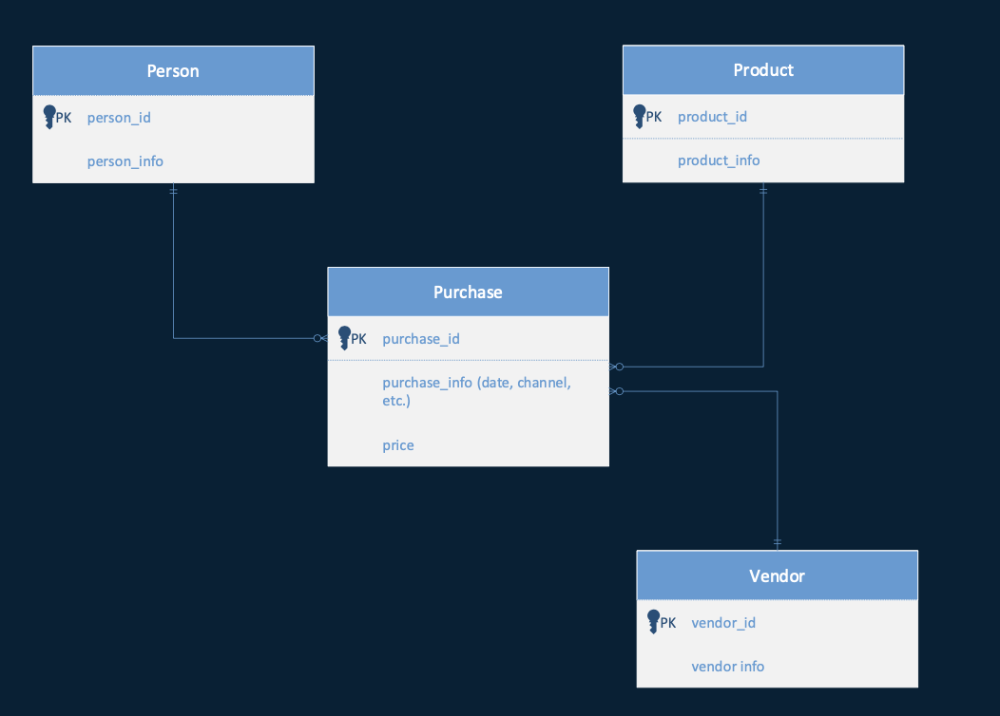
		-
	- **Many to Many Relationships**
	  collapsed:: true
		- cannot be directly implemented in a relational database, **因为many to many的relationship可能有属性但是关系型数据库不支持**
		- example
			- **relationships**
				- each employee must be assigned to one or more branches
				- each branch may be the location for one or more employees
			- **many to many model** (==错误示范==)
				- 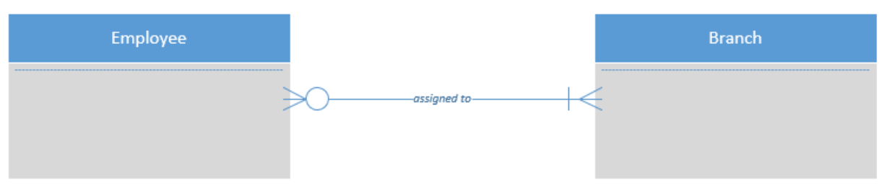
				- this may be information about the assignment itself that is lost in this model
				- it seems natural to think the relationship itself as attributes 但是attributes of relationships 是不可以的
				- solution is to create a new entity hold the assignment attributes **association table**
				  background-color:: #793e3e
					- 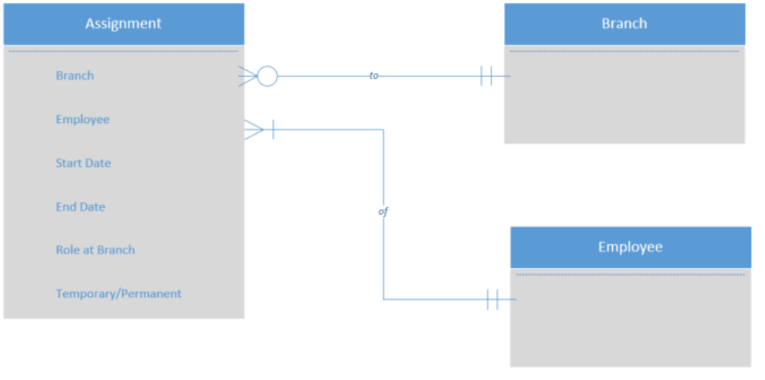
				- **bill of materials structure**
				  background-color:: #793e3e
					- products are collection of other products (汽车包含引擎, 轮子..)
					- 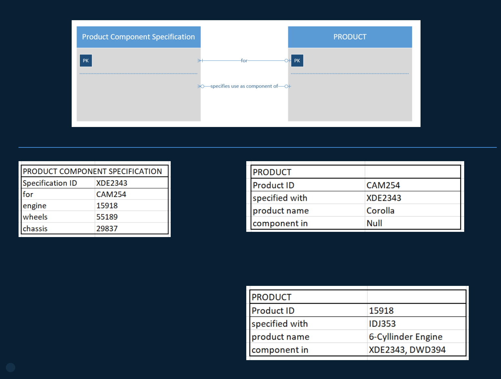{:height 402, :width 522}
	- **Mutually Exclusive Relationships 互斥, 不是A就是B, 不可同时AB**
	  collapsed:: true
		- 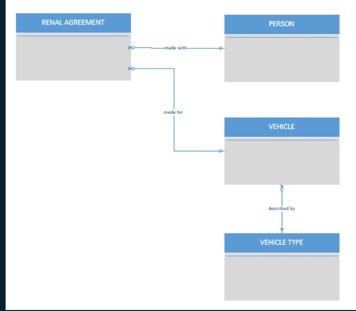{:height 335, :width 443}
		- if there were two different types of rental agreements (one for people one for companies)
		- 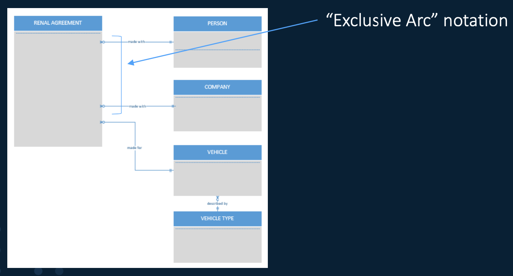
		-
	- **What is Generalization and Specialization?**
	  collapsed:: true
		- Entity occurrences of an entity type has a number of distinct subsets
			- personal rental agreements and company rental agreement
		- supertype/subtype rules (对照下图)
			- subtypes are disjoint (**mutually exclusive**) 
			  比如personal rental agreement 和 company rental agreement 只能有一个, 不是A就是B
			- hierarchy is complete (**all** instance of rental agreement are personal **or** company)
			- hierarchy is static (**one type cannot change into another over time**)
		- specialization example
			- 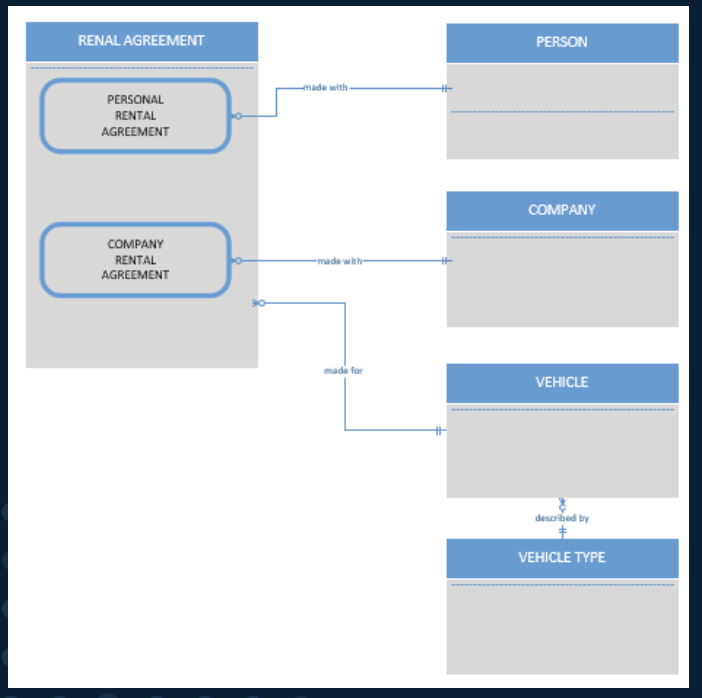{:height 297, :width 423}
	- Mapping from ER model to Schema
	  collapsed:: true
		- Basic process
			- create table for each entity
			- entity's attributes become fields of the tables
			- identify and declare a primary key
			- identify and declare "foreign keys" to implement relationships
	- **What is key and foreign key?**
	  collapsed:: true
		- **keys**
		  background-color:: #793e3e
			- A key is **an attribute** or a **set of attributes** that uniquely identify a specific entry in the entity set
			- Every entity must have a key
			- 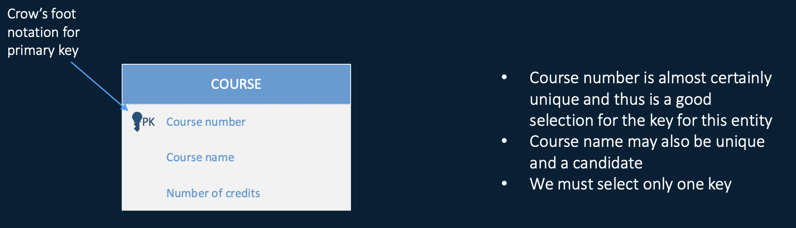
			- Primary Key
				- The attribute chosen to serve as the unique identifier for the entity type
				- there can be only one primary key for a relation, but several UNIQUE attributes
				- no attribute of a primary key can ever be NULL in any tuple, but UNIQUE attributes may have NULLs
			- Composite Key
			  id:: 62183a67-ffd1-4956-813c-0feb3f3b113d
				- The combination of two or more attributes selected as the primary key
			- [[natural key]]
			- [[surrogate key]] (Made up number 比如 student id)
			  id:: 621ef9a9-8c40-429f-af72-c159ef2298f7
		- **foreign Keys**
		  background-color:: #793e3e
		  id:: 61f23283-ed22-40dd-af75-dc7446f9436f
			- uniquely identifies an entity in another entity set (a row in another table) (**FK is defined in the table that represents the "many" end of the relationship**)
			- **One to Many Relationship** (most common)
				- 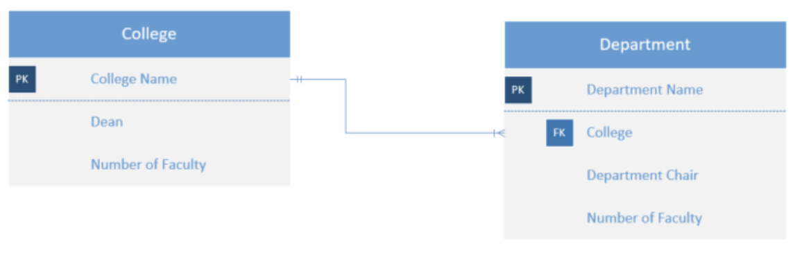
			- **Many to Many Relationship**
			  background-color:: #793e3e
				- many to many relationship are resolved with an associate entity type
				- 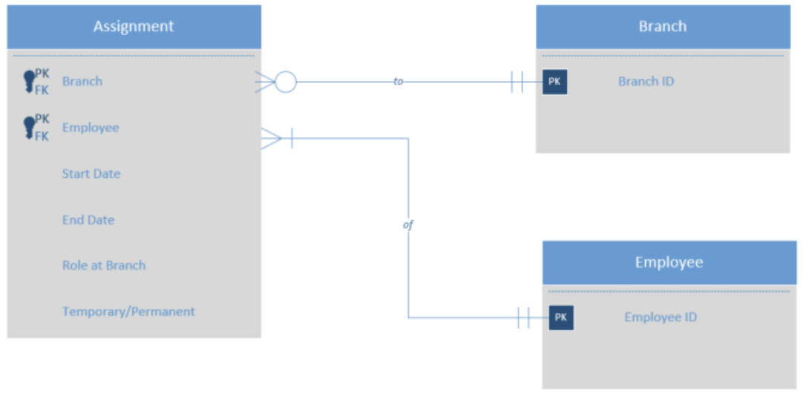
	- **Weak Entity Sets**
	  collapsed:: true
		- weak entity sets are entities need help to be identified uniquely
			- isn't enough info in the original entity to uniquely identify it
			- relationship to another entity is required
		- example
			- name is almost a key, but there might be two with the same name
			- number is not a key, since players on two team could have the same number
			- number, together with the team name related to the player by a "plays for" attribute should be unique
			- 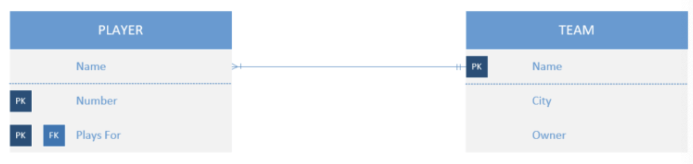
		- **Rules**
			- it has one or more many-one relationships to other (supporting) entity sets
			- not every many-one relationship from a weak entity set need be supporting
			- however, supporting relationships must be mandatory on the supporting entity
			-