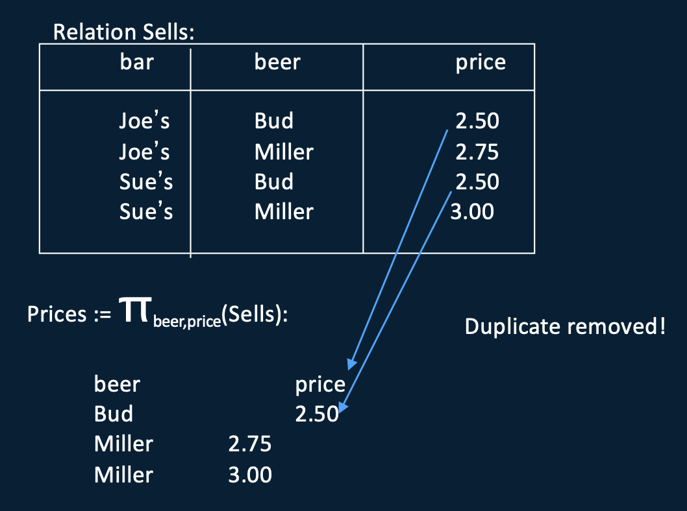

topic:: SQL properties, SQL constraints, data integrity, relational algebra, 数据库原理
date:: [[2022-02-01 Tuesday]], [[2022-02-03 Thursday]], [[2022-02-15 Tuesday]]

- # Notes
	- **What is relational algebra?**
	  collapsed:: true
		- Definition
		  background-color:: #793e3e
		  collapsed:: true
			- Formalism for **creating new relations from existing ones**
			- Mathematical representation of data
				- operands -- variables or values from which new values can be constructed.
				- operators -- symbols denoting procedures that construct new values from given values.
			- Operations on data
			- Constraints
		- Example
		  collapsed:: true
			- relational model = tables
			- semistructured model = trees/graphs
		- Basic concepts
		  background-color:: #793e3e
		  collapsed:: true
			- _Tuple_
				- **ordered** list of elements: (1), ("a", "b", "C") (**可以重复, 有序**), list 也是有序的
			- _Set_
				- A collection of **distinct** objects: {1, 2, 5, 7} (**唯一, 无序**)
				- Operations on set such as union, intersection,...
			- _Bag_
				- A collect of non-distinct objects (i.e. an object may appear more than once) (**可以重复, 无序**)
				- a bag is like a set, but an element may appear more than once, also called Muitlset, and order in bag is unimportant
				- some operations like projection are much more efficient on bags than sets
				- {1,2,1,3} is a bag, {1,2,3} is a bag and also a set
				- {1, 2, 2, 2, 5, 5, 5, 7, 7} -> {(1, 1), (3, 2), (3, 5), (2, 7)}
					- |数量|数字|
					  |1|1|
					  |3|2|
					  |3|5|
					  |2|7|
			- _Relation_ (表)
				- A named set of tuples
				- example
				  background-color:: #793e3e
					- 例如给定两个域：$X_1$ = {1，2，3} 和  $X_2$= {一，二，三}
					  这两个域的笛卡尔积是一个由9个二元组组成的集合: 
					  X1 × X2 = {(1，一), (1，二), (1，三), (2，一), (2，二), (2，三), (3，一), (3，二), (3，三)}
					  也可以列一张二维表
						- $X_1$ 和 $X_2$ 的笛卡尔系
							- |||
							  |阿拉伯数字|汉字数字|
							  |--|--|
							  |1|一|
							  |1|二|
							  |1|三|
							  |2|一|
							  |2|二|
							  |2|三|
							  |3|一|
							  |3|二|
							  |3|三|
					- 如果定义一个阿拉伯数字与其对应的汉字数字在一起才有意义, 那么上面9个二元组中只有3个是有意义的, 将这种关系取名为"数字", 则可得
						- 数字关系
							- |阿拉伯数字|汉字数字|
							  |1|一|
							  |2|二|
							  |3|三|
	- What is relation schema?
	  collapsed:: true
		- relation name and attribute list
		- example
			- Beers(name, manf) or Beers(name: string, manf: string)
	- **What is basic RA operations?**
	  collapsed:: true
		- Union (basic set operation) (binary operation) (UNION)
		  background-color:: #793e3e
		  collapsed:: true
			- 相当于SQL的`Union`
			- Definition: all tuples in R1 **or** R2
			- Notation: $R1 \cup R2$
			- Note
				- R1, R2 must have the same schema
				- $R1 \cup R2$ has the same schema as R1, R2
			- Bag Union
				- An element appears in the union of two bags the sum of the number of times it appears in each bag.
				- Example: {1,2,1} UNION {1,1,2,3,1} = {1,1,1,1,1,2,2,3}
		- Difference (basic set operation) (binary operation) (EXCEPT)
		  background-color:: #793e3e
		  collapsed:: true
			- 相当于SQL的`EXCEPT`
			- Definition: all tuples in R1 and **not** in R2
			- Notation: $R1-R2$
			- Note
				- R1, R2 must have the same schema
				- $R1-R2$ has the same schema as R1, R2
			- Bag difference
				- An element appears in the difference A – B of bags as many times as it appears in A, minus the number of times it appears in B. But never less than 0 time.
				- Example: {1,2,1} – {1,2,2,3} = {1}.
		- Selection: $\sigma$ (Unary operation 一元操作) (WHERE)
		  background-color:: #793e3e
		  collapsed:: true
			- 相当于SQL中的`WHERE`
			- Definition: Return all tuples which satisfy a condition
			- Notation: $\sigma_c(R)$
			- Note
				- c is a condition: boolean expression =, <, >, and, or, not
				- Output schema is same as input schema
			- SQL example
				- $\sigma_{salary > 40000}(Employee)$
				- ```sql
				  SELECT *
				  FROM employee
				  WHERE salary>40000
				  ```
			- Bag selection (允许duplicates)
				- {:height 264, :width 313}
		- Projection: $\pi$ (SELECTION)
		  background-color:: #793e3e
		  collapsed:: true
			- 相当于`SELECT` 的子语句
			- Notation: $R1 := \pi_L(R2)$
			- Definition
				- L is a list of attributes from the schema of R2
				- R1 is constructed by looking at each **tuple** (行) of R2, 提取list L中的 attributes (**in the order specified**) 并且创建tuple for R1
				- Eliminate duplicate tuple if any.
			- Note
				- projection also applies to each tuple, but as a bag operator, we do not eliminate duplicates
			- SQL example
			  background-color:: #793e3e
				- {:height 227, :width 345}
				- $\pi_{bear, price}(Sells)$
				- ```sql
				  SELECT bear, price
				  FROM Sells
				  ```
				- {:height 216, :width 421}
			- Bag projection (允许duplicates)
				- {:height 230, :width 223}
		- Cartesian Production (笛卡尔乘积): $X$, sometimes denoted as *
		  background-color:: #793e3e
		  collapsed:: true
			- 相当于SQL中两个表进行笛卡尔积(全匹配)得到的结果, 即SQL中进行多表链接不指定链接条件的情况
			- Notation: $R3:=R1 \times R2$
			- Definition
			  background-color:: #793e3e
				- pair each tuple `t1` of `R1` with each tuple `t2` of `R2`
				- concatenation ``t1 t2`` is the tuple of R3
				- Schema of R3 is the attributes of R1 and then R2, in order
				- But between attribute A of the same name in R1 and R2: use R1.B and R2.B
				- {:height 235, :width 548}
			- SQL example
			  background-color:: #793e3e
				- $$\pi_{ENAME, DNAME}(\sigma_{EMP.DEPTNO=DEPT.DEPTNO}(\sigma_{JOB="MANAGER"}(EMP \times DEPT)))$$
					- ```sql
					  SELECT ENAME, DNAME
					  FROM EMP JOIN DEPT ON EMP.DEPTNO = DEPT.DEPTNO
					  WHERE JOB = 'MANAGER'
					  ```
				- $$\pi_{ENAME, DNAME}(\sigma_{EMP.DEPTNO=DEPT.DEPTNO}((\sigma_{JOB="MANAGER"}(EMP)) \times DEPT)$$
					- ```sql
					  SELECT ENAME, DNAME
					  FROM DEPT JOIN (SELECT *
					                  FROM EMP
					                  WHERE JOB = 'MANAGER')
					            ON EMP.DEPTNO = DEPT.DEPTNO
					  ```
			- Bag product
				- {:height 277, :width 312}
		- Renaming: $\rho$ (AS)
		  background-color:: #793e3e
		  collapsed:: true
			- 相当于SQL中的`AS`
			- Notation: $R1:=\rho_{R1(A1,...,An)}(R2)$, or $R1(A1,...,An):=R2$
			- Definition
				- 将关系R2命名为R1, $Ai$ 表示的是给R2的第$i$个字段指定别名
				- {:height 146, :width 366}
		- Intersection
		  background-color:: #793e3e
		  collapsed:: true
			- Definition: all tuples both in R1 and R2
			- Notation: $R1 \cap R2$
			- Note
				- R1, R2 must have the same schema
				- $R1 \cap R2$ has the same schema as R1, R2
			- Bag intersection
				- An element appears in the intersection of two bags the **minimum** of the number of times it appears in either.
				- Example: {1,2,1} INTER {1,2,3} = {1,2}.
		- Join
		  background-color:: #793e3e
		  collapsed:: true
			- Theta join
			  background-color:: #793e3e
				- 带限定条件的笛卡尔积
				- Notation: $R 3:=R 1 \bowtie_{C} R 2 = \sigma_c(R1 \times R2)$
				- Definition
					- Take the product of $R1 \times R2$
					- Then apply $\sigma_c$ to the result
					- {:height 206, :width 322}
				- Bag Theta-join
					- {:height 239, :width 252}
			- Natural join (never use)
			  background-color:: #793e3e
				- 将两个表中具有相同名称的列进行匹配, 会改变columns的name, 不要使用!
				- Notation: $R3 := R1 \bowtie R2$
				- Definition
					- Connect two relationship by
					- Equating attributes of the same name and projecting out one copy of each pair of equated attributes
					- 
			- Equi-join (use this instead of nature join)
			  background-color:: #793e3e
				- Useful for ((61f23283-ed22-40dd-af75-dc7446f9436f))
				- Notation: $R 1 \underset{A=B}{\bowtie} R 2$
				- Nature Join is a particular case of equi-join
			- Semi-join
			  background-color:: #793e3e
			- Inner join
			  background-color:: #793e3e
			- Outer join
			  background-color:: #793e3e
	- **SQL properties of database tables**
	  collapsed:: true
		- Entries in columns are single-valued
		- Entries in columns are of the same kind
		- Each row is unique
		- Sequence of columns is insignificant
		- Sequence of rows is insignificant
		- Each column has a unique name
	- **Data integrity of RDBMS system**
	  id:: 61fb80c7-af53-46b4-886c-c534e69cac72
	  collapsed:: true
		- Entity integrity: No duplicate rows in a table
		- Domain integrity: Values for a given column comply with specified types, format, or range of values
		- Referential integrity: Rows cannot be deleted which are used by other records
		- User-Defined integrity: Complies with user-specified business rules
	- **What is the data types in SQLite**
	  collapsed:: true
		- |Storage Class|Meaning|
		  |--|--|
		  |NULL|NULL values mean missing information or unknown.|
		  |INTEGER|Integer values are whole numbers (either positive or negative). An integer can have variable sizes such as 1, 2,3, 4, or 8 bytes.|
		  |REAL|Real values are real numbers with decimal values that use 8-byte floats.|
		  |TEXT|TEXT is used to store character data. The maximum length of TEXT is unlimited. SQLite supports various character encodings.|
		  |BLOB|BLOB stands for a binary large object that can store any kind of data. The maximum size of BLOB is, theoretically, unlimited.|
		- 如果没有引号, 没有小数点, 没有指数 -> INTEGER
		- 如果有单/双引号 -> TEXT
		- 如果没有引号, 但是有小数点或者指数 -> REAL
		- 如果是NULL, 并且没有引号 -> NULL
		- 如果有 `X"ABCD"` 或者 `x'abcd'` -> BLOB
	- **Three-valued logic (TRUE, FALSE, UNKNOWN)**
	  collapsed:: true
		- 三值逻辑在SQL中为`IN`, 返回 TRUE, FALSE, UNKNOWN
		- when any value is compared with NULL, the truth value is UNKNOWN
		- **query only produces a tuple in the answer if its truth value for the WHERE clause is TRUE, not FALSE or UNKNOWN**
		- $$True = 1, False = 0, Unknown = \frac{1}{2}$$
		- $$AND = MIN, OR = MAX, NOT(x) = 1-x$$
		- 三值逻辑表
		  collapsed:: true
			- AND 的情况: false ＞ unknown ＞ true
			  OR 的情况: true ＞ unknown ＞ false
			- NULL和 <>= 链接都是unknown
			- 
			- 
			- 
		- example
		  background-color:: #793e3e
			- `TRUE AND (FALSE OR NOT(UNKNOWN))`
			  `= MIN(1, MAX(0, 1-1/2)))`
			  `=MIN(1, MAX(0, 1/2))`
			  `=MIN(1, 1/2)`
			  `=1/2`
	- **2-valued laws != 3-valued laws (Only TRUE, FALSE)**
	  collapsed:: true
		- [三值逻辑与NULL](https://www.cnblogs.com/youzhibing/p/11337745.html)
		- 二值逻辑在SQL中为`EXISTS`, 只返回TRUE, FALSE, 当 sub query 遇到null的时候, 表达式的计算结果为UNKNOWN会被过滤掉, 自然消除NULL值
		- some common laws, like commutativity of AND, hold in 3 valued logic
		- But others do not, for example, 'law of excluded middle', 
		  collapsed:: true
		  $\rho$ OR NOT $\rho$ = TRUE
		  排中律: 把命题和他的否命题通过或者连接起来而成的命题全都是真命题. 但排中律在SQL中是不成立的。
			- When $\rho$ = UNKNOWN, the left side is
			- `MAX(1/2, (1-1/2)) = 1/2 != 1`
		- SQL example
		  background-color:: #793e3e
			- tbl1 & tbl2
			  collapsed:: true
				- 
			- 三值逻辑 example 1
			  collapsed:: true
				- ```sql
				  SELECT * FROM tbl2 t2
				  WHERE age IN(SELECT t1.age FROM tbl1 t1)
				  ```
					- `IN` 为三值逻辑, UNKNOWN 为 NULL, 返回TRUE, 不返回FALSE, UNKNOWN
					- {:height 229, :width 172}
			- 三值逻辑 example 2
			  collapsed:: true
				- ```sql
				  select * from tbl2 t2 
				  where exists
				  	(select t1.age from tbl1 t1 where t1.age =t2.age)
				  ```
					- 
			- 三值逻辑 problem 1
			  collapsed:: true
				- id:: 61fd9502-f1e1-43b0-8803-dffd9b8da225
				  ```sql
				  SELECT * FROM tbl2 t2 
				  WHERE age NOT IN(SELECT t1.age FROM tbl1 t1)
				  ```
					- `IN` 为三值逻辑
					- **当对至少返回一个null值的子查询使用not in时, 外部查询总会返回一个空集**
					- 
			- 解决办法1
			  collapsed:: true
				- 显式地排除null值, 加条件where t1.age is not null
				- ```sql
				  select * from tbl2 t2 
				  where age not in
				  	(select t1.age from tbl1 t1 where t1.age is not null)
				  ```
					- 
			- 解决办法2
			  collapsed:: true
				- 隐式地排除null值, 使用not exists取代not in
				- ```sql
				  select * from tbl2 t2 
				  where not exists
				  	(select t1.age from tbl1 t1 where t1.age = t2.age)
				  ```
				- 
			- 小结
			  background-color:: #793e3e
				- 当一个列不应该允许为null时, 把它定义为not null很重要, 使用not exists比使用not in更安全
				- in 和 exists 在某种程度上他们是可以替换的. 经常用exists提升SQL性能. 但NOT IN 改成NOT EXISTS, 结果未必一样.
				- NOT IN 中的入值参数如果有NULL的话, 返回结果一定为UNKNOWN. 
				  而NOT EXISTS则会返回false (因为exists的结果只包含false和true)
				- **NULL 就是 UNKNOWN, 逻辑值 unknown 和作为 NULL 的一种的 UNKNOWN 是不同的东西**. 前者是明确的布尔型的逻辑值, 后者既不是值也不是变量.为了便于区分, 前者采用小写字母 unknown , 后者用大写字母 UNKNOWN 来表示
					- ```sql
					  -- 这个是明确的逻辑值的比较
					  unknown = unknown → true
					  
					  -- 这个相当于NULL = NULL
					  UNKNOWN = UNKNOWN → unknown
					  ```
				- 为什么使用`IS NULL` 而不是`= NULL`
					- 因为对 NULL 使用比较谓词后得到的结果总是 unknown . 而查询结果只会包含 WHERE 子句里的判断结果为 true 的行, 不会包含判断结果为 false 和 unknown 的行. 不只是等号, 对 NULL 使用其他比较谓词, 结果也都是一样的. 所以无论 remark 是不是 NULL , 比较结果都是 unknown , 那么永远没有结果返回. 以下的式子都会被判为 unknown
						- ```sql
						  -- 以下的式子都会被判为 unknown
						  = NULL
						  > NULL
						  < NULL
						  <> NULL
						  NULL = NULL
						  ```
				-
	- **Testing NULL values**
	  collapsed:: true
		- if x = Null, then `x/7`  is NULL, `x='joe'` is UNKNOWN
		- NULL 和空字符串有区别, 空字符串也是一个值, 但是是空的, NULL是一个'_未知_'的值, 没有值得概念
	- **SQL Essential**
	  collapsed:: true
		- Basic Querying
		  collapsed:: true
			- Procedure (vary with different ((61fc7d34-3789-429a-8fd7-a90189a9ed1a)) )
			  collapsed:: true
				- create a connection to the database
				- submit queries to the RDBMS
				- RDBMS checks query
					- check permission to execute the statement
					- check permission to access the desired data
					- check syntax
				- RDBMS executes query and returns a _result set_ to the calling application
		- Subqueries
		  collapsed:: true
			- Properties
			  collapsed:: true
				- always return table
				- Enclosed with parentheses
			- **return type**
			  collapsed:: true
				- can return single row with a single column
					- 子查询结果只要是单行单列, 在 WHERE 后面作为条件, 父查询使用比较运算符如 > ,  <,  <>, =等
					- ```sql
					  SELECT 查询字段 FROM 表 WHERE 字段 = (子查询)
					  ```
				- can return multiple rows with a single column
					- 子查询结果是单列多行, 结果集类似于一个数组, 父查询使用 IN 运算符
					- ```sql
					  SELECT 查询字段 FROM 表 WHERE 字段 IN (子查询)
					  ```
				- can return multiple rows with multiple columns
					- 子查询结果多列, 在FROM后面作为表
					- ```sql
					  SELECT 查询字段 FROM (子查询) 表别名 WHERE 条件
					  ```
			- **Correlated subqueries** (关联子查询)
			  collapsed:: true
				- 
				- reference columns from the containing statement, 内部茶性不能单独运行
				- 关联子查询中, 用于外部查询返回的每一行查询, 内部查询都要执行一次. 
				  关联子查询的信息流是双向的, 外部查询的每行数据传递一个值给子查询, 然后子查询为每一行数据执行一次并返回它的记录, 之后外部查询根据返回的记录做出决策
				- 先执行外部查询, 再执行内部查询, ==子查询引用到了主查询的数据数据==
				- Example
				  collapsed:: true
					- {:height 385, :width 379}
					- 要查出 article 表中的数据, 但要求 article 中的某个或某些字段与 user 表字段有逻辑关系, 本例为 uid 相等
					- ```sql
					  SELECT
					      *
					  FROM
					      article
					  WHERE
					      uid IN(
					          SELECT
					              uid
					          FROM
					              USER
					          WHERE
					              article.uid = USER.uid
					      )
					  ```
					- 结果如下
						- 
					- 与该sql比较
					- ```sql
					  SELECT
					      *
					  FROM
					      article
					  WHERE
					      uid IN(
					          SELECT
					              uid
					          FROM
					              USER
					      )
					  ```
					- 虽然返回结果都一样, 但是后者(普通子查询) 实际执行为
					- ```sql
					  SELECT
					      *
					  FROM
					      article
					  WHERE
					      uid IN(1, 2, 3)
					  ```
					-
			- **Non-correlated subqueries**
			  collapsed:: true
				- completely self contained
				- equality/inequality/comparison tests
				- 非相关子查询是独立于外部查询的子查询, 子查询执行完毕后将值传递给外部查询
			- Example (correlated)
			  collapsed:: true
				- 
			- Example1 (Non-correlated)
			  collapsed:: true
				- ```sql
				  SELECT city_id, city
				  FROM city
				  WHERE country_id <> {
				  	SELECT country_id
				  	FROM country
				  	WHERE country = 'India'
				  	);
				  ```
			- Example2 (Non-correlated)
			  collapsed:: true
				- return all the cities that are in Canada and Mexico or are NOT in Canada and Mexico
				- ```sql
				  SELECT city_id,city
				  FROM city
				  WHERE country id IN (
				  	SELECT country_id
				  	FROM country
				  	WHERE country IN ('Canada', 'Mexico')
				  );
				  
				  SELECT city_id,city
				  FROM city
				  WHERE country id NOT IN (
				  	SELECT country_id
				  	FROM country
				  	WHERE country IN ('Canada', 'Mexico')
				  );
				  ```
			- Example3 (Non-correlated)
			  collapsed:: true
				- 
		- Working with sets (combine rows)
		  collapsed:: true
			- UNION
			  collapsed:: true
				- ```sql
				  SELECT 1 num,
				  		'abc' str
				  UNION
				  SELECT 9 num,
				  		'xyz' str
				          
				  /* num   str
				  /* 1     abc
				  /* 9     xyz
				  ```
			- UNION ALL (allow duplicates, faster)
			  collapsed:: true
				- 
				- ```sql
				  SELECT 'Customer' Type,
				  		c. first_name,
				  		c. last_name
				  	FROM customer C
				  UNION ALL /* sum of the two source table */
				  SELECT 'Actor' Type,
				  		a. first_name,
				  		a. last_name
				  	FROM actor a;
				  ```
			- UNION, UNION ALL, INTERSECT
			  collapsed:: true
				- 
				- 799, 797, suppose to be two duplicates, but why just 1 shows in the intersect table?
				- 
				- 因为两个Susan Davis都是在actor table里面的, UNION ALL 允许重复
			- EXCEPT
			  collapsed:: true
				- Remove actors who have customers with the same name
				- 
		- Filtering
		  collapsed:: true
			- Three condition evaluation examples
			  collapsed:: true
				- |Intermediate result|Final result|
				  |--|--|
				  |`WHERE (true OR true) AND true`|`true`|
				  |`WHERE (true OR false) AND true`|`true`|
				  |`WHERE (false OR true) AND true`|`true`|
				  |`WHERE (false OR false) AND true`|`false`|
				  |`WHERE (true OR true) AND false`|`false`|
				  |`WHERE (true OR false) AND false`|`false`|
				  |`WHERE (false OR true) AND false`|`false`|
				  |`WHERE (false OR false) AND false`|`false`|
				- |Intermediate result|Final result|
				  |--|--|
				  |`WHERE NOT (true OR true) AND true`|`false`|
				  |`WHERE NOT (true OR false) AND true`|`false`|
				  |`WHERE NOT (false OR true) AND true`|`false`|
				  |`WHERE NOT (false OR false) AND true`|`true`|
				  |`WHERE NOT (true OR true) AND false`|`false`|
				  |`WHERE NOT (true OR false) AND false`|`false`|
				  |`WHERE NOT (false OR true) AND false`|`false`|
				  |`WHERE NOT (false OR false) AND false`|`false`|
			- conditions operators
			  collapsed:: true
				- Comparison operators, such as =, !=, <, >, <>, like, in, and between
				- Arithmetic operators, such as +, -, *, and /
			- Matching Conditions (partial string matches)
			  collapsed:: true
				- |Wildcard character|matches|
				  |`_`|Exactly one character|
				  |`%`|Any number of characters (including 0)|
				- |Search Expression|Interpretation|
				  |`F%`|Strings beginning with F|
				  |`%t`|Strings ending with t|
				  |`%bas%`|Strings containing the substring 'bas'|
				  |`__t_`|Four-character strings with at in the third position|
		- Constraints when creating table
		  collapsed:: true
			- NOT NULL:Cannot store a null value in a columnUNIQUE:All values in the column must be unique.
			- PRIMARY KEY:A primary key is a field which can uniquely identify each row in a table. And this constraint is used to specify a field in a table as primary key
			- FOREIGN KEY:A field which can uniquely identify each row in another table.
			- CHECK:Validates that the values of a column meet a specific condition
			- DEFAULT:Specifies a default value for a column when no value is specified by the user
			- example
				- create tables
				  collapsed:: true
					- _20220322_1647998159201_0.png)
					- _20220322_1647998171393_0.png)
				- declaring multi-attribute keys
				  collapsed:: true
					- ```sql
					  CREATE TABLE Sells(
					      bar CHAR(20),
					      beer VARCHAR(20),
					      price REAL,
					      PRIMARY KEY(bar, beer)
					  )
					  ```
				- Default values
				  collapsed:: true
					- ```sql
					  CREATE TABLE Drinkers(
					      name CHAR(30) PRIMARY KEY,
					      addr CHAR(50) DEFAULT '123 st',
					      phone CHAR(16)
					  )
					  ```
- # Summary
  collapsed:: true
	- Products and joins are done on each pair of tuples, so duplicates in bags have no effect on how we operate.
	- projection 出来可能是一个set (primary key) 也可能是一个bag (有duplicates 因为不是primary key) 如果想保留duplicates, 使用bag projection
	- SQL是bag language
	- **Bag laws != Set laws**
	  collapsed:: true
		- **not all algebraic laws that hold for sets also hold for bags**
		- for example, R UNION S = S UNION R does not hold for bags
			- Since addition is commutative, adding the number of times x appears in R and S doesn’t depend on the order of R and S.
			- Set Union idempotent (幂等的) meaning that
				- S UNION S = S
			- However, for bags, if x appears n times in S, then it appears 2n times in S UNION S, thus S UNION S!= S in general
	- **RA cannot compute transitive closure** 传递闭包
	  collapsed:: true
		- |Name1|Name2|Relationship|
		  |Fred|Mary|Father|
		  |Marry|Joe|Cousin|
		  |Marry|Bill|Spouse|
		  |Nancy|Lou|Sister|
		- find all direct and indirect relatives of fred
		- cannot express in RA, need recursion