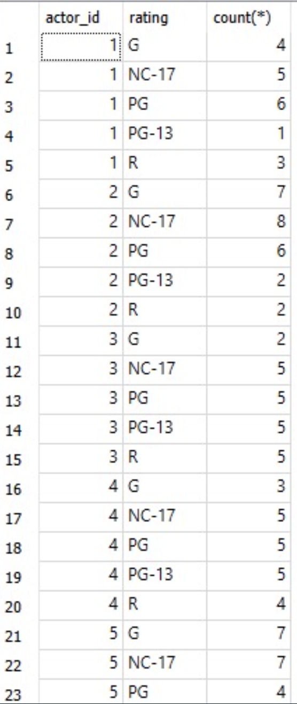
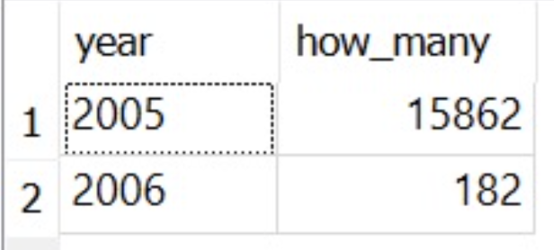
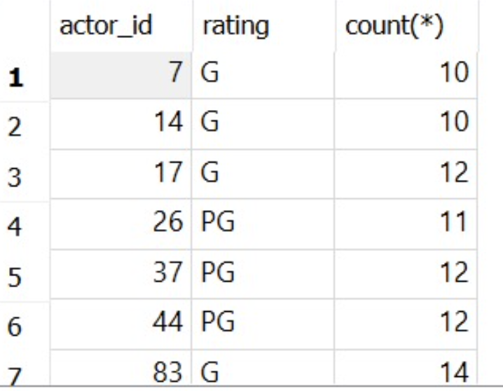

- Basic Select Query Form
	- `SELECT` desired attributes
	  collapsed:: true
		- ```sql
		  /*Columns (a.k.a. field)*/
		  SELECT column, another_column FROM mytable
		  SELECT * FROM mytables LIMIT 10; (查询所有列, 前10列)
		  /*结果可能会有重复, 选取unique*/
		  SELECT DISTINCT column FROM mytables;
		  ```
	- `WHERE` condition about content of the tables (filters)
	  collapsed:: true
		- ```sql
		  SELECT column, another_column, …
		  FROM mytable
		  WHERE condition
		      AND/OR another_condition
		      AND/OR …;
		  
		  /**LIKE and NOT LIKE
		  
		  % will match zero, one or many characters in text
		  For example, the following query matches companies like 'Data', 'DataC' 'DataCamp', 'DataMind' LIKE 'Data%'
		  
		  _ match a single character*/
		  SELECT name
		  FROM companies
		  WHERE name LIKE 'DataC_mp';
		  ```
			- 
			- BETWEEN: >= and <=
	- `GROUP BY` used to group rows together by common column values
	  collapsed:: true
		- The GROUP BY statement is often used with aggregate functions (`COUNT(), MAX(), MIN(), SUM(), AVG()`) to group the result-set by one or more columns.
		- ```sql
		  SELECT column_name(s)
		  FROM table_name
		  WHERE condition
		  GROUP BY column_name(s)
		  ORDER BY column_name(s);
		  ```
	- `HAVING` filters out unwanted groups. `WHERE` can not be used
	  collapsed:: true
		- ```sql
		  SELECT release_year
		  FROM films
		  GROUP BY release_year
		  HAVING COUNT(title) > 10;
		  ```
	- `ORDER BY` sorts the rows of the final result sets by one or more columns
	  collapsed:: true
		- ```sql
		  SELECT column1, column2, ...
		  FROM table_name
		  ORDER BY column1, column2, ... ASC|DESC;
		  ```
- 基本语法
	- TOP, LIMIT, FETCH FIRST
	  collapsed:: true
		- ```sql
		  SELECT TOP 3 * FROM Customers;
		  
		  SELECT * FROM Customers
		  LIMIT 3;
		  
		  SELECT * FROM Customers
		  FETCH FIRST 3 ROWS ONLY;
		  
		  -- 取前百分之五十
		  SELECT * FROM Customers
		  FETCH FIRST 50 PERCENT ROWS ONLY;
		  ```
	- AS aliasing
	  collapsed:: true
		- ```sql
		  /*此时, column name of your result 是function的名字*/
		  SELECT MAX(budget)
		  FROM films;
		  
		  /*可以使用AS来临时名*/
		  SELECT MAX(budget) AS max_budget,
		         MAX(duration) AS max_duration
		  FROM films;
		  ```
		- table aliasing
			- ```sql
			  -- Select fields with aliases
			  SELECT c.code AS country_code, name, year, inflation_rate
			  FROM countries AS c
			    -- Join to economies (alias e)
			    INNER JOIN economies AS e
			      -- Match on code
			      ON c.code = e.code;
			  ```
	- NULL values
	  collapsed:: true
		- ```sql
		  SELECT column_names
		  FROM table_name
		  WHERE column_name IS NULL;
		  ```
	- UNION 操作符用于合并两个或多个 SELECT 语句的结果集
	  collapsed:: true
		- ```sql
		  SELECT City FROM Customers
		  UNION
		  SELECT City FROM Suppliers
		  ORDER BY City;
		  ```
	- Grouping and Aggregates
	  background-color:: #793e3e
	  collapsed:: true
		- Basic count aggregate function
		  collapsed:: true
			- ```sql
			  SELECT customer_id, count(*)
			  FROM rental
			  GROUP BY customer_id
			  ```
		- Aggregate with filter
		  collapsed:: true
			- ```sql
			  SELECT customer_id, count(*)
			  FROM rental
			  GROUP BY customer_id
			  HAVING count(*) >= 40
			  ```
		- Using all aggregate function
		  collapsed:: true
			- ```sql
			  SELECT  MAX (amount) max_amt,
			  		MIN (amount) min_amt,
			  		AVG (amount) avg_amt,
			  		SUM (amount) tot_amt,
			  		COUNT (DISTINCT customer_id ) num_payments
			  FROM payment;
			  GROUP BY customer_id
			  ```
		- Single column grouping
		  collapsed:: true
			- ```sql
			  SELECT actor_id, count(*)
			  FROM film_actor
			  GROUP BY actor_id
			  ```
		- Multi-column grouping
		  collapsed:: true
			- ```sql
			  SELECT fa.actor_id, f.rating, count(*)
			  FROM film_actor fa
			  	INNER JOIN
			  	film f 
			      ON fa.film_id = f.film_id
			  GROUP BY fa.actor_id,
			  		 f.rating
			  ORDER BY 1,
			  		 2;
			  ```
			- 
		- grouping via expressions
		  collapsed:: true
			- ```sql
			  SELECT strftime('%Y', rental_date) year,
			  	   COUNT(*) how_many
			  FROM rental
			  GROUP BY strftime('%Y', rental_date);
			  ```
			- 
		- group filter conditions
		  collapsed:: true
			- ```sql
			  SELECT fa.actor_id,
			  	   f.rating,
			  	   count(*)
			  FROM film_actor fa
			  	 INNER JOIN
			  	 film f 
			       ON fa.film_ id = f.film_ id
			  WHERE f.rating IN ('G', 'PG')
			  GROUP BY fa. actor_id,
			  		 f.rating
			  HAVING count ( * ) > 9;
			  ```
			- 
- JOINS
	- Join types
	  collapsed:: true
		- {:height 352, :width 418}
		- `INNER JOIN`: returns records that have matching values in both tables
		  collapsed:: true
			- 如果表中有至少一个匹配，则返回行
			- 
		- `LEFT (OUTER) JOIN`: returns all records from the left table, and the matched records from the right table, even if there are no matches in the right table.
		  collapsed:: true
			- 即使右表中没有匹配，也从左表返回所有的行
			- 
		- `RIGHT (OUTER) JOIN`: returns all records from the right table, and the matched records from the left table, even if there are no matches in the left table
		  collapsed:: true
			- 即使左表中没有匹配，也从右表返回所有的行
			- 
		- `FULL (OUTER) JOIN` returns all records when there is a match in either left or right table
		  collapsed:: true
			- 只要其中一个表中存在匹配，则返回行
			- 
	- Join more than one tables
	  collapsed:: true
		- ```sql
		  -- Join two tables
		  SELECT column_name(s)
		  FROM table1
		  INNER JOIN table2
		  ON table1.column_name = table2.column_name;
		  
		  -- Join three tables
		  SELECT column_name(s)
		  FROM ((table1
		  INNER JOIN table2 ON table1.column_name = table2.column_name)
		  INNER JOIN table3 ON table1.column_name = table3.column_name);
		  ```
	- SELF JOIN
	  collapsed:: true
		- ```sql
		  SELECT A.CustomerName AS CustomerName1, B.CustomerName AS CustomerName2, A.City
		  FROM Customers A, Customers B
		  WHERE A.CustomerID <> B.CustomerID
		  AND A.City = B.City
		  ORDER BY A.City;
		  ```
		- 创建了Customers表的两个副本 (A和B), WHERE A.CustomerID <> B.CustomerID是为了排除匹配一样id的同一条记录
	- Examples
	  collapsed:: true
		- 演示数据
		  collapsed:: true
			- 表A
				- |||
				  |aID|aNum|
				  |--|--|
				  |1|a20050111|
				  |2|a20050112|
				  |3|a20050113|
				  |4|a20050114|
				  |5|a20050115|
			- 表 B
				- |||
				  |bID|bNum|
				  |--|--|
				  |1|2006032401|
				  |2|2006032402|
				  |3|2006032403|
				  |4|2006032404|
				  |8|2006032408|
		- INNER JOIN (JOIN)
		  collapsed:: true
			- 显示 A.aID = B.bID 的记录. 
			  inner join并不以谁为基础,它只显示符合条件的记录.
			- ```sql
			  SELECT * FROM A
			  INNERJOIN B
			  ON A.aID = B.bID
			  ```
				- |||
				  |aID|aNum|bID|bName|
				  |--|--|--|--|
				  |1|a20050111|1|2006032401|
				  |2|a20050112|2|2006032402|
				  |3|a20050113|3|2006032403|
				  |4|a20050114|4|2006032404|
		- LEFT JOIN
		  collapsed:: true
			- left join是以A表的记录为基础的,A可以看成左表,B可以看成右表,left join是以左表为准的.
			  左表(A)的记录将会全部表示出来,而右表(B)只会显示符合搜索条件的记录(例子中为: A.aID = B.bID).
			  B表记录不足的地方均为NULL
			- ```sql
			  SELECT * FROM A
			  LEFT JOIN B
			  ON A.aID = B.bID
			  ```
				- |aID|aNum|bID|bName|
				  |1|a20050111|      1                |2006032401|
				  |2|a20050112|         2               |2006032402|
				  |3|a20050113|         3               |2006032403|
				  |4|a20050114|         4               |2006032404|
				  |5|a20050115|         NULL        |NULL|
		- RIGHT JOIN
		  collapsed:: true
			- 以右表(B)为基础的,A表不足的地方用NULL填充.
			- ```sql
			  SELECT * FROM A
			  RIGHT JOIN B
			  ON A.aID = B.bID
			  ```
				- |||
				  |aID|aNum|bID|bName|
				  |--|--|--|--|
				  |1|a20050111|1|2006032401|
				  |2|a20050112|2|2006032402|
				  |3|a20050113|3|2006032403|
				  |4|a20050114|4|2006032404|
				  |NULL|NULL|8|2006032408|
- DDL - data definition language
	- `CREATE` create a new table
	- `ALTER` modifies an existing database object, such as table
	  collapsed:: true
		- example
			- remove an attribute from a schema
			  collapsed:: true
				- ```sql
				  ALTER TABLE <name>
				  	DROP <attribute>
				      
				  ALTER TABLE Bars DROP license
				  ```
	- `DROP` deletes an entire table, a view of table or other object
- DML - data manipulation language
	- `INSERT` creates a record (tuple or tuples)
	  collapsed:: true
		- 如果only insert一个值, 那么其他的都会是NULL, 如果有的列不许NULL, 那么就会报错
		- example
			- ```sql
			  /*1. Specify both the column names and the values to be inserted:*/
			  INSERT INTO table_name (column1, column2, column3, ...)
			  VALUES (value1, value2, value3, ...);
			  
			  /*2. Adding value to all columns*/
			  INSERT INTO table_name
			  VALUES (value1, value2, value3, ...);
			  
			  /*example*/
			  INSERT INTO Customers (CustomerName, ContactName, Address, City, PostalCode, Country)
			  VALUES ('Cardinal', 'Tom B. Erichsen', 'Skagen 21', 'Stavanger', '4006', 'Norway');
			  ```
	- `UPDATE` Modifies records (tuple or tuples)
	  collapsed:: true
		- example
			- ```sql
			  UPDATE Customers
			  SET ContactName = 'Alfred Schmidt', City= 'Frankfurt'
			  WHERE CustomerID = 1;
			  ```
	- `DELETE` Deletes records (values of an existing tuple or tuples)
	  collapsed:: true
		- example
		  collapsed:: true
			- ```sql
			  DELETE FROM Customers WHERE CustomerName='Alfreds Futterkiste';
			  -- 一整行delete
			  -- DELECT FROM Customers :删除所有
			  ```