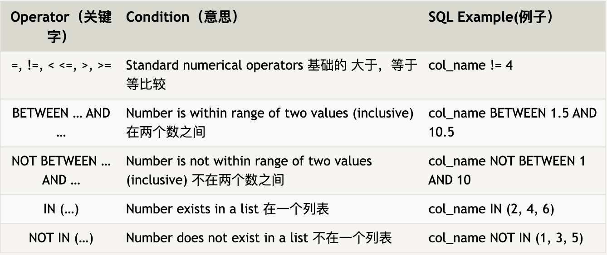
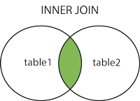
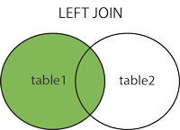
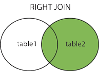
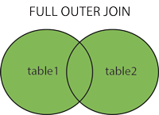

- # 基本语法
	- Select
	  collapsed:: true
		- ```sql
		  /*Columns (a.k.a. field)*/
		  SELECT column, another_column FROM mytable
		  SELECT * FROM mytables LIMIT 10; (查询所有列, 前10列)
		  /*结果可能会有重复, 选取unique*/
		  SELECT DISTINCT column FROM mytables;
		  ```
	- Constraints
	  collapsed:: true
		- ```sql
		  SELECT column, another_column, …
		  FROM mytable
		  WHERE condition
		      AND/OR another_condition
		      AND/OR …;
		  
		  /**LIKE and NOT LIKE
		  
		  % will match zero, one or many characters in text
		  For example, the following query matches companies like 'Data', 'DataC' 'DataCamp', 'DataMind' LIKE 'Data%'
		  
		  _ match a single character*/
		  SELECT name
		  FROM companies
		  WHERE name LIKE 'DataC_mp';
		  ```
			- 
			- BETWEEN: >= and <=
	- AS aliasing
	  collapsed:: true
		- ```sql
		  /*此时, column name of your result 是function的名字*/
		  SELECT MAX(budget)
		  FROM films;
		  
		  /*可以使用AS来临时名*/
		  SELECT MAX(budget) AS max_budget,
		         MAX(duration) AS max_duration
		  FROM films;
		  ```
		- table aliasing
			- ```sql
			  -- Select fields with aliases
			  SELECT c.code AS country_code, name, year, inflation_rate
			  FROM countries AS c
			    -- Join to economies (alias e)
			    INNER JOIN economies AS e
			      -- Match on code
			      ON c.code = e.code;
			  ```
	- ORDER BY
	  collapsed:: true
		- ```sql
		  SELECT column1, column2, ...
		  FROM table_name
		  ORDER BY column1, column2, ... ASC|DESC;
		  ```
	- INSERT INTO
	  collapsed:: true
		- ```sql
		  /*1. Specify both the column names and the values to be inserted:*/
		  INSERT INTO table_name (column1, column2, column3, ...)
		  VALUES (value1, value2, value3, ...);
		  
		  /*2. Adding value to all columns*/
		  INSERT INTO table_name
		  VALUES (value1, value2, value3, ...);
		  
		  /*example*/
		  INSERT INTO Customers (CustomerName, ContactName, Address, City, PostalCode, Country)
		  VALUES ('Cardinal', 'Tom B. Erichsen', 'Skagen 21', 'Stavanger', '4006', 'Norway');
		  ```
	- NULL values
	  collapsed:: true
		- ```sql
		  SELECT column_names
		  FROM table_name
		  WHERE column_name IS NULL;
		  ```
	- UPDATE (modify existing records)
	  collapsed:: true
		- ```sql
		  UPDATE Customers
		  SET ContactName = 'Alfred Schmidt', City= 'Frankfurt'
		  WHERE CustomerID = 1;
		  ```
	- DELETE
	  collapsed:: true
		- ```sql
		  DELETE FROM Customers WHERE CustomerName='Alfreds Futterkiste';
		  -- 一整行delete
		  -- DELECT FROM Customers :删除所有
		  ```
	- ^^TOP, LIMIT, FETCH FIRST^^
	  collapsed:: true
		- ```sql
		  SELECT TOP 3 * FROM Customers;
		  
		  SELECT * FROM Customers
		  LIMIT 3;
		  
		  SELECT * FROM Customers
		  FETCH FIRST 3 ROWS ONLY;
		  
		  -- 取前百分之五十
		  SELECT * FROM Customers
		  FETCH FIRST 50 PERCENT ROWS ONLY;
		  ```
	- ^^JOIN^^
collapsed:: true
		- Join more than one tables
			- ```sql
			  -- Join two tables
			  SELECT column_name(s)
			  FROM table1
			  INNER JOIN table2
			  ON table1.column_name = table2.column_name;
			  
			  -- Join three tables
			  SELECT column_name(s)
			  FROM ((table1
			  INNER JOIN table2 ON table1.column_name = table2.column_name)
			  INNER JOIN table3 ON table1.column_name = table3.column_name);
			  ```
		- SELF JOIN
		  id:: 620076fd-5f4e-4dff-b493-19b54301cca9
			- ```sql
			  SELECT A.CustomerName AS CustomerName1, B.CustomerName AS CustomerName2, A.City
			  FROM Customers A, Customers B
			  WHERE A.CustomerID <> B.CustomerID
			  AND A.City = B.City
			  ORDER BY A.City;
			  ```
			- 创建了Customers表的两个副本 (A和B), WHERE A.CustomerID <> B.CustomerID是为了排除匹配一样id的同一条记录
		- Join types
			- {:height 352, :width 418}
			  id:: 620076fd-6b8a-4e8b-a86b-dd50cd974aab
			- `INNER JOIN`: returns records that have matching values in both tables
			  collapsed:: true
				- 如果表中有至少一个匹配，则返回行
				- 
			- `LEFT (OUTER) JOIN`: returns all records from the left table, and the matched records from the right table, even if there are no matches in the right table.
			  collapsed:: true
				- 即使右表中没有匹配，也从左表返回所有的行
				- 
			- `RIGHT (OUTER) JOIN`: returns all records from the right table, and the matched records from the left table, even if there are no matches in the left table
			  collapsed:: true
				- 即使左表中没有匹配，也从右表返回所有的行
				- 
			- `FULL (OUTER) JOIN` returns all records when there is a match in either left or right table
			  collapsed:: true
				- 只要其中一个表中存在匹配，则返回行
				- 
		-
	- UNION 操作符用于合并两个或多个 SELECT 语句的结果集
	  collapsed:: true
		- ```sql
		  SELECT City FROM Customers
		  UNION
		  SELECT City FROM Suppliers
		  ORDER BY City;
		  ```
	- ^^GROUP BY^^
	  collapsed:: true
		- The GROUP BY statement is often used with aggregate functions (`COUNT(), MAX(), MIN(), SUM(), AVG()`) to group the result-set by one or more columns.
		- ```sql
		  SELECT column_name(s)
		  FROM table_name
		  WHERE condition
		  GROUP BY column_name(s)
		  ORDER BY column_name(s);
		  ```
	- ^^HAVING^^ WHERE cannot be used with aggregate functions like max, sum, min...
	  collapsed:: true
		- ```sql
		  SELECT release_year
		  FROM films
		  GROUP BY release_year
		  HAVING COUNT(title) > 10;
		  ```
-