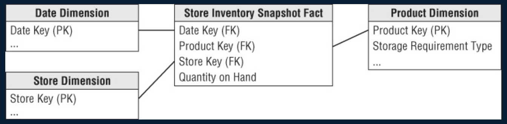

alias:: 半可加事实, 半可加事实表, semi-additive

- Definition
	- 该度量在某些维度下不可以汇总, 或者说汇总没有意义, 比如差价额, 差价额在时间维度下的汇总就没有意义 ==can not be aggregated across time==
- Properties
	- Semi-additive measures must be identified and specially handled in queries
	- Semi-additive facts can be added across some, but not all dimensions
- Example
	- 
		- date can not be add, only average