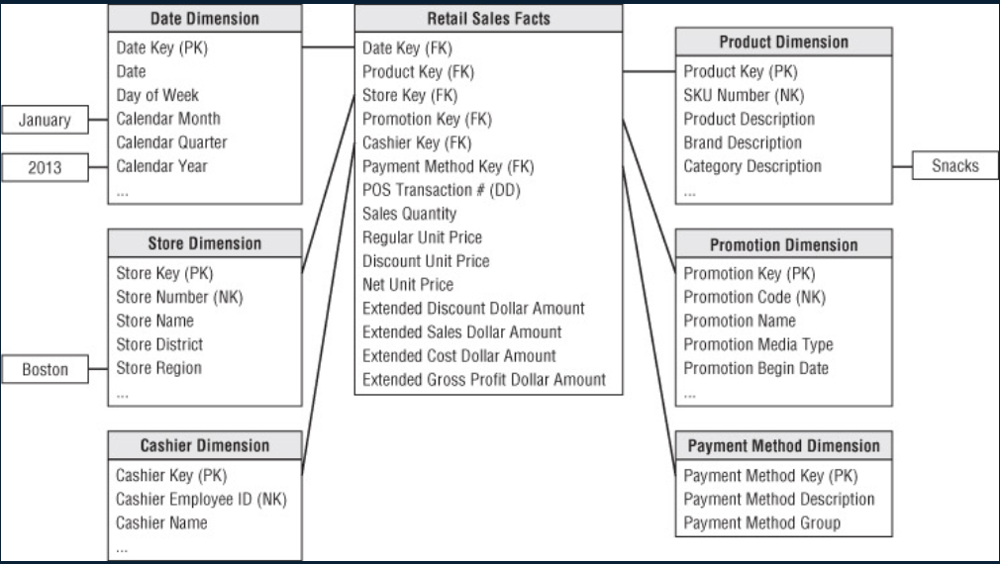

alias:: 星型模型

- Definition
	- Star schema is a simplified entity-relational model with the following constraints
		- Fact table has the same type of relationship with each dimension
			- Every fact table row references one and only one entry in the dimension table
			- Every dimension table row reference zero or more entries in the fact table
		- There are no other relationships in the data model
- Properties
	- There will be a ((62183a67-ffd1-4956-813c-0feb3f3b113d)) which will be values of the dimensions, and that will be unique for every element
	- dimensional values are going to indicate those through in foreign keys in other dimensional value being used many times, or no times, but a combination of conventional values will be unique for every entry in the fact table
- Pros and cons
	- Simplifies queries
	- Optimizes query performance
	- Optimizes navigation
	- More stable over time as source system change or new data sources become available
	- works well with traditional one-to-many relationships
	- ---
	- 多维数据集的每一个维度都和事实表相连, 不存在渐变维度, 所以数据有一定冗余
	- ==Two situations cannot be handled well==
		- [[Multi-valued dimensions]] occur when a fact table row may need to refer to more than one row in a dimension table
		- [[Multi-valued attributes]] occur when a dimension row needs to capture multiple values for a single attribute
- Example
collapsed:: true
	- 