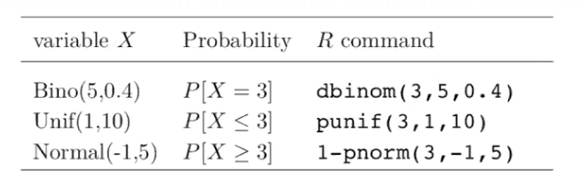
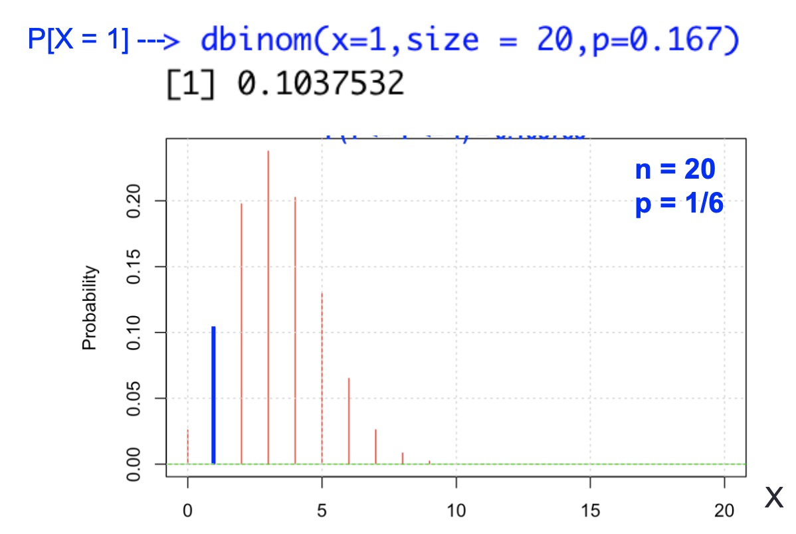
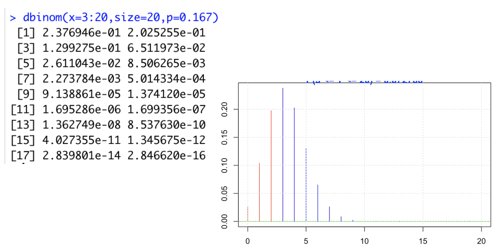

topic:: central limit theorem, covariance, correlation, quantile plots, normal distribution, kernel density estimator

- # Notes
	- **What is** [[bernoulli trials]] #recall
	  collapsed:: true
		- trials is a random experiment with two possible outcomes
		- ((259e1a74-d814-4f14-aa74-21cd7664fb21))
	- **What is Discrete random variables** #recall
	  collapsed:: true
		- Bernoulli: n. of successes in ^^1^^ trial
		- Binomial: n. of successes in ^^n^^ trials
		- Geometric: n. of trials until ^^1st^^ success
		- Negative Binomial: n. of trials until ^^m^^ successes
		- Geometric order ^^k^^: n. of trials until ^^k^^ consecutive successes
	- **What is** [[probability distribution function]]? #recall
	- **What is** [[bernoulli random variable]]? #recall
	- **What is** [[binomial random variable]] and connection with [[bernoulli random variable]]? #recall
	- **What is** [[multinomial random variable]]? #recall
	- **What is** [[normal random variable]]? #recall
	- **What is** [[joint random variable]]? #recall
	- **What is independent random variable?** #recall
	  collapsed:: true
		- Random variables are independent if the associated events are independent
		- two events are independent if the outcome of one does not affect the outcome of the other
		- $X_1$ and $X_2$ are independent random variable if
		- $$
		  P\left[X_{1}=x_{1}, X_{2}=x_{2}\right]=P\left[X_{1}=x_{1}\right] P\left[X_{2}=x_{2}\right] $$
		  $$X_{1}, X_{2} \text { are discrete }$$
		- $$
		  f\left(x_{1}, x_{2}\right)=f\left(x_{1}\right) f\left(x_{2}\right)$$
		  $$X_{1}, X_{2} \text { are continuous }
		  $$
	- **What is** [[central limit theorem]]? #recall
	- **What is** [[covariance]], [[correlation]] #recall
	- **What are R functions for computing probabilities** #recall
	  collapsed:: true
		- 
		- Recall that $$P[X=a]=0$$ for all continuous random variables
		- Probability (pdf) of getting only one six in 20 rolls of a die
			- 
		- Probability (pdf) of getting at least 3 six in 20 rolls of a die
			- 1-pbinom(2,size=20,p=0.167), 或者
			- 
	- **How to verify data's distribution** #recall
	  collapsed:: true
		- [[normal distribution]]
		- [[qqplot]]
	- **What is** [[multivariable normal distribution]] #recall
	- **What is** [[kernel density estimator]]? #recall