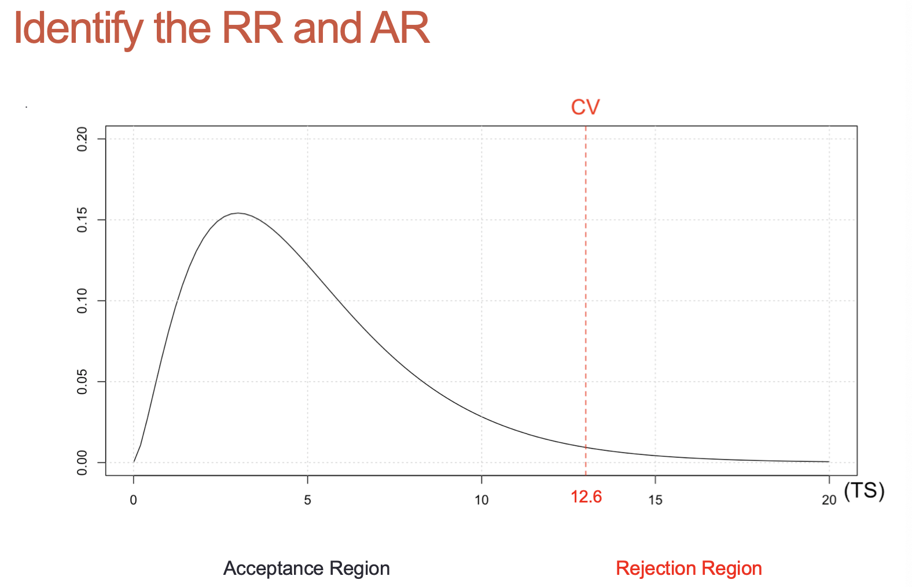

topic:: hypothesis test, confidence interval, test on one proportion, test to compare k proportions

- # Notes
	- **What is bernoulli / binomial random variable?** #recall
	  collapsed:: true
		- [[bernoulli trials]] is a random experiment with two possible outcomes
		- [[bernoulli random variable]] is defined on ==one== trial
		  Where $X$ is the number of successes in **1** trial
			- {{embed ((61f23283-1473-492c-b35d-6952253cb194))}}
		- [[binomial random variable]] is defined on a ==sequence== of **n** [[bernoulli trials]]
		  Where $X$ is the number of successes in **n** trial
			- {{embed ((61f60fde-ef15-4237-b9b3-e62028290442))}}
		- bernoulli & binomial random variables
			- ((61f23283-b426-40b9-b3b7-3ca8e9e9a26a))
			- if $(X_1, X_2, ..., X_n)$ are $iid$ $BERN(P)$, then the sum of IID Bernoulli variables is a Binomial variable
				- $$
				  \sum_{i=1}^{n} X=X_{1}+X_{2}+\ldots X_{n} \quad \sim B I N O(n, p)
				  $$
	- **What is [[confidence interval]] (CI)?** #recall
	  collapsed:: true
		- A CI is a ==random interval== (lower bound and upper bound are random) that may include the parameter of interest with probability $1-\alpha$ 
		  where $\alpha$ **is the probability of an incorrect conclusion**
	- **What is proportion transformation (p) 成功数/总数?** #recall
	  collapsed:: true
		- Let $X$ be the number of successes in _n_ trials
		  id:: 61f615e4-da33-4cfb-aa24-991fdda3ac8b
			- {{embed ((61f60fde-ef15-4237-b9b3-e62028290442))}}
			- id:: 61f615f7-752b-4e70-a624-3e6a6e97861c
			  $$
			  \hat{p}=\frac{X}{n} \quad\left\{\begin{array}{l}
			  E[\hat{p}]=p \\
			  \operatorname{Var}[\hat{p}]=\frac{p(1-p)}{n}
			  \end{array}\right.
			  $$
		- if _n_ is large 必定服从正态分布
		  $Z$ 是经过 [[CLT]] 标准化后, 服从标准正态分布$N(0,1)$ [[z-score]]
		- $$
		  \hat{p} \sim N\left[p, \frac{p(1-p)}{n}\right] \quad Z=\frac{\hat{p}-p}{\sqrt{\frac{p(1-p)}{n}}}
		  $$
	- **What is [[confidence interval]] on p?** #recall
	  collapsed:: true
		- For any random variable 其中$x_{\alpha/2}$ 是分布的quantile
			- $$
			  1-\alpha=P\left[x_{\alpha / 2}<X<x_{1-\alpha / 2}\right]
			  $$
		- Let us use it for [[z-score]] is the **CI on p**
			- $$
			  1-\alpha=P\left[z_{\alpha / 2}<Z<z_{\alpha / 2}\right]
			  $$
				- where 
				  $$Z=\frac{\hat{p}-p}{\sqrt{\frac{p(1-p)}{n}}}$$
				- 因为上式计算太麻烦, 所以使用 [[test statistic]]
					- $$
					  Z=\frac{\hat{p}-p}{\sqrt{\frac{\hat{p}(1-\hat{p})}{n}}}
					  $$
						- where 
						  $$\hat{p} = \frac{X}{n}$$
				- 所以
				  $$
				  1-\alpha=P\left[-z_{\alpha / 2}<\frac{\hat{p}-p}{\sqrt{\frac{\hat{p}(1-\hat{p})}{n}}}<z_{\alpha / 2}\right]
				  $$
		- 解方程, 最终可以得到[[confidence interval]] on p:
			- id:: 61f61e34-10b0-47f9-b790-28dfa7ff98e1
			  $$
			  1-\alpha=P\left[\hat{p}-z_{\alpha / 2} \sqrt{\frac{\hat{p}(1-\hat{p})}{n}}<p<\hat{p}+z_{\alpha / 2} \sqrt{\frac{\hat{p}(1-\hat{p})}{n}}\right]
			  $$
				- where $$\hat{p} = \frac{X}{n}$$ can be found from data set
	- **Example of [[confidence interval]] on p, use [[Monte Carlo method]] to understand** $\alpha$ **in a [[confidence interval]]** #recall
	  collapsed:: true
		- 题目
		  background-color:: #793e3e
			- **suppose** that $p = 30\%$ of customers that visit a new website make a purchase
			- we **do not know** this percentage since the website is new
			- to estimate $p$, the website is monitored over 50 days
			- each day the first 50 visits are recorded and a **CI on P** is constructed 每天用前五十个数据创建CI using
			  ((61f61e34-10b0-47f9-b790-28dfa7ff98e1))
			- find how many CIs cover p
		- 答案
		  background-color:: #793e3e
			- create the population
				- ```r
				  p = 0.3
				  N = 1000
				  population = rbinom(N, size=1, prob=p)
				  table(population)
				  ## Population
				  ##   0   1
				  ##  696  304
				  ```
			- select 50 rows from vector population and find $\hat{p}$ and its std deviation
				- $$
				  \hat{p}=\frac{X}{n} \quad\left\{\begin{array}{l}
				  E[\hat{p}]=p \\
				  \operatorname{Var}[\hat{p}]=\frac{\hat{p}(1-\hat{p})}{n}
				  \end{array}\right.
				  $$
				- $$
				  \left[\hat{p}-z_{\alpha / 2} \sqrt{\frac{\hat{p}(1-\hat{p})}{n}} \quad, \quad \hat{p}+z_{\alpha / 2} \sqrt{\frac{\hat{p}(1-\hat{p})}{n}}\right]
				  $$
				- 
			- calculate $z_\alpha$
				- ```r
				  alpha = 0.05
				  z_alpha = qnorm(1-alpha/2)
				  ```
					- {:height 214, :width 358}
			- find CI
				- {:height 255, :width 365}
			- repeat 100 times and plot all CIs
				- 
				- 
		- summary
		  background-color:: #793e3e
			- This experiment shows 8 intervals that do not include p = 0.30
			- In practice, we just observe one CI and hope that it includes (covers) p
			- We say we are 95% confident that, that CI, includes p = 0.30
	- **What is [[hypothesis test]]?** #recall
	- **How to analyze the data?** #recall
	  collapsed:: true
		- Identify [[test statistic]] distribution
		- Use [[显著性水平]] to find the [[critical value]]
		  collapsed:: true
			- {:height 276, :width 451}
		- Identify the RR and AR
		  collapsed:: true
			- {:height 269, :width 437}
		- Collect the data
		- Use data to find OTS
		  collapsed:: true
			- {:height 322, :width 449}
		- Find the p-value (tail probability)
		  collapsed:: true
			- if p-value < $\alpha$, OTS must be in the RR, reject $H_0$
			- 其中, $\alpha$ 是红色到头的区域, p-value是蓝色到头的区域
			- {:height 335, :width 481}
		- If p-value < $\alpha$, reject $H_0$
	- **Test on one proportion** #recall
	  collapsed:: true
		- [[hypothesis test]] Procedure to compare ==one proportions==
		  collapsed:: true
			- ((61f615e4-da33-4cfb-aa24-991fdda3ac8b))
			- To test
			  $$
			  \begin{aligned}
			  &H_{0}: p=p_{0} \\
			  &H_{a}: p>p_{0}
			  \end{aligned}
			  $$
			- use
				- **Test Statistic (TS)**
					- $$
					  Z=\frac{\hat{p}-p}{\sqrt{\frac{p(1-p)}{n}}}
					  $$
				- **Critical Value (CV)**
					- $$Z_{\alpha}$$
				- **Obs. Test Statistic (OTS)**, $p_0$ is known
					- $$
					  z_{0}=\frac{\hat{p}-p_{0}}{\sqrt{\frac{p_{0}\left(1-p_{0}\right)}{n}}}
					  $$
				- **p-value**
					- $$P[Z>z_0]$$
		- [[hypothesis test]] Example to compare ==one proportions==
		  collapsed:: true
			- 1000 flips of a coin result in 530 heads, is the coin fair?
				- $$
				  \begin{aligned}
				  &H_{0}: p=0.50 (=p_0) \\
				  &H_{a}: p>0.50
				  \end{aligned}
				  $$
				- Test Statistic (TS)
					- $$
					  Z=\frac{\hat{p}-0.5}{\sqrt{\frac{p(1-p)}{n}}}
					  $$
				- Critical Value (CV)
					- $$Z_{0.05} = 1.645$$
				- Observed fraction
					- $$
					  \hat{p}=\frac{x}{n}=\frac{530}{1000}=0.53
					  $$
				- Obs. Test Statistic (OTS), $p_0$ is known
					- $$
					  \begin{aligned}
					  z_{0} &=\frac{\hat{p}-p_{0}}{\sqrt{\frac{p_{0}\left(1-p_{0}\right)}{n}}} \\
					  &=\frac{0.53-0.50}{\sqrt{\frac{0.5(1-0.50)}{1000}}} \\
					  &=1.897
					  \end{aligned}
					  $$
				- p-value
					- $$P[Z>z_0]=0.029$$
				- ==Reject H0==
				- ```r
				  binomial.test(530, 1000, 0.5, 'greater')
				  ```
	- **Test to compare two proportions (testing p1-p2)** #recall
	  collapsed:: true
		- [[hypothesis test]] Procedure to compare ==two proportions==
		  collapsed:: true
			- $X_1$ the number of success in $n_1$ trials from population 1 (if $n_1$ is large)
			  collapsed:: true
				- $$X_1 \sim BINO(n_1, p_1)$$
				- $$
				  \hat{p}_{1}=\frac{X_{1}}{n_{1}} \quad \hat{p}_{1} \sim N\left[p_{1}, \frac{p_{1}\left(1-p_{1}\right)}{n_{1}}\right]
				  $$
			- $X_2$ the number of success in $n_2$ trials from population 2  (if $n_2$ is large)
			  collapsed:: true
				- $$X_1 \sim BINO(n_1, p_1)$$
				- $$
				  \hat{p}_{2}=\frac{X_{2}}{n_{2}} \quad \hat{p}_{2} \sim N\left[p_{2}, \frac{p_{2}\left(1-p_{2}\right)}{n_{2}}\right]
				  $$
			- $$
			  \begin{array}{ll}
			  \hat{p}_{1}=\frac{X_{1}}{n_{1}} & \hat{p}_{1} \sim N\left[p_{1}, \frac{p_{1}\left(1-p_{1}\right)}{n_{1}}\right] \\
			  \hat{p}_{2}=\frac{X_{2}}{n_{2}} & \hat{p}_{2} \sim N\left[p_{2}, \frac{p_{2}\left(1-p_{2}\right)}{n_{2}}\right]
			  \end{array}
			  $$
			- distribution of two proportions
			  $$
			  \hat{p}_{1}-\hat{p}_{2} \sim N\left[p_{1}-p_{2}, \frac{p_{1}\left(1-p_{1}\right)}{n_{1}}+\frac{p_{2}\left(1-p_{2}\right)}{n_{2}}\right]
			  $$
			- To test
			  $$
			  \begin{aligned}
			  &H_{0}: p_{1}=p_{2} \\
			  &H_{a}: p_{1}>p_{2}
			  \end{aligned}
			  $$
			  or
			  $$
			  \begin{aligned}
			  &H_{0}: p_{1}-p_{2}=0 \\
			  &H_{a}: p_{1}-p_{2}>0
			  \end{aligned}
			  $$
			- use
				- **Test Statistic (TS) of two proportions**
				  $$
				  Z=\frac{\hat{p}_{1}-\hat{p}_{2}-\left(p_{1}-p_{2}\right)}{\sqrt{\frac{p_{1}\left(1-p_{1}\right)}{n_{1}}+\frac{p_{2}\left(1-p_{2}\right)}{n_{2}}}}
				  $$
				- **Critical Value (CV)** $Z_\alpha$
				  if its two tails, it should be $Z_{\alpha/2}$
				- **Obs. Test Statistic (OTS)**
					- $$
					  z_{0}=\frac{\hat{p}_{1}-\hat{p}_{2}}{\sqrt{\frac{p_{1}\left(1-p_{1}\right)}{n_{1}}+\frac{p_{2}\left(1-p_{2}\right)}{n_{2}}}}
					  $$
					  其中$p_1$, $p_2$ 不知道, 所以用 $\hat{p}_p$ 并且 assume its true
					  $$
					  z_{0}=\frac{\hat{p}_{1}-\hat{p}_{2}}{\sqrt{\frac{\hat{p}_{p}\left(1-\hat{p}_{p}\right)}{n_{1}}+\frac{\hat{p}_{p}\left(1-\hat{p}_{p}\right)}{n_{2}}}}
					  $$
					- **use the pooled fraction of successes**
						- $$
						  \begin{aligned}
						  \hat{p}_{p} &=\frac{x_{1}+x_{2}}{n_{1}+n_{2}} \\
						  &=\frac{x_{1}}{n_{1}+n_{2}}+\frac{x_{2}}{n_{1}+n_{2}} \\
						  &=\frac{n_{1}}{n_{1}+n_{2}}\left(\frac{x_{1}}{n_{1}}\right)+\frac{n_{2}}{n_{1}+n_{2}}\left(\frac{x_{2}}{n_{2}}\right) \\
						  &=\frac{n_{1}}{n_{1}+n_{2}} \hat{p}_{1}+\frac{n_{2}}{n_{1}+n_{2}} \hat{p}_{2}
						  \end{aligned}
						  $$
				- **p-value**
					- $$P[Z>z_0]$$
		- [[hypothesis test]] Example to compare ==two proportions==
		  collapsed:: true
			- Compare two sites A and B and the number of purchases, does site A have a higher purchase rate over site B?
			- ||A|B|
			  |Click (purchased)|405|380|
			  |No click (not purchased)|495|570|
			  |Visits (total)|900|950|
			  |Click rate|405/900=0.45|380/950=0.4|
			- want to test (90% cofidence)
			  $$
			  \begin{array}{lll}
			  H_{0}: p_{A}=p_{B} & n_{A}=900 & \hat{p}_{A}=0.45 \\
			  H_{a}: p_{A}>p_{B} & n_{B}=950 & \hat{p}_{B}=0.40 & Z_{\alpha}=1.645
			  \end{array}
			  $$
				- [[CheatSheet/R]] find z critical value
					- ```r
					  qnorm(p=0.05, lower.tail = F) #right tail test
					  qnorm(p=.05, lower.tail=T) #left tail test
					  qnorm(p=.05/2, lower.tail=FALSE) #two tail test
					  ```
			- pooled fraction of successes:
			  $$\hat{p}_p = \frac{405+380}{900+950} = 0.42432$$
			- observed test statistic
			  $$
			  \begin{aligned}
			  z_{0} &=\frac{\hat{p}_{A}-\hat{p}_{B}}{\sqrt{\frac{\hat{p}_{p}\left(1-\hat{p}_{p}\right)}{n_{1}}+\frac{\hat{p}_{p}\left(1-\hat{p}_{p}\right)}{n_{2}}}} \\
			  &=\frac{0.45-0.40}{\sqrt{0.24427\left(\frac{1}{900}+\frac{1}{950}\right)}} \\
			  &=2.17486
			  \end{aligned}
			  $$
			- p-value
			  $$
			  \begin{aligned}
			  \text { p-value } &=P[Z>2.17486] \\
			  &=1-\text { pnorm }(2.17486) \\
			  &=0.01482
			  \end{aligned}
			  $$
			- $p-value < \alpha$, reject $H_0$ and conclude that site A gives a higher purchase rate than B
			  background-color:: #793e3e
			- [[CheatSheet/R]] [[hypothesis test]] to compare two proportions
				- ```r
				  prop.test(c(405,380),c(900,950),correct=F, alternative = "greater")
				  ```
	- **Test to compare three proportions** #recall
	  collapsed:: true
		- [[hypothesis test]] Example for ==three proportions== [[Chi-square test]]
		  collapsed:: true
			- Which site has a higher purchase rate (what is the best)?
			- This is a table of **observed** frequencies
				- ||A|B|C|
				  |Click (purchased)|405|380|490|
				  |No click (not purchased)|495|570|510|
				  |Visits (total)|900|950|1000|
				  |Click rate|405/900=0.45|380/950=0.4|490/1000=0.49|
			- Compare to a table of **expected** frequencies
				- ||A|B|C|
				  |Click (purchased)|402.6|425|447.4|
				  |No click (not purchased)|497.4|525|552.6|
				  |Visits (total)|900|950|1000|
				  |Click rate|402.6/900=0.45|425/950=0.45|447.4/1000=0.45|
			- **Observed and expected frequencies**
				- To test $H_0: p_1 = p_2 = ... = p_k$
				  use the table of observed frequencies and expected frequencies
				  $$
				  \chi_{0}^{2}=\sum_{i=1}^{k} \sum_{j=1}^{2} \frac{\left(f_{i j}-e_{i j}\right)^{2}}{e_{i j}}
				  $$
					- where $f_{ij}$ observed frequency in row $i$ and column $j$
					  $e_{ij}$ expected frequency in row $i$ and column $j$
					  2 是因为只有click和no-click, 也就是只有两行
				- **How to compute expected frequencies from observed frequencies?**
					- ||A| B| C|SUM|
					  |Click |405| 380| 490|
					  |No click| 495| 570| 510|
					  |Visits|900| 950| 1000| 2850|
					  $$\hat{p}_p \text{(pooled rate)}= \frac{405+380+490}{2850} = 0.4473684$$
					  $$1-\hat{p}_p \text{(pooled rate)} = 0.5526316$$
					- Visits
						- |(multiply)|A|B|C|
						  |0.4473684|900|950|1000|
						  |0.5526316|900|950|1000|
						- 得到**expected frequencies**
						  ||A|B|C|
						  |Click (purchased)|402.6|425|447.4|
						  |No click (not purchased)|497.4|525|552.6|
						  |Visits (total)|900|950|1000|
			- compute $\chi_0^2$ and p-value
			  background-color:: #793e3e
				- $$
				  \begin{aligned}
				  \chi_{0}^{2} &=\frac{(405-402.6)^{2}}{402.6}+\cdots+\frac{(510-552.6)^{2}}{552.6} \\
				  &=15.99
				  \end{aligned}
				  $$
				- $$\text { if } \chi_{0}^{2}>\chi_{k-1,1-\alpha}^{2} \quad \text { reject } \mathrm{H}_{0}$$
				  也就是 $\chi_{0}^{2}>\chi_{2,0.95}^{2}$, reject $H_0$
				- ```r
				  # p-value
				  pvalue = 1-pchisq(15.99, 2)
				  ## [1] 0.0003357446
				  ```
				- $p-value < \alpha$, reject $H_0$, websites are not equally good
			- Code version
			  background-color:: #793e3e
				- ```r
				  headlines = c('A', 'B', 'C')
				  clicks = c(405,380,490)
				  visits = c(900,950,1000)
				  d0 = rbind(clicks, visits)
				  d0 = data.frame(d0)
				  names(d0) = headlines
				  d0
				  ## A B C
				  ## clicks 405 380 490
				  ## visits 900 950 1000
				  prop.test(clicks, visits)
				  ## 3-sample test for equality of proportions without
				  ## correction
				  ##
				  ## data: clicks out of visits
				  ## X-squared 15.998, df = 2, p-value = 0.0003357
				  ```
	- **Compare k proportions** #recall
	  collapsed:: true
		- [[hypothesis test]] Example to compare ==k proportions== and how to rank
		  collapsed:: true
			- if $H_0$ is rejected, which one is preferable?
				- $$H_0:p_1 = p_2 = ... = P_k = p_0$$
				  $$H_1: \text{at least one is different}$$
			- How to rank? compare CIs from each population
				- ||A|B|C|
				  |Click (purchased)|405|380|490|
				  |No click (not purchased)|495|570|510|
				  |Visits (total)|900|950|1000|
				- ```r
				  test = binom.test(405, 900) #默认p为0.5
				  
				  ## Exact binomial test
				  ## data: 405 and 900
				  ## number of successes 405, number of trials = 900, p-value = 0.002989
				  ## alternative hypothesis: true probability of success is not equal to 0.5
				  ## 95 percent confidence interval:
				  ## 0.4171515 0.4831768
				  
				  test$conf.int
				  ## [1] 0.4171515 0.4831768
				  test = binom.test(405,900)
				  test = binom.test(380,950)
				  test = binom.test(490,1000)
				  ```
				- {:height 143, :width 511}
				- 
				- Site C better than site B, not sure if than site A
				- Choose site C or collect more data to better compare with site A
				- {:height 254, :width 508}
				- {:height 405, :width 508}
				- C is better
- # Summary
	- If p-value < $\alpha$, reject $H_0$, apply to all test. 因为If p-value < $\alpha$, OTS must locate in the reject region