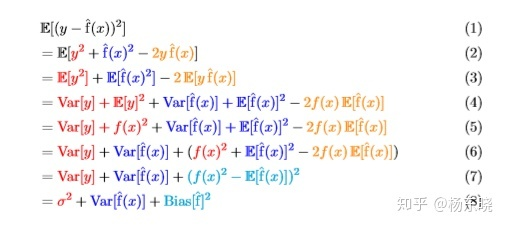
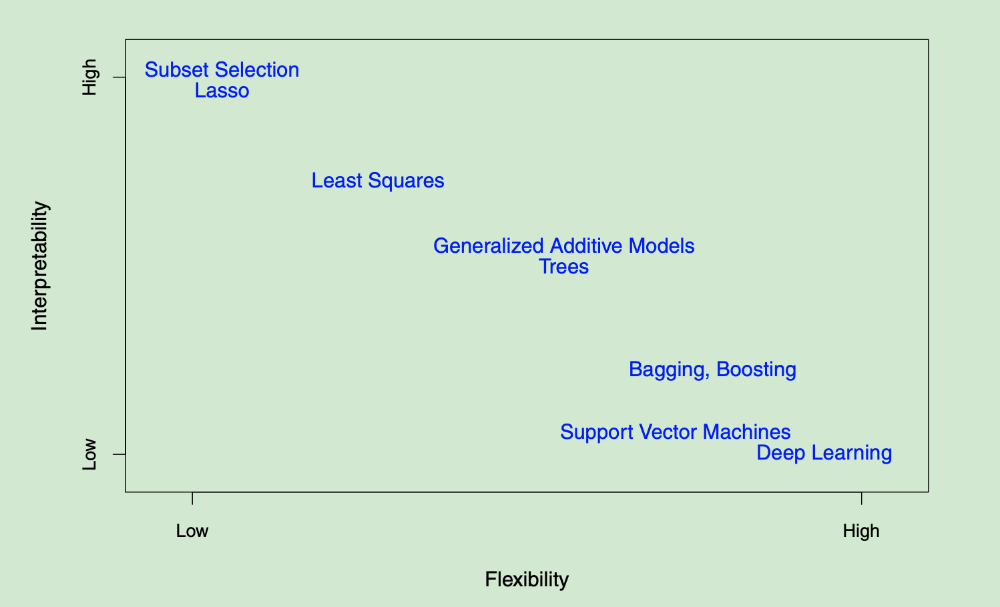

topic:: parametric model, mon-parametric model

- # Notes
	- **What are the names/denotes of input/output variables?**
	  collapsed:: true
		- **Input**: predictors, independent variables, features, variables. Typically denoted using $$X_i$$
		- **Output**: response, dependent variable. Typically denoted using $$Y_i$$
	- **预测误差的推导**
	  collapsed:: true
		- reducible error (可减少的误差)
			- Variance: 离散程度, 和预测结果的稳定性正比. 模型复杂度低, 方差比较低.
			- Bias: 模型的复杂程度和bias成反比
		- irreducible error (不可减少的误差, 噪声)
		- 方差的公式 其中E表示期望或者均值
			- $$
			  \begin{aligned}
			  \operatorname{Var}(X) &=\mathrm{E}\left[(X-\mathrm{E}[X])^{2}\right] \\
			  &=\mathrm{E}\left[X^{2}-2 X \mathrm{E}[X]+\mathrm{E}[X]^{2}\right] \\
			  &=\mathrm{E}\left[X^{2}\right]-2 \mathrm{E}[X] \mathrm{E}[X]+\mathrm{E}[X]^{2} \\
			  &=\mathrm{E}\left[X^{2}\right]-\mathrm{E}[X]^{2}
			  \end{aligned}
			  $$
			- 
			  id:: 7966e105-61bc-4a47-b1a0-68b84c86e5e1
				- 其中红色为噪声, 蓝色的$$f(x)$$上面没有平方.[统计学习笔记1-开篇与一些基本概念 - 知乎](https://zhuanlan.zhihu.com/p/45319239)
				  id:: c8a53de8-4b28-4fef-96bb-d607b714c645
		- $E$ represents the **average**, or expected value of the squared difference between the predicted and actual value of Y
		-
	- **Difference between [[parametric model]] and [[non-parametric model]]**
	  collapsed:: true
	- **What's the Trade-off between prediction accuracy and model interpretability?**
	  collapsed:: true
		- 
		- 当目标是推理时，选择更严格，更简单的统计学习模型。
		- 当目标是预测时，选择更灵活，更复杂的统计学习模型。
	- **What is Supervised and Unsupervised learning?**
	  collapsed:: true
		- [[supervised learning]]
			- For each observation of predictor measurements, there is an associated response measurement.
		- [[unsupervised learning]]
			- every observation $$i = 1,...n$$, observe a vector of measurements $$x_i$$ but no associated response $$y_i$$
			- 发现没有标签的数据里潜在的结构
- # Summary
	- inference: 就是从data来获取一些内在的联系的解释 (解释性), parametric model更加可解释.
	- 希腊字母一般都是不知道的, 和模型相关的 Unknowable world
	  英文字母一般都是row data相关的 Knowable world
	- 戴帽子(hat)的表示估计值, 预测值
	- 就算有完美fit的模型, 也会有irreducible error, (y 不能被 produced by x, 还有隐藏的参数永远不可能知道)