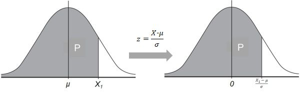

- alias:: Z统计量, Z值, Z分数, z statistic, z-statistic
- 当某个变量$X$以$\mu$作为平均值, $\sigma$ 作为标准差成正态分布的时候, 若将X作如下变化, 则新的变量$Z$也成正态分布
	- $$z =\frac{X-\mu}{\sigma}$$
		- 其中, $Z$ 的平均值为0, $Z$的标准差为1
- 对于一个正态分布的变量$X$, $X\leq X_1$ ($X_1$为任意常数) 的概率$P$等于$z =\frac{X_1-\mu}{\sigma}$的概率 (阴影部分面积)
	- 