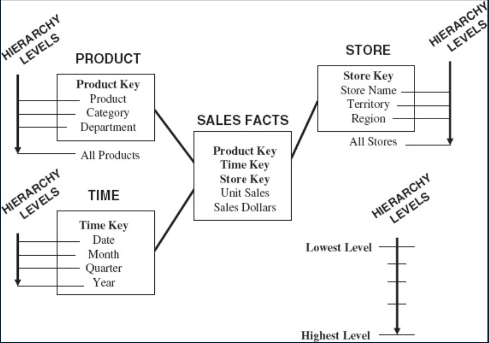
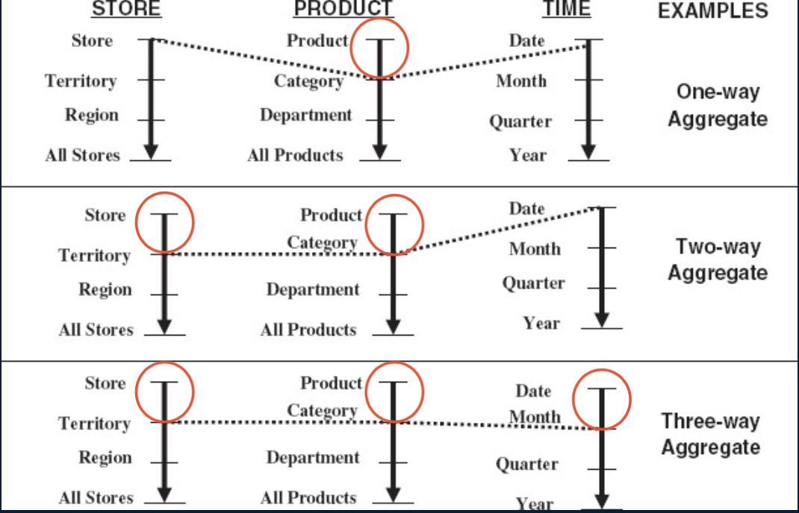
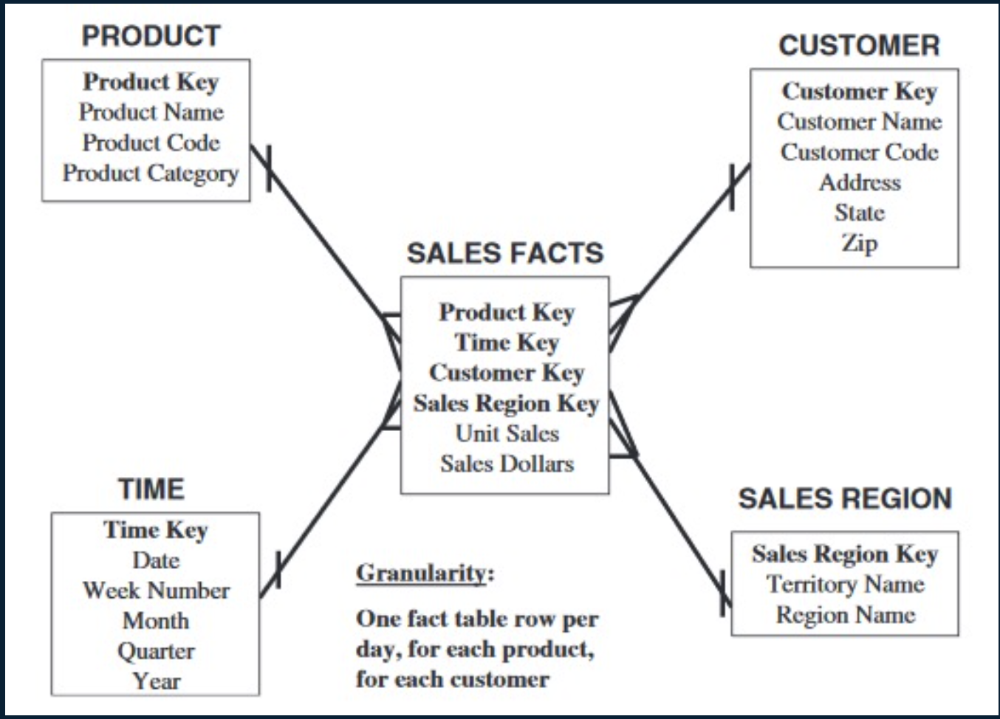
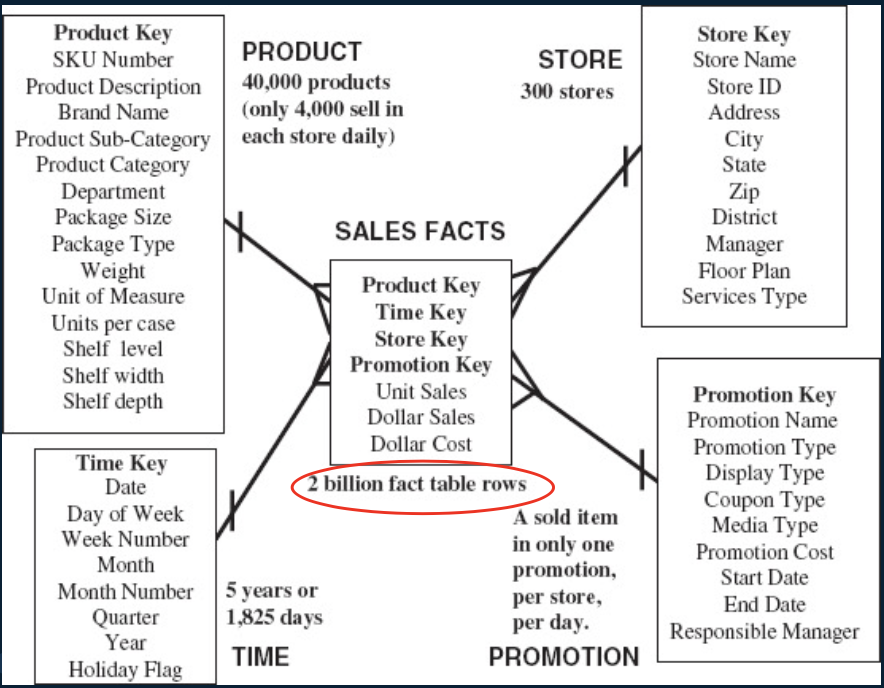
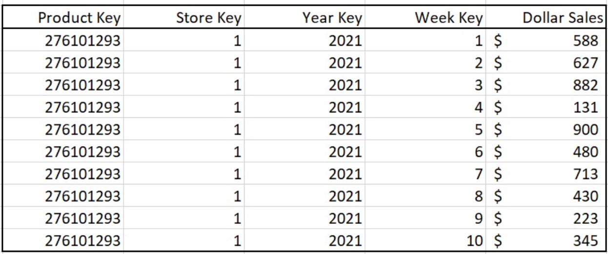
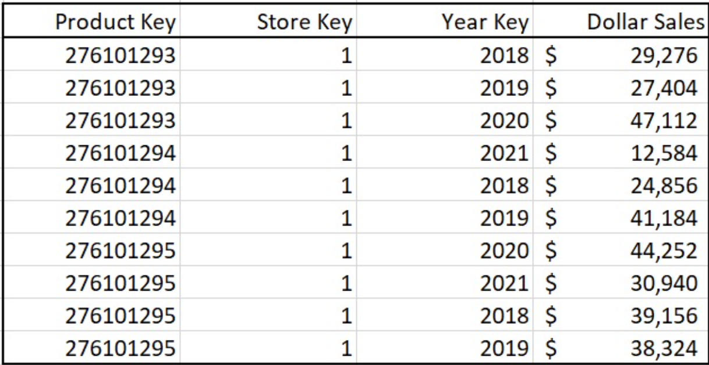

alias:: 聚集事实表, 聚合表, aggregate fact tables, 汇总事实表

- Definition
	- When [[fact table]] get very large -> create additional aggregate fact tables
	- 原子事实表(most granular fact table)的汇总数据. 新建立一个事实表, 它的维度表是比原维度表要少, 或者某些维度表是原维度表的子集, 如用月份维度表代替日期维度表, 事实数据是相应事实的汇总, 即求和或求平均值等
	- OLAP Cubes
- ==Approach==
	- Aggregate fact tables are simply summaries of the most granular data at higher levels along the dimension hierarchies. (具体见例子, 就是按hierarchies聚合原表)
	- What is ==hierarchies== and what is ==one-way aggregate, two-way aggregate, three-way aggregate==
		- 
		- 
		- Aggregate tables can be created by aggregating one dimension only or more than one at a time 比如 (possible aggregations):
			- Product category by store by date
			- Product department by store by date
			- All products by store by date
			- Territory by product by date
			- Region by product by date
			- All stores by product by date
			- Month by store by product
			- Quarter by store by product
			- Year by store by product
- Properties
	- Aggregate fact tables can significantly **improve query times** when employed intelligently
	- Modern data science platforms are moving away from the need to aggregate fact tables by employing high-speed in-memory analytics engines
- Example
	- Why aggregate fact table?
	  collapsed:: true
		- [[Star Schema]] for lowest granularity fact table
		  collapsed:: true
			- {:height 397, :width 471}
		- Sample query
			- Total sales for customer number 12345678 during the first week of December 2008 for product Widget-1 -> **7 rows**
			- Total sales for customer number 12345678 during the first three months of 2009 for product Widget-1. -> **90 rows**
			- Total sales for **all customers** in the south-central territory for the first two quarters of 2009 for product category Bigtools. -> Potentially large number of rows!!
	- ==Grocery Chain Example (calculate the rows)==
	  collapsed:: true
		- [[Star Schema]] for the Grocery chain example
			- 
		- Assume: at least one sale per product per store per week.
		  collapsed:: true
			- A query that involves 1 brand, all stores, 1 year (assuming the brand has 500 products) returns how many rows?
				- brand: 1, stores: 300, products: 1*500 = 500, weeks: 52
				- $500 \times 300 \times 52 \quad \text{(52 weeks = 1 year)} = 7800000 \quad \text{(fact table rows)}$
		- Suppose you had pre-calculated an aggregate fact table in which each row summarized the total for a product, per store, ==per week==. How many rows would the following queries return?
		  collapsed:: true
			- 
			- A query that involves 1 product, 1 store, and 1 week?
				- -> 1 row
			- A query that involves 1 product, all stores, and 1 year?
				- -> 300*52=15600 rows
			- A query that involves all products, all stores, and 1 week?
				- -> 300*40000 = 12000000 rows
			- A query that involves all products, 1 store, 1 year?
				- -> 40000*52 = 20800000 rows
		- Suppose you had recalculated another aggregate fact table in which each row summarized the total for a product, per store, store, ==per year==?
		  collapsed:: true
			- 
			- A query that involves 1 product, 1 store, and 1 week?
				- Could not execute with this fact table
			- A query that involves 1 product, all stores, and 1 year?
				- -> 300 rows
			- A query that involves all products, all stores, and 1 week?
				- Could not execute with this fact table
			- A query that involves all products, 1 store, 1 year?
				- -> 40000 rows