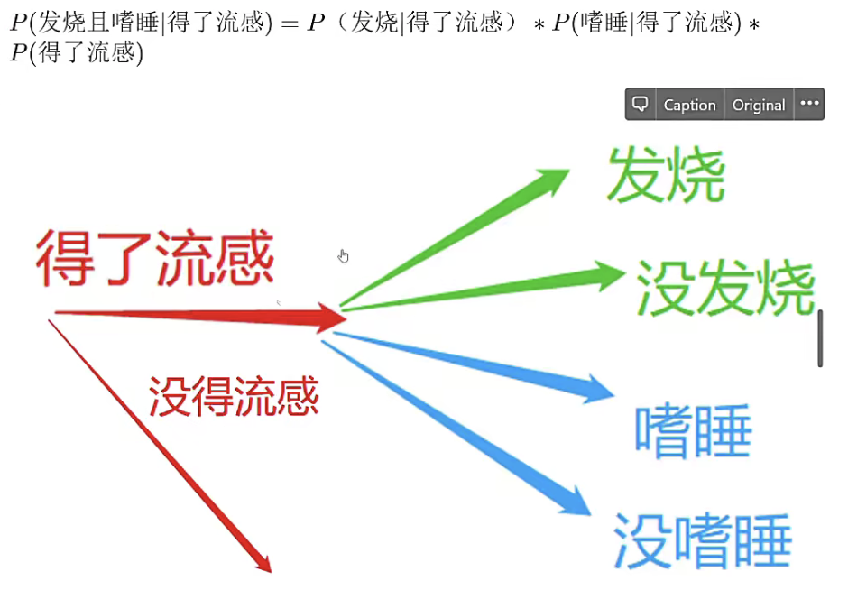
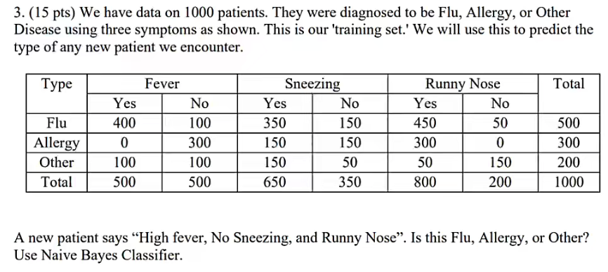
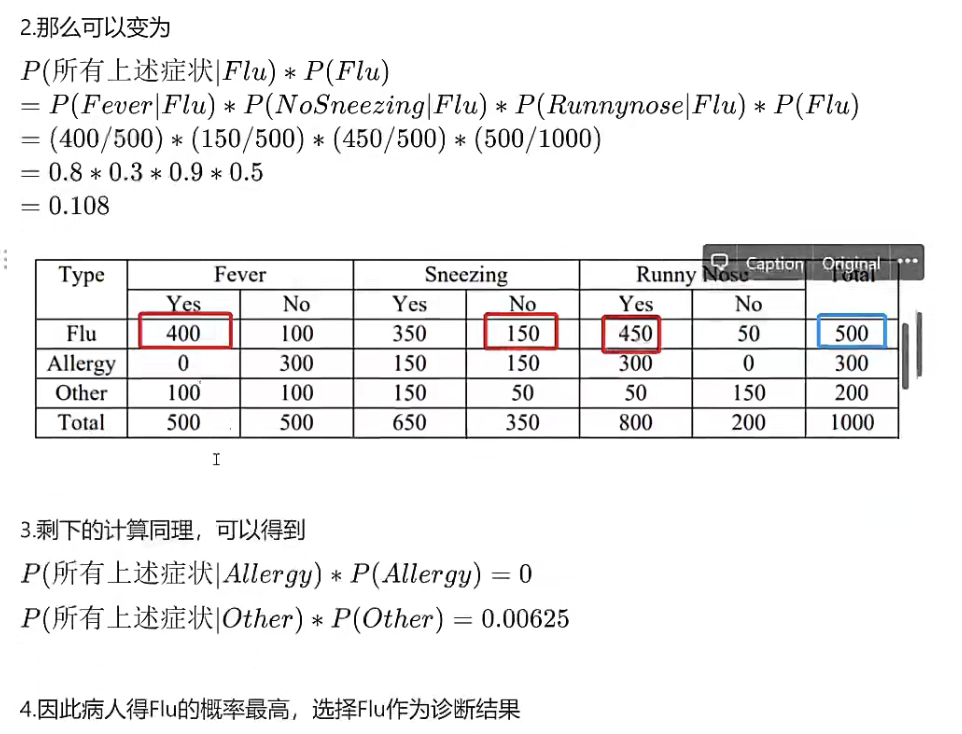

alias:: 朴素贝叶斯分类器, naive bayes classifier

- 原理
	- 对于给出的待分类项, 求解在此项出现的条件下各个类别出现的概率, 哪个最大, 就认为此待分类项属于哪个类别.
- [[assumption]]
	- Within the $k_{th}$ class, the $p$ predictors are indipendent
	- id:: e0caca76-390f-4a0f-b74b-ae0963b3d11c
	  $$
	  f_{k}(x)=f_{k 1}\left(x_{1}\right) \times f_{k 2}\left(x_{2}\right) \times \cdots \times f_{k p}\left(x_{p}\right)
	  $$
		- $f_{kj}$ is the [[probability density function]] of the $j_{th}$ predictor among observations in $k_{th}$ class
	- 这个假设可以 eliminate the need to worry about the association between the p-predictors, given that: 
	  ((6222b6df-c624-4af6-9f51-311744997893))
	- 并且这个假设虽然 ==increase== bias, but ==reduce== variance, ([[bias-variance tradeoff]])
	- 通俗解释: 每个属性都是相互独立的, 概率就是两个事件的概率相乘
	  collapsed:: true
		- {:height 308, :width 480}
- Formula
	- Plug
	  $$
	  f_{k}(x)=f_{k 1}\left(x_{1}\right) \times f_{k 2}\left(x_{2}\right) \times \cdots \times f_{k p}\left(x_{p}\right)
	  $$
	  into 
	  $$
	  \operatorname{Pr}(Y=k \mid X=x)=\frac{\pi_{k} f_{k}(x)}{\sum_{l=1}^{K} \pi_{l} f_{l}(x)}
	  $$
	  get
	  $$
	  \operatorname{Pr}(Y=k \mid X=x)=\frac{\pi_{k} \times f_{k 1}\left(x_{1}\right) \times f_{k 2}\left(x_{2}\right) \times \cdots \times f_{k p}\left(x_{p}\right)}{\sum_{l=1}^{K} \pi_{l} \times f_{l 1}\left(x_{1}\right) \times f_{l 2}\left(x_{2}\right) \times \cdots \times f_{l p}\left(x_{p}\right)}
	  $$
	- to estimate the one-dimensional density function $f_{kj}$, using training data $x_{1j}...x_{nj}$
		- if $X_j$ is quantitative (定量)
			- [[assumption]]
				- $$
				  X_{j} \mid Y=k \sim N\left(\mu_{j k}, \sigma_{j k}^{2}\right)
				  $$
				- In other words, assume within each class, the $j_{th}$ predictor is drawn from a normal distribution, the difference with [[QDA]] is that here we assume that the predictors are independent, which means that the non-diagonal $\Sigma$ is 0
		- if $X_j$ is quantitative (定量)
			- use a non-parametric estimate for $f_{kj}$, [[kernel density estimator]]
		- if $X_j$ is qualitative (定性)
			- ISLRv2 p156
- **Algorithm**
	- 设 $x=\left\{a_{1}, a_{2}, \ldots, a_{m}\right\}$ 为一个待分类项, 每个a为x的一个特征属性
	- 有类别集合$C=\left\{y_{1}, y_{2}, \ldots, y_{n}\right\}$
	- 根据[[bayes theorem]]计算$$P\left(y_{1} \mid x\right), P\left(y_{2} \mid x\right), \ldots, P\left(y_{n} \mid x\right)$$
		- 找到一个已知分类的待分类项集合, 这个集合叫做训练样本集
		- 统计各个类别下各个特征属性的条件概率统计
		  $$P\left(a_{1} \mid y_{1}\right), P\left(a_{2} \mid y_{1}\right), \ldots, P\left(a_{m} \mid y_{1}\right)$$
		  $$P\left(a_{1} \mid y_{2}\right), P\left(a_{2} \mid y_{2}\right), \ldots, P\left(a_{m} \mid y_{2}\right)\ldots$$
		  $$P\left(a_{1} \mid y_{n}\right), P\left(a_{2} \mid y_{n}\right), \ldots, P\left(a_{m} \mid y_{n}\right)$$
		- 如果各个特征属性是条件独立的, 根据 $P(A \mid B)=\frac{P(A) P(B \mid A)}{P(B)}$ , 因为分母对于所有类别为常数, 因此将分子最大化即可, 又因为各特征属性是条件独立的, 所以有
		- $$P\left(x \mid y_{i}\right) P\left(y_{i}\right)=P\left(a_{1} \mid y_{i}\right) P\left(a_{2} \mid y_{i}\right) \ldots P\left(a_{m} \mid y_{i}\right) P\left(y_{i}\right)$$
		  $$=P\left(y_{i}\right) \prod_{j=1}^{m} P\left(a_{j} \mid y_{i}\right)$$
		- 如果$$P\left(y_{k} \mid x\right)=\max \left\{P\left(y_{1} \mid x\right), P\left(y_{2} \mid x\right), \ldots, P\left(y_{n} \mid x\right)\right\}$$, 
		  则$$x \in y_{k}$$
- **Example**
  collapsed:: true
	- 
	- 
	- 根据假设, 可以得到是求下面式子中最高的一项
	  $$P(上述所有症状\mid Flu)*P(Flu)$$
	  $$P(上述所有症状\mid Allergy)*P(Allergy)$$
	  $$P(上述所有症状\mid Other)*P(Other)$$
	- 
	-