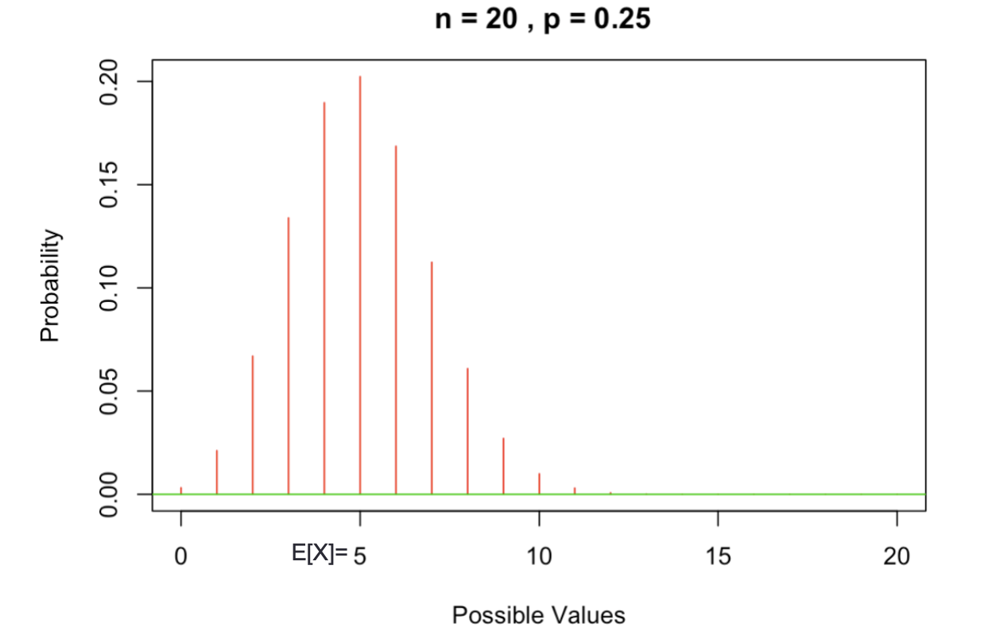

alias:: 二项式随机变量, Binomial Random Variable, 二项随机变量
title:: binomial random variable

- # **Definition**
	- ==generalization of== [[bernoulli random variable]]
	- 假设进行n次独立的重复实验, 每次实验成功率为$$p$$, 失败的概率为$$1-p$$, 现在令随机变量$$X$$表示$$n$$次实验中成功的次数, 那么此时就称$$X$$为参数是$$(n,p)$$的二项随机变量
	  id:: 61f23283-b426-40b9-b3b7-3ca8e9e9a26a
		- [[bernoulli random variable]] 是参数为$$(1,p)$$的二项随机变量
		- if $$(X_1, X_2, X_3, ... , X_n)$$ are Independent and identically distributed (iid) $$BERN(p)$$, then
			- $$
			  \sum_{i=1}^{n} X=X_{1}+X_{2}+\ldots X_{n} \sim \operatorname{BINO}(n, p)
			  $$
	- (Binomial) $$X$$: n. of successes in __n __trials
	- [[probability distribution function]] for binomial random variable
		- $$
		  \begin{aligned}
		  P[X=x] &=\left(\begin{array}{l}
		  n \\
		  x
		  \end{array}\right) p^{x}(1-p)^{n-x} \quad x=0, \ldots, n \\
		  \left(\begin{array}{l}
		  n \\
		  x
		  \end{array}\right) &=\frac{n !}{x !(n-x) !} \\
		  E[X] &=n p \\
		  \operatorname{Var}[X] &=n p(1-p)
		  \end{aligned}
		  $$
		- or
		- id:: 61f60fde-ef15-4237-b9b3-e62028290442
		  $$
		  X \sim B I N O(n, p)\left\{\begin{array}{l}
		  E[X]=n p \\
		  \operatorname{Var}[X]=n p(1-p)
		  \end{array}\right.
		  $$
		- 
- # **Properties**
	- 二项随机变量的概率质量函数的一个重要性质：如果$$X$$是一个参数为$$(n,p)$$的二项随机变量$$( 0 < p < 1 )$$，那么当$$k$$从0到$$n$$时，$$P { X = k }$$ 是先增后减的，当$$k = [ ( n + 1 ) p ]$$ 时取得最大值