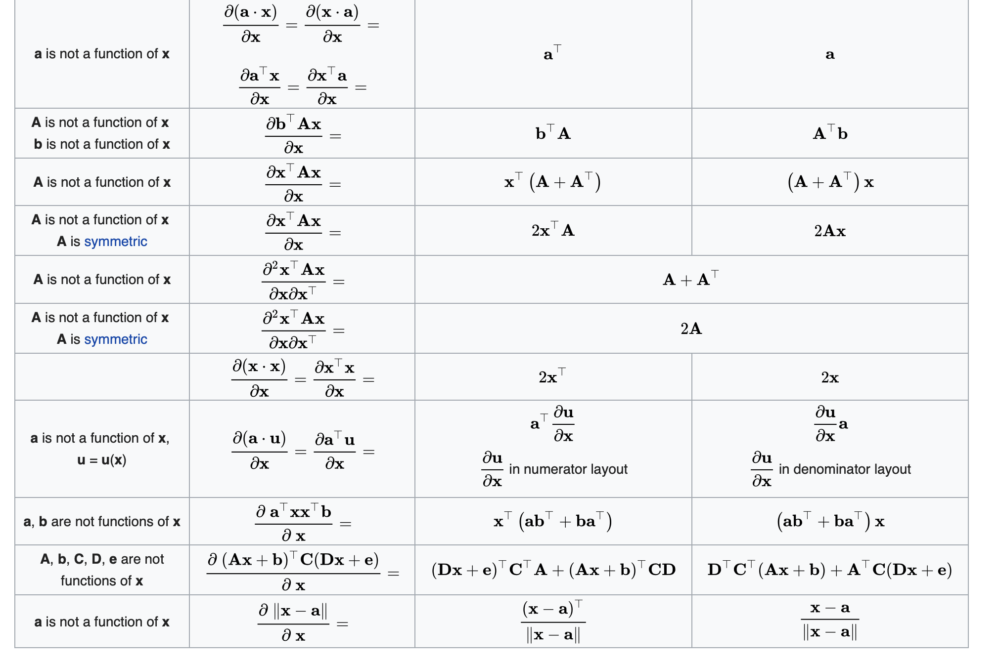

alias:: 微积分, 导数, 积分, matrix calculus, 矩阵求导

- {{renderer :tocgen, [[]], 1}}
- 导数(derivative)
  collapsed:: true
	- definition
		- 假设有一个函数 $f : \mathbb{R}^n \to \mathbb{R}$, 其输入和输出都是标量, 如果$f^{\prime}(x)$ 存在, 那么 $f$ 在 $a$ 处是可微的 (differentiable) 也就是瞬时变化率
		- $$
		  f^{\prime}(x)=\lim _{h \rightarrow 0} \frac{f(x+h)-f(x)}{h}
		  $$
	- 表达形式
		- $$
		  f^{\prime}(x)=y^{\prime}=\frac{d y}{d x}=\frac{d f}{d x}=\frac{d}{d x} f(x)=\operatorname{Df}(x)=D_{x} f(x)
		  $$
	- properties
		- 常数相乘法则
			- $$
			  \frac{d}{d x}[C f(x)]=C \frac{d}{d x} f(x)
			  $$
		- 加法法则
			- $$
			  \frac{d}{d x}[f(x)+g(x)]=\frac{d}{d x} f(x)+\frac{d}{d x} g(x)
			  $$
		- 乘法法则
			- $$
			  \frac{d}{d x}[f(x) g(x)]=f(x) \frac{d}{d x}[g(x)]+g(x) \frac{d}{d x}[f(x)]
			  $$
		- 除法法则
			- $$
			  \frac{d}{d x}\left[\frac{f(x)}{g(x)}\right]=\frac{g(x) \frac{d}{d x}[f(x)]-f(x) \frac{d}{d x}[g(x)]}{[g(x)]^{2}}
			  $$
- 链式法则 (chain rule)
  collapsed:: true
	- definition
		- 可以用来微分复合函数 (composite)
		- 假设 $y = f(u)$ 和 $u = g(x)$ 都是可微的
		- $$
		  \frac{d y}{d x}=\frac{d y}{d u} \frac{d u}{d x}
		  $$
		- 假设可微分函数 $y$ 有变量 $u_1, u_2,..., u_m$, 其中每个可微分函数 $u_i$ 又都有变量 $x_1, x_2, ..., x_n$ 
		  ( $y$ 是 $x_1, x_2, ..., x_n$ 的函数), 对于任意的$i = 1,2,...,n$
			- $$
			  \frac{d y}{d x_{i}}=\frac{d y}{d u_{1}} \frac{d u_{1}}{d x_{i}}+\frac{d y}{d u_{2}} \frac{d u_{2}}{d x_{i}}+\cdots+\frac{d y}{d u_{m}} \frac{d u_{m}}{d x_{i}}
			  $$
		- 如果 $y = f(g(x))$ 那么 $y'(x) = f'(g(x))g'(x)$
- 乘积法则
  collapsed:: true
	- $$(fg)' = f'g + fg'$$
- 求和法则
  collapsed:: true
	- $$(f+g)' = f' + g'$$
- 矩阵求导 [矩阵求导](https://fei-wang.github.io/matrix.html)
  collapsed:: true
	- definition
		- 矩阵求导就是分别将各元素进行求导, 然后将求导的结果写成矩阵的形式(向量为矩阵特殊形式), 根据写成的矩阵的排列方式, 又分为分子布局和分母布局
	- 分子布局 (本文使用)
		- 行数和分子相同的维度, 列数和分母相同的维度. 如列向量对列向量的导数为分子各元素分别对分母各元素的导数, 然后将结果排列为矩阵, 矩阵的行数为分子的行数, 矩阵的列数为分母的行数
	- 分母布局
		- 行数和分母相同的维度, 列数和分子相同的维度, 如列向量对列向量的导数为分子各元素分别对分母各元素的导数, 然后将结果排列为矩阵, 矩阵的行数为分母的行数, 矩阵的列数为分子的行数
	- 混合布局
		- 向量或者矩阵在分子时采用分子布局, 向量或矩阵在分母时采用分母布局
- 常用等式
  collapsed:: true
	- $$
	  \|\boldsymbol{X}\|^{2}=\operatorname{tr}\left(\boldsymbol{X}^{\mathrm{T}} \cdot \boldsymbol{X}\right)=\operatorname{tr}\left(\boldsymbol{X} \cdot \boldsymbol{X}^{\mathrm{T}}\right)
	  $$
	- $$
	  \operatorname{tr}(\boldsymbol{A B C D})=\operatorname{tr}(\boldsymbol{B C D} \boldsymbol{A})=\operatorname{tr}(\boldsymbol{C D A B})=\operatorname{tr}(\boldsymbol{D} \boldsymbol{A B C})
	  $$
- 向量对标量求导
  collapsed:: true
	- definition
	  collapsed:: true
		- 向量 $\mathbf{y} = [y_1, y_2, ..., y_m]^{\top}$ 对标量$x$的导数
		- $$
		  \frac{\partial \mathbf{y}}{\partial x}=\left[\frac{\partial y_{1}}{\partial x}, \frac{\partial y_{2}}{\partial x}, \cdots, \frac{\partial y_{m}}{\partial x}\right]^{\mathrm{T}}
		  $$
		- 也就是
		- $$
		  \left(\frac{\partial \mathbf{y}}{\partial x}\right)_{i}=\frac{\partial y_{i}}{\partial x}
		  $$
	- 恒等式
	  collapsed:: true
		- 
- 标量对向量求导
  collapsed:: true
	- definition
		- 标量$y$对向量$\mathbf{x}^{\top} = [x_1, ..., x_n]$的导数写成如下形式
			- $$
			  \frac{\partial y}{\partial \mathbf{x}^{\mathrm{T}}}=\left[\frac{\partial y}{\partial x_{1}}, \frac{\partial y}{\partial x_{2}}, \cdots, \frac{\partial y}{\partial x_{n}}\right]^{\mathrm{T}}
			  $$
		- 即
			- $$
			  \left(\frac{\partial y}{\partial \mathbf{x}^{T}}\right)_{i}=\frac{\partial y}{\partial x_{i}}
			  $$
	- 恒等式
	  collapsed:: true
		- 
		- 
- 向量对向量求导
  collapsed:: true
	- definition
		- 向量$y = [y_1, y_2, ..., y_m]^{\top}$ 对向量 $x = [x_1, x_2, ..., x_m]^{\top}$的导数为[[jacobi matrix]]
		  $$
		  \frac{\partial \mathbf{y}}{\partial \mathbf{x}}=\left[\begin{array}{cccc}
		  \frac{\partial y_{1}}{\partial x_{1}} & \frac{\partial y_{1}}{\partial x_{2}} & \cdots & \frac{\partial y_{1}}{\partial x_{n}} \\
		  \frac{\partial y_{2}}{\partial x_{1}} & \frac{\partial y_{2}}{\partial x_{2}} & \cdots & \frac{\partial y_{2}}{\partial x_{n}} \\
		  \vdots & \vdots & \ddots & \vdots \\
		  \frac{\partial y_{m}}{\partial x_{1}} & \frac{\partial y_{m}}{\partial x_{2}} & \cdots & \frac{\partial y_{m}}{\partial x_{n}}
		  \end{array}\right]
		  $$
		- 即
		- $$
		  \left(\frac{\partial \mathbf{y}}{\partial \mathbf{x}}\right)_{i j}=\frac{\partial y_{i}}{\partial x_{j}}
		  $$
	- 恒等式
	  collapsed:: true
		- 
- 矩阵对标量求导
  collapsed:: true
	- definition
	  collapsed:: true
		- $$
		  \frac{\partial \boldsymbol{Y}}{\partial x}=\left[\begin{array}{cccc}
		  \frac{\partial y_{11}}{\partial x} & \frac{\partial y_{12}}{\partial x} & \cdots & \frac{\partial y_{1 n}}{\partial x} \\
		  \frac{\partial y_{21}}{\partial x} & \frac{\partial y_{22}}{\partial x} & \cdots & \frac{\partial y_{2 n}}{\partial x} \\
		  \vdots & \vdots & \ddots & \vdots \\
		  \frac{\partial y_{m 1}}{\partial x} & \frac{\partial y_{m 2}}{\partial x} & \cdots & \frac{\partial y_{m n}}{\partial x}
		  \end{array}\right]
		  $$
		- 即
		- $$
		  \left(\frac{\partial \mathbf{Y}}{\partial x}\right)_{i j}=\frac{\partial y_{i j}}{\partial x}
		  $$
	- 恒等式
	  collapsed:: true
		- 
- 标量对矩阵求导
  collapsed:: true
	- definition
	  collapsed:: true
		- $$
		  \frac{\partial y}{\partial X}=\left[\begin{array}{cccc}
		  \frac{\partial y}{\partial x_{11}} & \frac{\partial y}{\partial x_{21}} & \cdots & \frac{\partial y}{\partial x_{p 1}} \\
		  \frac{\partial y}{\partial x_{12}} & \frac{\partial y}{\partial x_{22}} & \cdots & \frac{\partial y}{\partial x_{p 2}} \\
		  \vdots & \vdots & \ddots & \vdots \\
		  \frac{\partial y}{\partial x_{1 q}} & \frac{\partial y}{\partial x_{2 q}} & \cdots & \frac{\partial y}{\partial x_{p q}}
		  \end{array}\right]
		  $$
		- 即
		- $$
		  \left(\frac{\partial y}{\partial X}\right)_{i j}=\frac{\partial y}{\partial x_{j i}}
		  $$
	- 恒等式
	  collapsed:: true
		- 
		- 
		- 
- scaler-by-scaler with vectors or matrix involved
  collapsed:: true
	- 
-