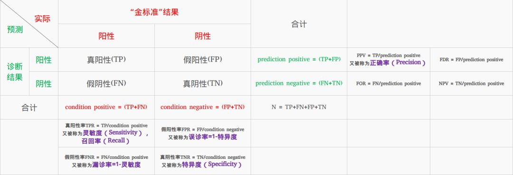
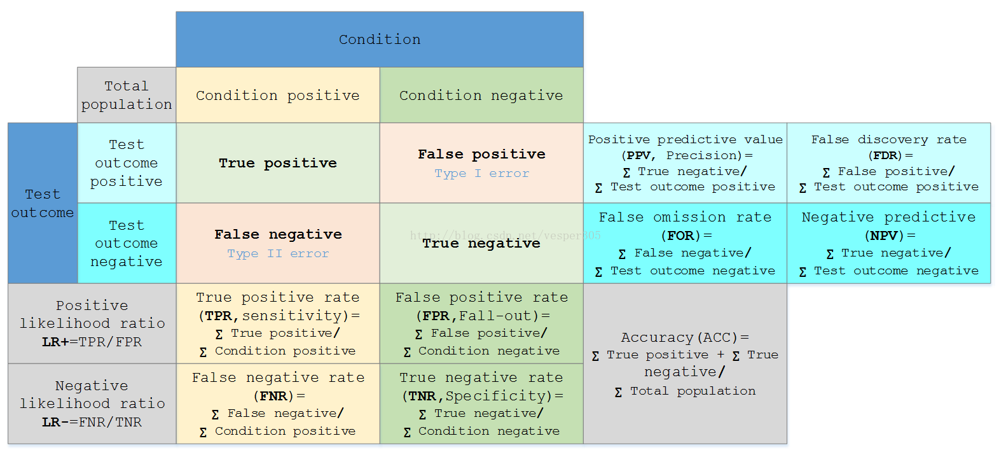

alias:: 混淆矩阵

- Definition
	- 当变量测量的结果是连续值的时候, 类与类之间必须用一个 threshold 来界定
	- 
	- 
- Jargon
	- |Definition||
	  |--|--|
	  |True positive(TP)|eqv. with hit|
	  |True negative(TN)|eqv. with correct rejection|
	  |False positive(FP)|eqv. with false alarm, [[type I error]] |
	  |False negative(FN)|eqv. with miss, [[type II error]] |
	- |Definition|Formula|
	  |--|--|
	  | [[sensitivity]] or true positive rate (TPR) (1-Type II error) (recall)|TPR = TP/P = TP/(TP + FN)|
	  | [[specificity]] or true negative rate (TNR)|SPC = TN/N = TN/(FP + TN)|
	  | [[Precision]] or positive prediction value (PPV)|PPV = TP/P* = TP/(TP + FP)|
	  |Negative predictive value (NPV)|NPV = TN/N* = TN/(TN + FN)|
	  |Fall-out or false positive rate (FPR) (Type I error)(1-Specificity)|FPR = FP/N = FP/(FP + TN)|
	  |False discovery rate (FDR)|FDR = FP/(FP + TP) = 1 - PPV|
	  |Miss Rate orFalse Negative Rate (FNR)|FNR = FN/P = FN/(FN + TP)|
	  |Accuracy (ACC)|ACC = (TP + TN)/(P + N)|