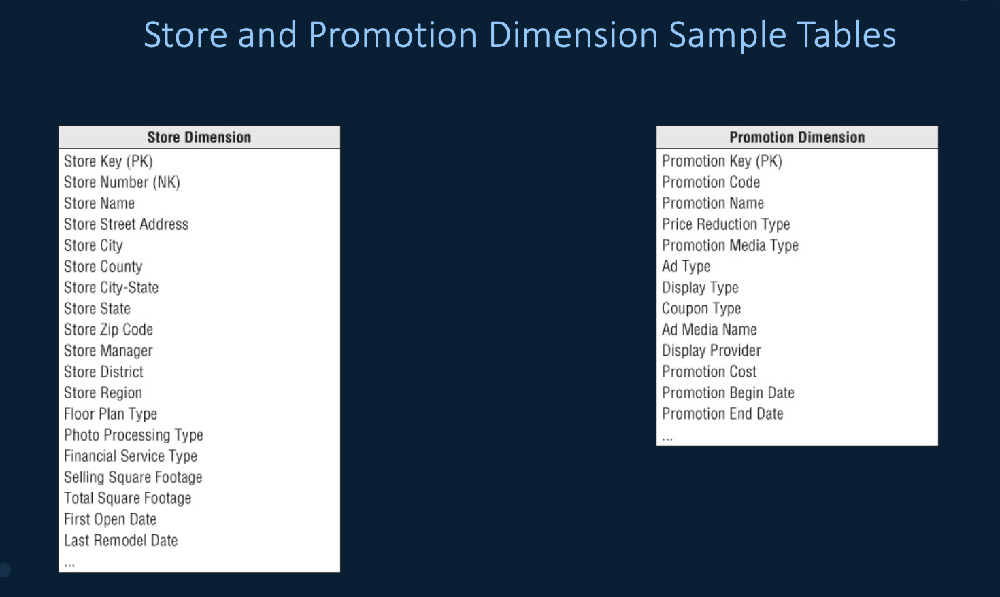
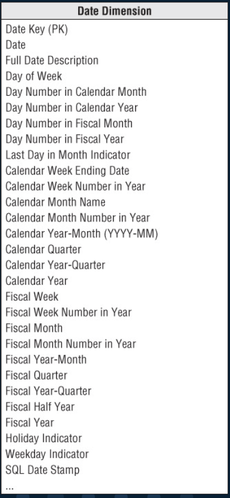
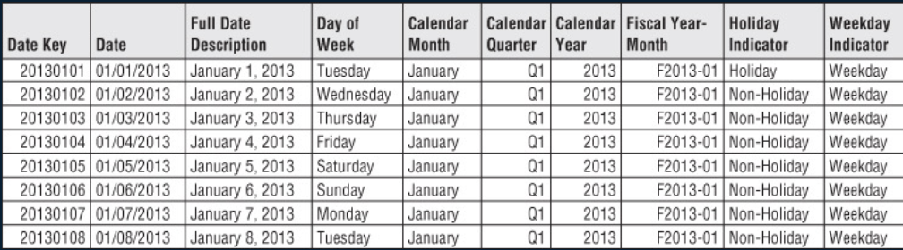
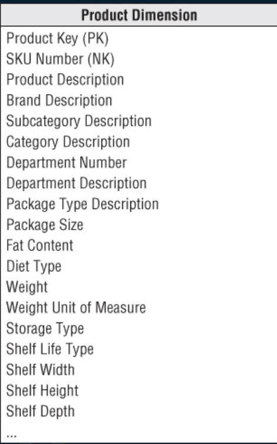
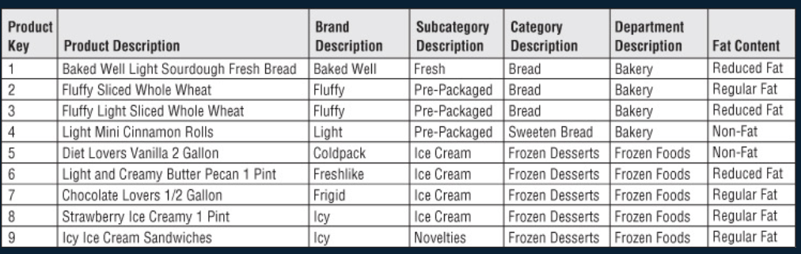
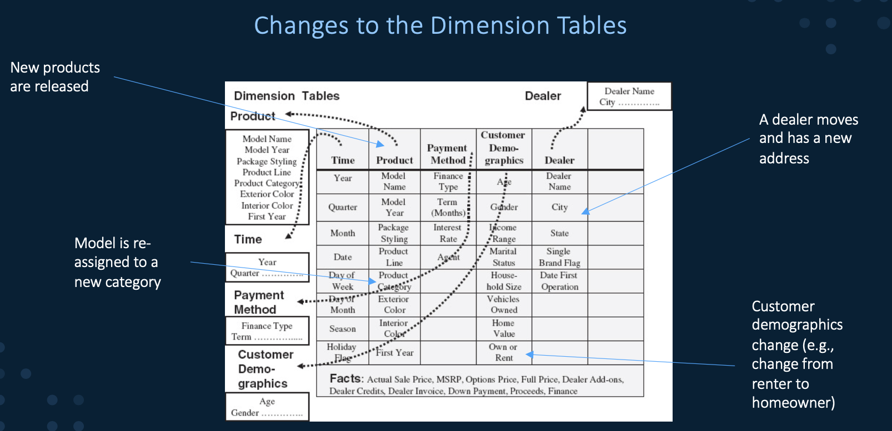
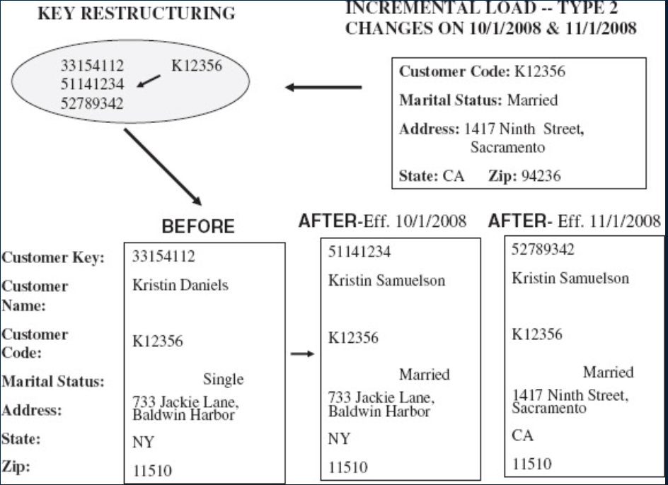
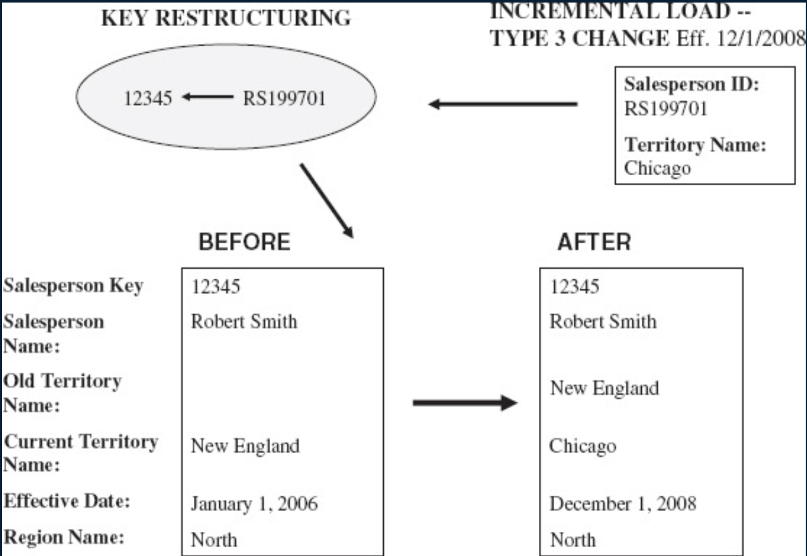

alias:: 维度表, 维表, dimension tables

- **Definition**
	- 对于数据进行分析时所用的一个量
	- 对数据分析是用的一个量, 比如分析产品销售, 选择**按类别**, 或者**按区域**, 或者**按...**分析就构成一个维度, 维度下面的子维度叫属性, 比如子类型, 产品名.
- **Properties**
	- 维度表一半不用自然键, 而是使用 [[surrogate key]]
- **Example**
	- 产品维度表: Prod_id, Product_Name, Category, Color, Size, Price
	  时间维度表: TimeKey, Season, Year, Month, Date
	- 
- **Type**
	- Date Dimension
	  collapsed:: true
		- properties/Definition
			- Contained in virtually every dimensional model
			- table can be built in advance
			- Typically one row per day with many attributes that are likely to be useful in queries
		- example
		  collapsed:: true
			- 
			- 
	- Product Dimension
	  collapsed:: true
		- Describes every SKU in the grocery store
		- Typically contains **hierarchies**
			- individual SKUs roll up to brands, which roll up to categories, which roll up to department
		- example
		  collapsed:: true
			- 
			- 
	- [[Conformed Dimension]]
	- [[multivalue dimension]]
- **Changes to the dimension tables** (slowly changing dimensions)
	- Example
	  collapsed:: true
		- 
	- General Principles
	  collapsed:: true
		- Most dimensions are generally constant over time
		- Some dimensions change, but change **slowly**
		- Best approach to handling changes to the dimensions depends on the types of changes and what information wants to preserve (Overwriting is not desirable)
	- **Approaches**
		- Type 1 changes: Overwrite (correction of errors)
		  collapsed:: true
			- If the value does't needs to be retained before the change -> Type 1 changes
		- Type 2 changes: add new row
		  collapsed:: true
			- If the value needs to be retained before the change -> Type 2 changes
			- Implement
				- add a new row to the dimension table with the new value of the changed attribute and an effective date field
				- No changes to the original row
				- The new row is inserted with a new [[surrogate key]]
				- example
					- 
		- Type 3 changes: add new attribute
		  collapsed:: true
			- sometimes need to maintain two alternate realities (current version and alternate version)
			- Implement
			  collapsed:: true
				- Add an "old" field in the dimension table and copy the existing value of the attribute to the "old" field
				- Add the new value of the attribute to the "current" field
				- 
			- example
			  collapsed:: true
				- management wishes is considering realigning territories for its sales staff and wants to see certain reports and analyses based on the current and contemplated new assignments
	- General [[ETL]] / Update process for dimension tables
		- Take the [[natural key]] from the source system
		- Use this identifier to look up the **corresponding record in the dimension table**
			- If it exists, update the dimension table based on the type of update (Type 1, 2, or 3)
			- If it doesn't exist, insert a new record into the dimension table generating a new [[surrogate key]] in one of the following ways:
				- Using the capabilities of the underlying database SQL
				- Using the capabilities of an ETL tool