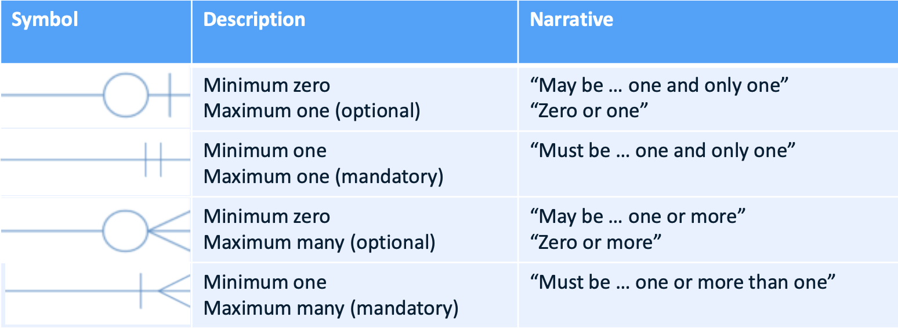
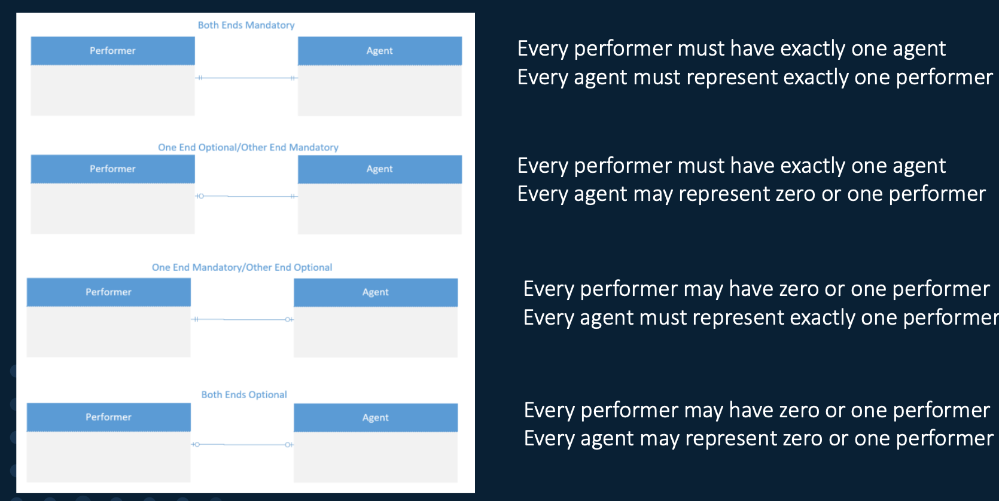
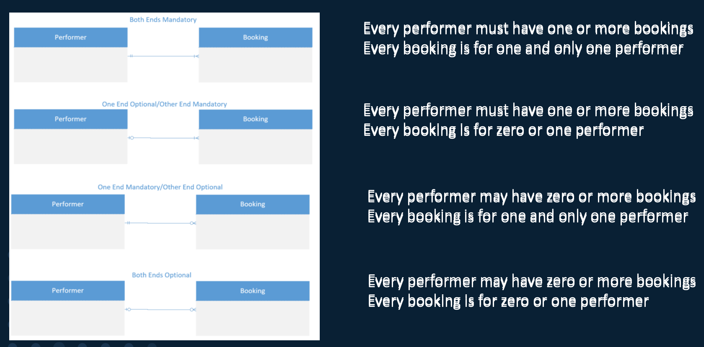
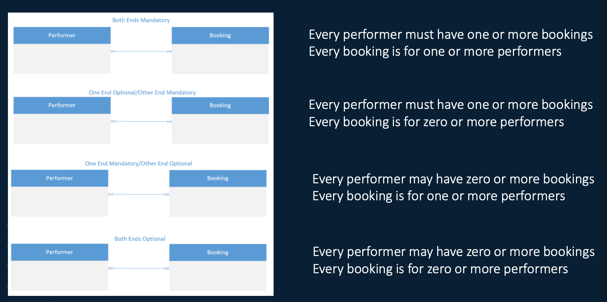
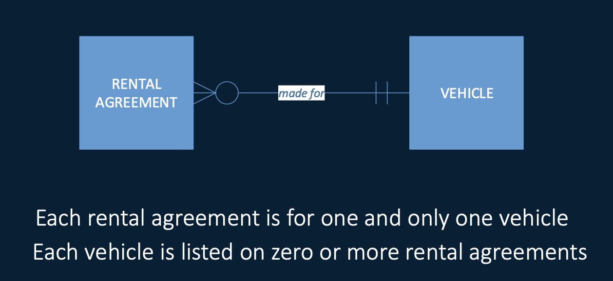
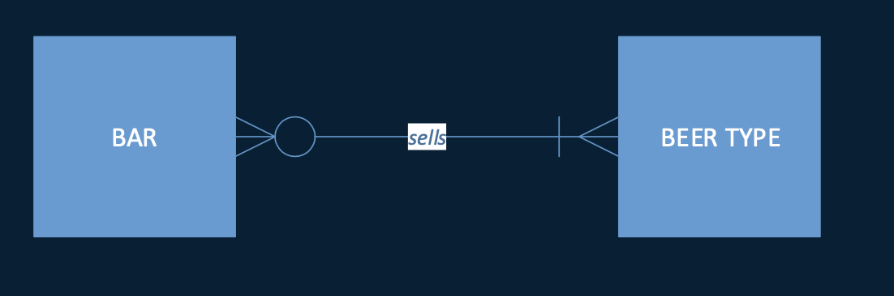
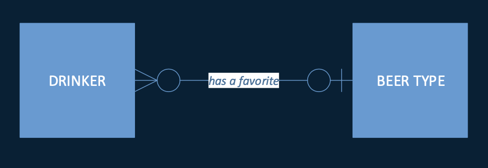
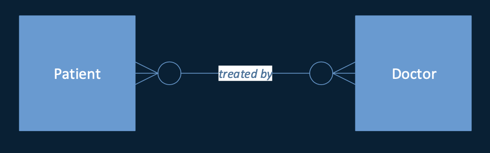
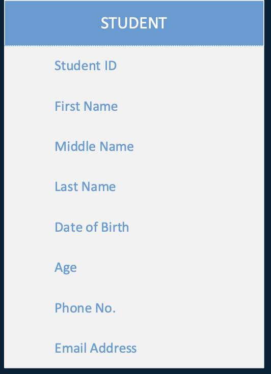

alias:: ER model, ER图, ERD, ER模型, ER diagram, entity relationship diagram, entity relationship model

- different types
  collapsed:: true
	- chen
	- IDEF1X
	- Bachman
	- UML
	- Min-Max/ISO
	- Crow's foot
- **Basic model components**
	- **Entities**: Things of interest to the business about which information needs to be recorded
		- ==csv's rows==
		- entities 不是单独, 特定的东西, 是一群有共同特征的事情
			- entity types: group or class of entities that have the same chareacteristics
			- entity occurrences: individual entities within the same entity type
			- examples
			  collapsed:: true
				- VEHICLE (not VEHICLES)
				- VEHICLE TYPE (not TYPE OF VEHICLE)
				- PERSON (not PEOPLE, PERSON FILE, PERSON TABLE, PERSON RECORD)
				- RENTAL AGREEMENT (not RENTAL AGREEMENTS, RENTAL HISTORY)
		- examples
		  collapsed:: true
			- city, department, customer, house, movie, employee...
	- **Relationships**: Logical links between two or more entities (**Key activities**)
		- Entities are related to other entities in ways that are specific to our business
			- reflect the rules, conditions, or constraints of the business
		- examples
		  collapsed:: true
			- An employee WORKS FOR a department
			- A customer PURCHASES a House
	- **Atributes**: Additional information about a specific Entity
		- ==csv's columns==
		- examples
		  collapsed:: true
			- A house has an ADDRESS
			- A house has a PURCHASE PRICE
- **Crows Foot Notations**
	- (带圆圈的是optional, 不带的是mandatory)
	- **Relationships**
		- 
		- **One to One Relationships**
		  collapsed:: true
			- 
		- **One to Many Relationships**
		  id:: 622022a6-3905-416d-96cd-63de998ad049
			- 
		- **Many to Many Relationships**
		  id:: 622022a6-270c-4332-93d9-30ddc76b14e1
			- 
		- **Many to One / Optional - Mandatory**
		  collapsed:: true
			- 
		- **Many to Many / Optional - Mandatory**
		  collapsed:: true
			- 
		- **Many to One / Optional - Optional**
		  collapsed:: true
			- 
		- **One to Many / Mandatory - Optional**
		  collapsed:: true
			- 
		- **One to One / Optional - Mandatory**
		  collapsed:: true
			- 
		- **Many to Many / Optional - Optional**
		  collapsed:: true
			- 
		- ^^One-to-one mandatory-mandatory relationship is very rare and usually turns out to be wrong (better expressed as an attribute)^^
	- **Attributes**
		- **attributes are simple values, not structures of sets.**
		- example
		  collapsed:: true
			- 
		- Types
			- simple attribute: cannot be divided into subparts (age)
			- [[composite attribute]] : composed of multiple components (address is composed of city, state..)
			- Single valued attribute: holds a single value (age)
			- [[multi-valued attribute]] : hold multiple values for a single entity (phone number)
			- [[Derived attribute]] : attribute that can be derived from other attributes (age can be derived from date of birth)