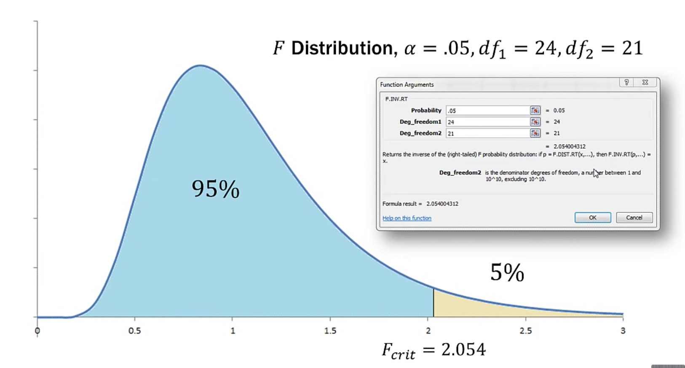
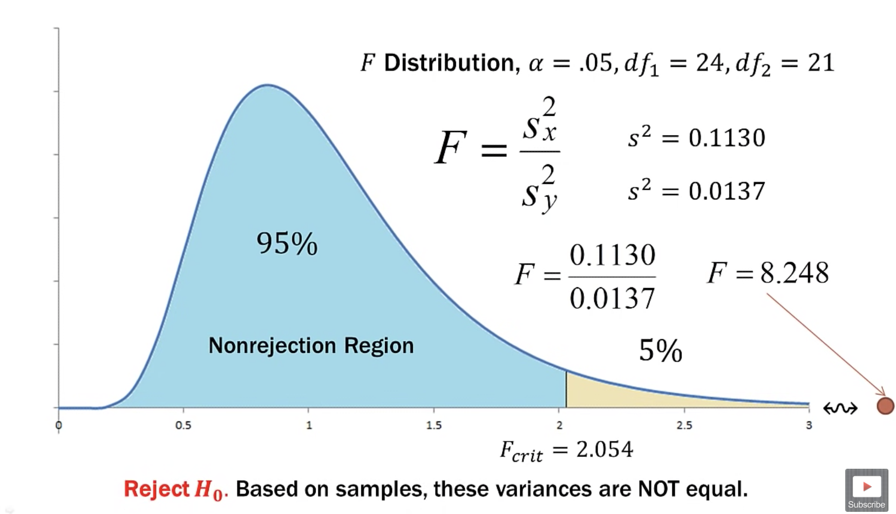

alias:: f检验, 联合假设检验, 方差比率检验, 方差齐性检验, f-distribution, f 分布, f distribution, f ratio, f statistic, f值

- F-distribution
	- When ==independent== random samples, $n_x$ and $n_y$ (or $n_1$ and $n_2$) are taken from two ==normal populations with equal variances==, the sampling distribution of the ratio of those sample variances follows the f-distribution. The f distribution is a distribution of ratios
	- f-distribution is two [[chi-square]] distribution in a ratio, thats why each one has its own d.f.
		- $$
		  F = \frac{S_{x}^{2}}{S_{y}^{2}}
		  $$
			- $S_{x}^{2}$ = larger sample variance, $n_x-1$ [[degree of freedom]] (sample size)
			  $S_{y}^{2}$ = smaller sample variance, $n_y-1$ [[degree of freedom]] (sample size)
- Example
	- The Terrific Tuna Company uses two machines to fill each 5 ounce can of tuna. The quality assurance manager wishes to compare the variability, the variance, of the two canning machines. (comparing sample variance of each other, not compare with hypothesized variance)
	  $$
	  \sigma_{x}^{2}=\sigma_{y}^{2} ?
	  $$
	- To do this, a sample of cans is selected from each machine for testing, results are
	  machine 1: n = 25, $\bar{x} = 5.0592$, $s^2 = 0.1130$, $s = 0.3361$ 
	  machine 2: n = 22, $\bar{x} = 4.9808$, $s^2 = 0.0137$, $s = 0.1171$
	- note that the machine 1's variance is little bit higher, but there are samples, not population.
	  so there going to be the sample error, we ned to test if this is because the sampling error or statistically difference
	- relative size of two measurements by using f ratio
	  $$
	  F = \frac{S_{x}^{2}}{S_{y}^{2}}
	  $$
		- $S_{x}^{2}$ = larger sample variance, $n_x-1$ [[degree of freedom]] (sample size)
		  $S_{y}^{2}$ = smaller sample variance, $n_y-1$ [[degree of freedom]] (sample size)
	- in this case, 
	  $$
	  \begin{aligned}
	  &df_x= df_1 =25-1=24 \quad \text{The numerator degrees of freedom}\\
	  &df_y= df_2 = 22-1=21 \quad \text{The denominator degrees of freedom}
	  \end{aligned}
	  $$
	- From F table, plug in the degree of freedom gives you the p-value
	- find f critical value in r [[CheatSheet/R]]
collapsed:: true
		- ```r
		  #find F critical value
		  qf(p=.05, df1=6, df2=8, lower.tail=FALSE)
		  
		  #[1] 3.58058
		  ```
	- F-distribution for $\alpha = 0.05, df_1 = 24, df_2 = 21$
		- 
	- [[hypothesis test]] for equally of variance (f test)
		- $$
		  \begin{aligned}
		  &H_{0}: \sigma_{x}^{2}=\sigma_{y}^{2} \\
		  &H_{a}: \sigma_{x}^{2} \neq \sigma_{y}^{2}
		  \end{aligned}
		  $$
		- This is ==Upper/right-tailed test==/distribution (always place the larger sample variance in the numerator)
		- 