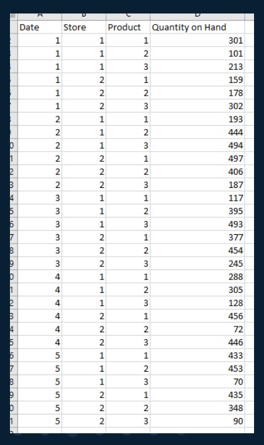
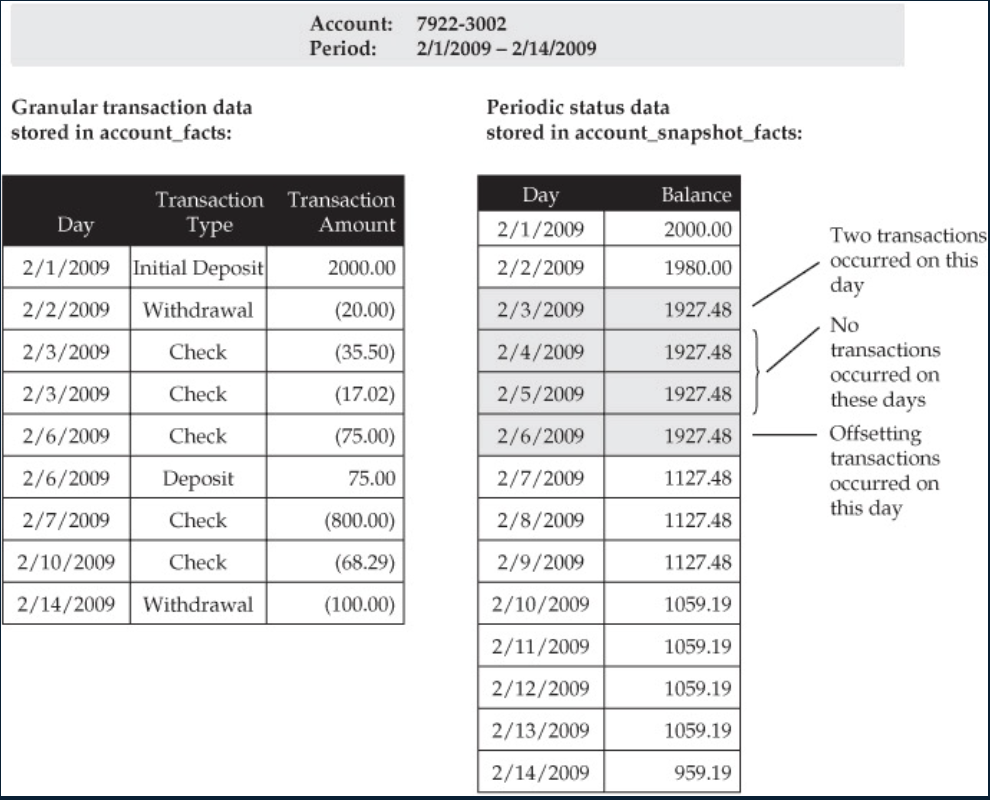
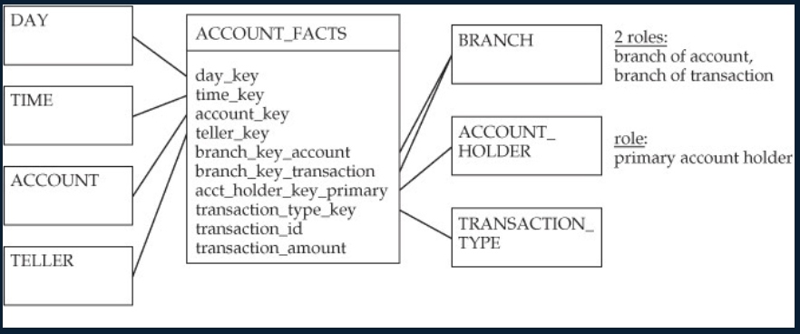
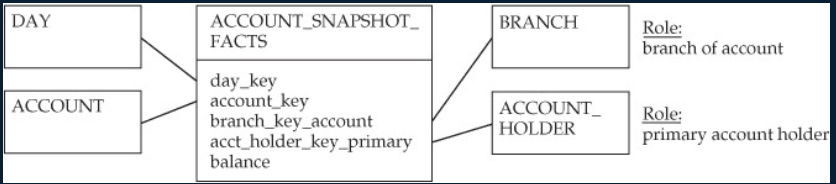

alias:: 事实表, fact tables

- Definition
	- 数据聚合后根据某个维度生成的结果表, 是具体的统计表
	- 事实表为数据聚合后根据某个维度生成的结果表
- Example
	- 销售事实表: Prod_id(引用产品维度表), TimeKey(引用时间维度表), SalesAmount(销售总量, 以货币计), Unit(销售量)
- Granularity (粒度)
	- level of detail in the fact table
	- example
		- each row represents one order
		- each row represents total orders for a specific month
	- Generally, we select the lowest level grain possible
- Type
	- [[Additive fact table]]
	- [[Semi-Additive fact table]]
	- [[Non-Additive fact table]]
	- [[Factless Fact table]]
	- Quantity example of [[Additive fact table]] and [[Non-Additive fact table]]
	  collapsed:: true
		- {:height 434, :width 215}
		- Sample additive queries (有意义的)
			- For a given day, what is our total number of products on hand?
			- For a given day and a given store, what is our total number of products on hand?
			- For a given day and a given product, what is our total number of products on hand?
		- Sample non-additive queries (无意义)
			- For a given store, what is our total number of products on hand? (聚合每一个store的所有product类型的手头数量是没意义的, 因为每天的都不一样, 加起来也没意义)
			- For a given product, what is our total number of products on hand? (同上)
			- For a given store and a given product, what is our total number of products on hand? (同上)
	- [[Transaction fact table]]
	- [[Periodic snapshot table]]
	- [[Accumulating snapshot tables]]
	- Banking example of [[Transaction fact table]] VS [[Periodic snapshot table]]
	  collapsed:: true
		- 
		- [[Transaction fact table]]
			- 
		- [[Periodic snapshot table]]
			- 
	- [[aggregate fact table]]