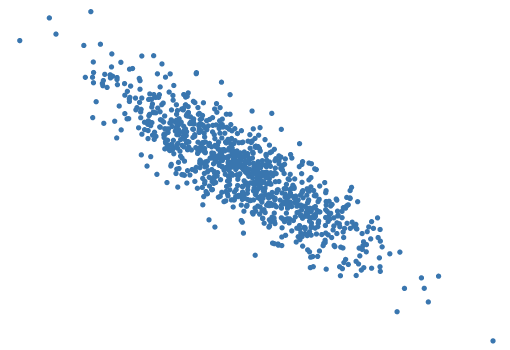

alias:: 梯度下降法, 梯度下降, GD, gradient descent method, SGD, BGD, MBGD

- 梯度下降 (BGD)
	- Definition
		- 计算 [[loss function]] (数据集中所有样本的损失均值) 关于模型参数的 [[导数]], 也可以称为 [[梯度]] (也叫批量梯度下降)
		- 但实际中的执行可能会非常慢, 因为在每一次更新参数之前, 必须遍历整个数据集, 所以使用随机梯度下降
	- Pros and cons
	  collapsed:: true
		- 全局最优解, 易于并行实现
		- 当样本数目很多时, 训练过程会很慢
- 随机梯度下降 (SGD)
	- Definition
		- 在每次需要计算更新的时候随机抽取一小批样本, 也叫小批量随机梯度下降(minibatch stochastic gradient descent)
	- Procedure
		- 首先随机抽取一个小批量 $\mathcal{B}$ ([[batch size]]), 由固定的训练样本组成. 之后计算小批量的平均损失关于模型参数的导数(梯度), 最后将梯度乘以一个预先确定的正数 $\eta$ ([[learning rate]]) 并从当前参数的值中减掉
		- 参数更新过程
			- $$
			  \begin{aligned}
			  \mathbf{w} & \leftarrow \mathbf{w}-\frac{\eta}{|\mathcal{B}|} \sum_{i \in \mathcal{B}} \partial_{\mathbf{w}} l^{(i)}(\mathbf{w}, b)=\mathbf{w}-\frac{\eta}{|\mathcal{B}|} \sum_{i \in \mathcal{B}} \mathbf{x}^{(i)}\left(\mathbf{w}^{\top} \mathbf{x}^{(i)}+b-y^{(i)}\right) \\
			  b & \leftarrow b-\frac{\eta}{|\mathcal{B}|} \sum_{i \in \mathcal{B}} \partial_{b} l^{(i)}(\mathbf{w}, b)=b-\frac{\eta}{|\mathcal{B}|} \sum_{i \in \mathcal{B}}\left(\mathbf{w}^{\top} \mathbf{x}^{(i)}+b-y^{(i)}\right)
			  \end{aligned}
			  $$
	- Pros and cons
	  collapsed:: true
		- 速度快
		- 准确度下降, 不是全局最优, 不易于并行实现
	- 使用 [[CheatSheet/PyTorch]], [[SGD]], 拟合 [[mlr]]
	  collapsed:: true
		- library
		  collapsed:: true
			- ```python
			  #!pip install d2l
			  import torch
			  import random
			  from d2l import torch as d2l
			  ```
		- 构造数据集
		  collapsed:: true
			- 生成一个包含1000个样本的数据集,每个样本包含从 standard normal distribution 中采样的2个特征, 数据集为矩阵:$\mathbf{X} \in \mathbb{R}^{1000*2}$
			- 模型为
			  $$\mathbf{y} = \mathbf{Xw}+b+ϵ$$
			  模型参数为 (true model)
			  $$\mathbf{w} = [2, -3.4]^{\top}, b = 4.2$$
			- collapsed:: true
			  ```python
			  def synthetic_data(w, b, num_examples):
			    X = torch.normal(0, 1, (num_examples, len(w)))
			    # X's shape is (1000, 2)
			    y = torch.matmul(X, w) + b
			    y += torch.normal(0, 0.01, y.shape)
			    return X, y.reshape(-1, 1) # 标量 -> 向量
			  
			  true_w = torch.tensor([2, -3.4])
			  true_b = 4.2
			  features, labels = synthetic_data(true_w, true_b, 1000)
			  ```
				- ```python
				  features
				  #tensor([[ 1.5143, -1.6460],
				  #        [ 1.4646, -0.4502],
				  #        [ 1.9864,  0.9908],
				  #        ...,
				  #        [-1.1339,  1.2024],
				  #        [-1.2921, -0.1032],
				  #        [ 0.7275,  1.3155]])
				  labels
				  #tensor([[ 12.8018],
				  #        [  8.6508],
				  #        [  4.8142],
				  #        [  8.9901],
				  #        ...
				  ```
			- collapsed:: true
			  ```python
			  d2l.set_figsize()
			  d2l.plt.scatter(features[:,1].detach().numpy(),
			                  labels.detach().numpy(), 1)
			  ```
				- 
		- 读取数据集 (random batch select)
		  collapsed:: true
			- ```python
			  # 打乱数据集, 小批量获取
			  def data_iter(batch_size, features, labels):
			    num_examples = len(features) #1000
			    indices = list(range(num_examples))
			    random.shuffle(indices)
			    for i in range(0, num_examples, batch_size):
			      batch_indices = torch.tensor(
			          indices[i: min(i+batch_size, num_examples)]
			      )
			      yield features[batch_indices], labels[batch_indices] # 构造一个generator
			  ```
			- collapsed:: true
			  ```python
			  batch_size = 10
			  for X, y in data_iter(batch_size, features, labels):
			    print(X, '\n', y)
			    break
			  ```
				- tensor([[ 1.3049, -0.4945],
				          [-1.6132, -0.4637],
				          [ 0.2183, -1.6855],
				          [ 0.4436, -0.0314],
				          [-1.1163,  0.3185],
				          [-0.4928, -0.0727],
				          [ 0.0995, -0.0180],
				          [ 0.0114,  0.2692],
				          [ 0.5284,  1.4269],
				          [-2.4745, -0.5959]]) 
				   tensor([[ 8.5030],
				          [ 2.5620],
				          [10.3623],
				          [ 5.1965],
				          [ 0.8771],
				          [ 3.4431],
				          [ 4.4489],
				          [ 3.2862],
				          [ 0.4145],
				          [ 1.2907]])
		- 初始化权重和偏置
		  collapsed:: true
			- 任务为更新这些参数, 直到参数足够拟合数据
			- ```python
			  w = torch.normal(0, 0.01, size=(2,1), requires_grad=True)
			  b = torch.zeros(1, requires_grad=True)
			  ```
		- 定义模型和 loss function
		  collapsed:: true
			- ```python
			  def linreg(X, w, b):
			    return torch.matmul(X, w) + b
			  
			  def squared_loss(y_hat, y):
			    return (y_hat - y.reshape(y_hat.shape))**2/2
			  ```
		- 定义优化算法
		  collapsed:: true
			- 使用 SGD 算法更新参数, 每一步更新的大小由学习率决定
			- 用批量大小(batch_size)来规范化步⻓，这样步⻓大小就不会取决于我们对批量大小的选择
			- 此函数只负责更新参数, 所以才不记录grad, 使用 `with torch.no_grad()`
			- ```python
			  def sgd(params, lr, batch_size):
			    with torch.no_grad(): # don't record grad, 此函数只负责更新param
			      for param in params:
			        param -= lr * param.grad / batch_size
			        param.grad.zero_() # set grad to 0
			  ```
		- 训练
		  collapsed:: true
			- 每次迭代读取小批量训练样本 --> 通过模型或得一组预测 --> 计算损失 --> 反向传播, 储存每个参数的梯度 --> 调用优化算法来更新模型参数
			- 1. 初始化参数
			- 2. 重复以下训练直到完成
				- 计算梯度 ($\nabla$)
				- $$
				  \mathbf{g} \leftarrow \partial_{(\mathbf{w}, b)} \frac{1}{|\mathcal{B}|} \sum_{i \in \mathcal{B}} l\left(\mathbf{x}^{(i)}, y^{(i)}, \mathbf{w}, b\right)
				  $$
				- 更新参数
				- $$
				  (\mathbf{w}, b) \leftarrow(\mathbf{w}, b)-\eta \mathbf{g}
				  $$
			- ```python
			  lr = 0.03
			  num_epochs = 3 # 迭代周期个数
			  net = linreg
			  loss = squared_loss
			  for epoch in range(num_epochs):
			    for X, y in data_iter(batch_size, features, labels):
			      l = loss(net(X, w, b), y) # X 和 y 的小批量损失
			      # l 的形状是(batch_size, 1), 而不是一个标量
			      # 所以l中的所有元素被加到一起(也就是乘单位向量, 对梯度无影响)
			      # 以此计算[w, b]的梯度
			      l.sum().backward()
			      sgd([w,b], lr, batch_size) # 更新参数
			    with torch.no_grad():
			      train_l = loss(net(features, w, b), labels)
			      print(f'epoch {epoch + 1}, loss {float(train_l.mean()):f}')
			  ```
				- epoch 1, loss 0.000054
				  epoch 2, loss 0.000054
				  epoch 3, loss 0.000054
			- ```python
			  print(f'w的估计误差: {true_w - w.reshape(true_w.shape)}') 
			  print(f'b的估计误差: {true_b - b}')
			  ```
				- w的估计误差: tensor([-0.0007,  0.0009], grad_fn=<SubBackward0>)
				  b的估计误差: tensor([0.0008], grad_fn=<RsubBackward1>)
- 小批量梯度下降 (MBGD)
	- Definition
		-
-
-