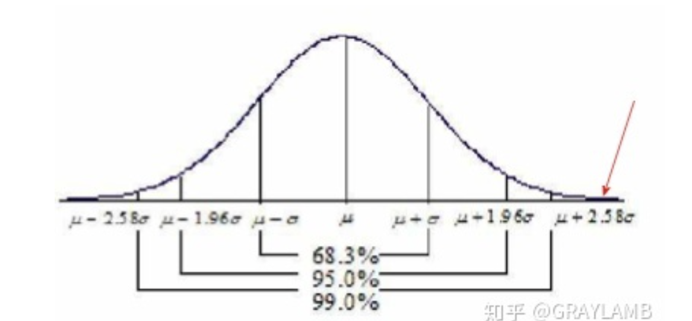

alias:: statistical hypothesis testing, hypothesis test, 假设性检验, 假设检验

- {{renderer :tocgen}}
- # Definition
	- statistical procedure to infer about a population using random samples
	- 通俗理解
	  id:: 621c53b0-b327-450e-bffe-093474b631b5
		- 通过“小概率事件在少量实验中是几乎不可能出现的”这一结论，去证明假设是错误的, 从而反证假设的另一面很可能是正确的. (如果不反证, 那么就需要无限次实验, 但是反证只要找一个错误的就行)
		- 投飞镖 (假设正态分布), 一个人的历史投飞镖样本, 可以算出 $$\mu$$ 和$$\sigma$$, 可以画出一个正态分布概率图.
		- 那么使用假设性检验来确定这个样本计算出的 $$\mu$$ 正确不正确
		- 原假设 $H_0$ 为假设一个人他的飞镖成绩均值是 $\mu$
		- 备择假设 $H_1$ 为他的均值成绩不是 $\mu$
		- 假设这个人立刻投一次飞镖, 落在了这个位置
		- {:height 197, :width 424}
		- 这个位置偏离$\mu$非常远, 也就是说这个情况没有落在99% ([[置信区间]]) 的可能性之内. 也就是投了一次还出现了1%的小概率事件 ( [[显著性水平]] )
		  id:: 61efa0f7-6916-4d6f-a345-4a8c63800b84
		- 所以拒绝均值为$\mu$这一原假设, 接受$H_1$
- # Jargon
	- 示意图
	  collapsed:: true
		- 
	- [[null hypothesis]] $$H_0$$
	- [[critical value]] CV
	  id:: 61f74ce5-696a-41a9-86a2-48efafdca21b
	- [[alternative hypothesis]] $H_1, H_\alpha$
	- [[test statistic]]
	  id:: 61f23283-bcd2-4cc5-965d-ae4182cab84a
	- [[p-value]]
	- [[显著性水平]] $\alpha$
	  id:: 61f23283-4449-4f71-ba32-ba192d7d0939
	- [[confidence level]] $1-\alpha$
	- [[confidence interval]]
	  id:: 61f23283-b8e6-4678-9bdf-4fb5f3370b50
	- 功效 (power) $1-\beta$
	  collapsed:: true
		- 正确拒绝零假设的概率，即$1-\beta$。
			- 当检验结果是不能拒绝零假设, 人们又需要进行决策时, 需要关注功效. 
			  功效越大, 犯第二类错误的可能性越小。
	- 效应值 (effect size)
	  collapsed:: true
		- 样本间差异或相关程度的量化指标
			- 效应量越大, 两组平均数离得越远, 差异越大. 
			  如果结果具有统计显著性, 那么有必要报告效应量的大小. 
			  效应量太小, 意味着即使结果有统计显著性, 也缺乏实用价值。
	- [[第一型及第二型错误]]
- # Performing a test of hypothesis
	- State the hypothesis
	- Identify the test needed
	- Collect the data (random sampling)
	- Statistical analysis
	- Conclusion (favoring $H_0$ or $H_a$)
- # Additional reading
	- [假设检验 - MBA智库百科](https://wiki.mbalib.com/wiki/%E5%81%87%E8%AE%BE%E6%A3%80%E9%AA%8C)