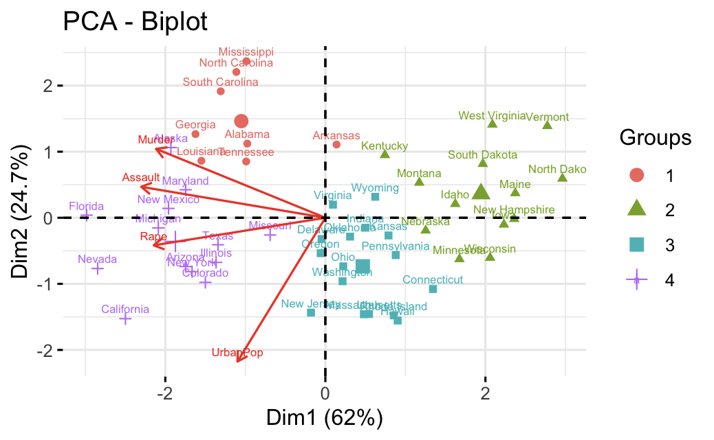

alias:: k-means, kmeans, kmean, k-mean
type:: unsupervised learning

- **Procedures**
  background-color:: #793e3e
	- Scale is importanc
	- Fix K
	- Randomly assign an integer (1 to K) to each observation (row)
	- These assignments are the initial cluster assignments
	- Repeat
	  collapsed:: true
		- Find the centroid of each cluster
		- For each observation, find the distance to each centroid
		- Assign the observation to the closest centroid
	- Finish when the cluster assignments stop changing **(Local Optimus)**
	  collapsed:: true
		- K-means always find a solution that depends on the initial assignment
		- must run the algorithm with many different initial assignments
		- Select the solution with the smallest **within-cluster variation**
- **Distances**
  background-color:: #793e3e
	- 点间距离
		- [[Distance/Euclidean]]
		- [[Distance/Manhattan]]
	- 类间距离
		- average linkage 类平均法
			- 吧所有平均值汇总在一起, 除以n个类的总数
		- centroid linkage 重心法
		- Ward's minimum-variance 离差平方法 (**最常用**)
			- 将n个样品各自分为一类, 然后每次缩小一类, 类内的样本间的离差平方和就会增大, 选择使离差平方和增大最小的两类合并, 直至所有样本归为一类位置. _数据标准化很重要_
- **Evaluate clusters** (larger silhouette, smallest $$TWCV$$)
  background-color:: #793e3e
	- **Silhouette coefficient (Silhouette width)**
	  collapsed:: true
		- **Properties**
			- Silhouette coefficient are in $(-1,1)$ mostly in $(0,1)$
			- **Large** Silhouette coefficient indicates that the data point
				- is well matched to its own cluster
				- is poorly matched to neighboring clusters
			- example
			  collapsed:: true
				- 
		- **for point** $i$
			- $$
			  s_{i}=\frac{b_{i}-a_{i}}{\max \left(a_{i}, b_{i}\right)}
			  $$
				- $a_i$ average distance to all points in same cluster
				- $b_i$ average distance to all points _not_ in same cluster
				- $s_i$ silhouette coefficient for data point $i$
		- for each cluster
		- for all the clusters
	- **Within-cluster variation (WCV)**
	  collapsed:: true
		- **formula**
			- $$
			  \begin{aligned}
			  d_{12}^{2} &=\left(x_{21}-x_{11}\right)^{2}+\left(x_{22}-x_{12}\right)^{2}+\cdots+\left(x_{2 p}-x_{1 p}\right)^{2} \\
			  &=\sum_{m=1}^{p}\left(x_{2 m}-x_{1 m}\right)^{2}
			  \end{aligned}
			  $$
			- find the square-distance between _all_ rows
			  collapsed:: true
				- {:height 251, :width 588}
		- **procedures**
			- $C_i$: clusters, $|C_i|$: size of cluster (cardinality)
			- consider $K$ clusters $C_1, C_2, ..., C_k$
			- for the $r^\text{th}$ cluster, with $|C_r|$ observations, the within-cluster variation is
				- $$
				  W C V_{r}=\frac{1}{\left|C_{r}\right|} \sum_{i, j \in C_{r}} \sum_{m=1}^{p}\left(x_{i m}-x_{j m}\right)^{2}
				  $$
			- for all clusters the within-cluster variation is total within-cluster variation
				- $$
				  T W C V=\sum_{k=1}^{K} W C V_{k}
				  $$
			- #+BEGIN_TIP
			  try to find the number of cluster K that result in the **smallest TWCV**
			  #+END_TIP
		- **How to find K? (Elbow chart)**
			- Identify the point when the $TWCV$ **starts decreasing slowly**
			- example
			  collapsed:: true
				- 
- k-means Example [[CheatSheet/R]]
	- 
	- use the library `cluster` and `USArrests` and `factoextra`
	  id:: 620b3f27-dc28-4327-8c67-62c5355a36e6
	  collapsed:: true
		- It contains statistics, in arrests per 100,000 residents for assault, murder, and rape in each of the 50 US states
		- Also includes the percent of population living in urban areas
		- Murder, Assault, Rape, UrbanPop, Murder arrests
	- R example
	  collapsed:: true
		- scale the data and produce distance in a matrix display
		  collapsed:: true
			- ```r
			  df0 = USArrests
			  df = scale(df0)
			  str(df0)
			  #'data. frame': 50 obs. of 4 variables:
			  #$ Murder num
			  #$ Assault int
			  #$ UrbanPop: int
			  #$ Rape: num
			  
			  distance = dist(df) # length(distance) = 1223 (50 choose 2)
			  dismat = as.matrix(distance)
			  dim(dismat) # 50 50
			  ```
		- Produce the distance heat map
		  collapsed:: true
			- ```r
			  fviz_dist(distance)
			  ```
		- Produce k-means with 2 clusters
			- ```r
			  k2 = kmeans(df, centers = 2, nstart = 25) #random assignment is 25
			  ```
				- $withinss is $WCV$ for each cluster
				- $tot.withinss is $TWCV = sum(withinss)$
				- $size is cluster size
		- Plot the cluster
			- ```r
			  fviz_cluster(k2, data = df)
			  ```
		- Plot the cluster with k = 2,3,4,5
			- ```r
			  k2 = kmeans(df, centers = 2, nstart = 25)
			  k3 = kmeans(df, centers = 3, nstart = 25)
			  k4 = kmeans(df, centers = 4, nstart = 25)
			  k5 = kmeans(df, centers = 5, nstart = 25)
			  
			  p1 = fviz_cluster(k2, geom = 'point', data = df) + ggtitle("k = 2")
			  p2 = fviz_cluster(k3, geom = 'point', data = df) + ggtitle("k = 3")
			  p3 = fviz_cluster(k4, geom = 'point', data = df) + ggtitle("k = 4")
			  p4 = fviz_cluster(k5, geom = 'point', data = df) + ggtitle("k = 5")
			  
			  library(gridExtra)
			  grid.arrange(p1, p2, p3, p4, nrow = 2)
			  ```
		- Produce and plot the TWCV for k = 1 to 15 and choose the proper k (choose k = 4)
			- ```r
			  set.seed(123)
			  twcv = function(k) kmeans(df, k, nstart = 10)$tot.withinss
			  
			  k = 1:15
			  twcv_values = sapply(k, twcv)
			  # Elbow chart #choose k = 4
			  plot(k, twcv_values, type = 'b', pch = 19,
			      xlab = 'number of clusters K', ylab = 'TWCV')
			  grid()
			  ```
		- Silhouette diagram and find the average silhouette diagram for k clusters
			- ```r
			  # for k2
			  ss = silhouette(k2$cluster, distance)
			  plot(ss, main = "")
			  
			  # function to find the average silhouette for k clusters
			  avg_ail = function (k) {
			    km.res = kmeans(df, centers = k, nstart = 25)
			    ss = silhouette(km.res$cluster, dist(df))
			    mean(ss[, 3])
			  }
			  # average silhouette for 2-15 clusters
			  k <- 2:15
			  avg_sil_values <- sapply(k, avg_sil)
			  avg_sil_values
			  
			  plot(k, avg_sil_values,type = "b", pch = 19, 
			       xlab = "Number of clusters K",
			       ylab = "Average Silhouette")
			  grid()
			  
			  
			  ```
		- PCA biplot
			- ```r
			  # I chose clustering with k = 4
			  #
			  set.seed(123)
			  final <- kmeans(df,centers = 4,nstart = 25)
			  final
			  
			  fviz_cluster(final,data = df)
			  # add cluster number to dataframe
			  #
			  cluster_number = as.factor(final$cluster)
			  df0$cluster = cluster_number
			  head(df0)
			  #
			  # average unscaled measures by cluster
			  #
			  aggregate( .~ cluster,FUN=mean,data = df0)
			  
			  # biplot with clusters
			  #
			  m3 = prcomp(df, scale=T)
			  fviz_pca_biplot(m3,labelsize = 2,col.var = "red",
			                  habillage = cluster_number)
			  ```
				- 
				- Group (cluster) 1 has high murder rates
				- Group (cluster) 2 has low rates on all crimes and urbanization
				- Group (cluster) 3 has low crime rates but some states with lots of urban population:  California, New York, Washington, New Jersey have high level of urbanization
				- Group (cluster) 4 has high rates on all crimes (slightly less in Murder)