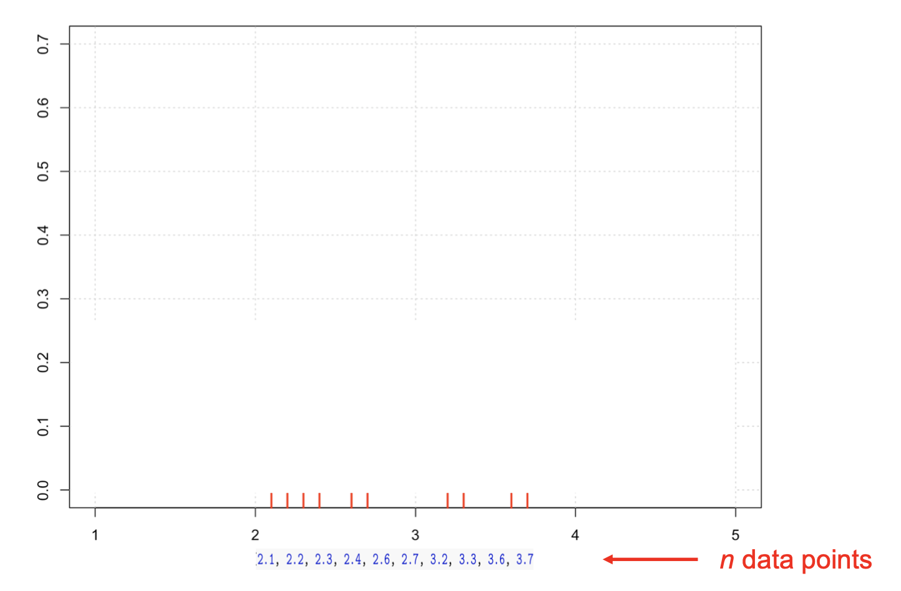
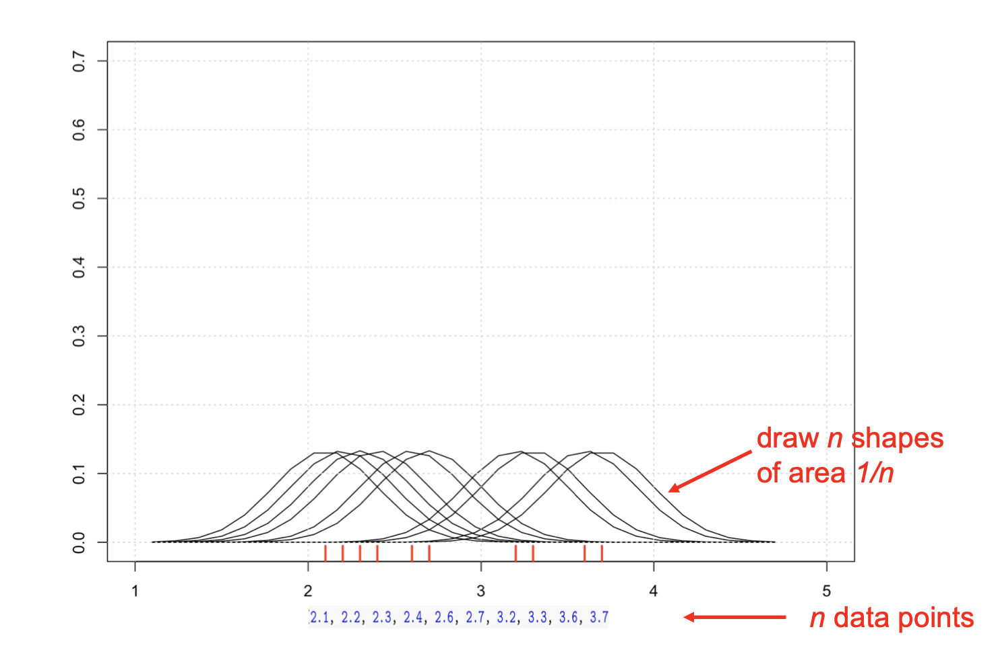
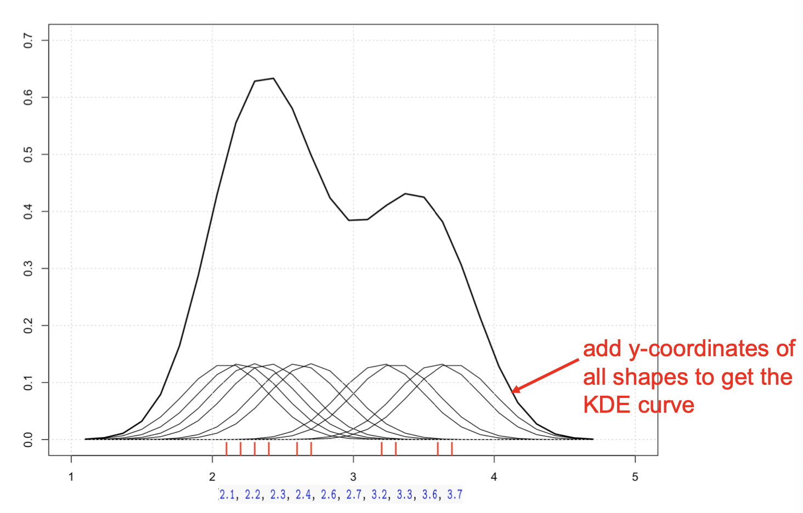
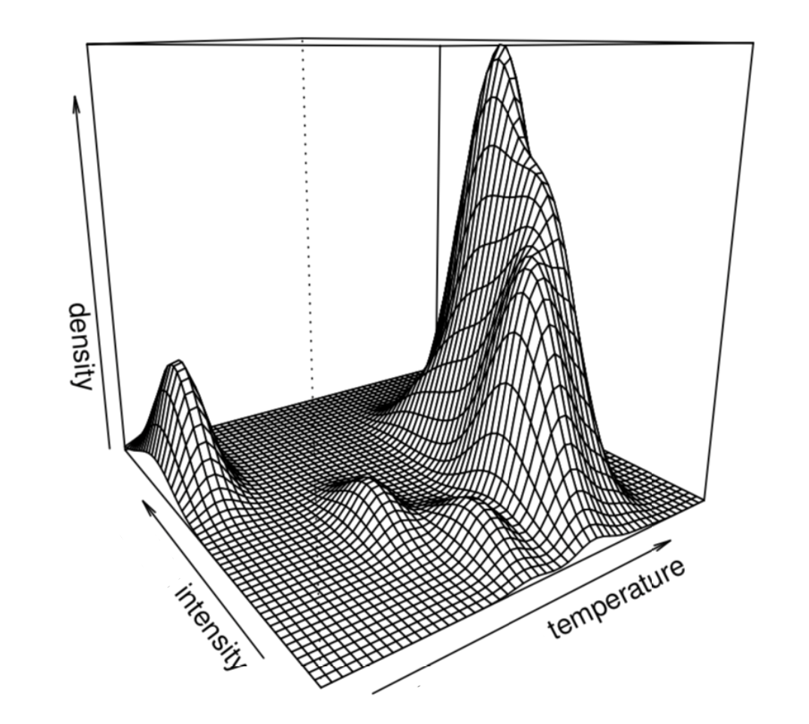
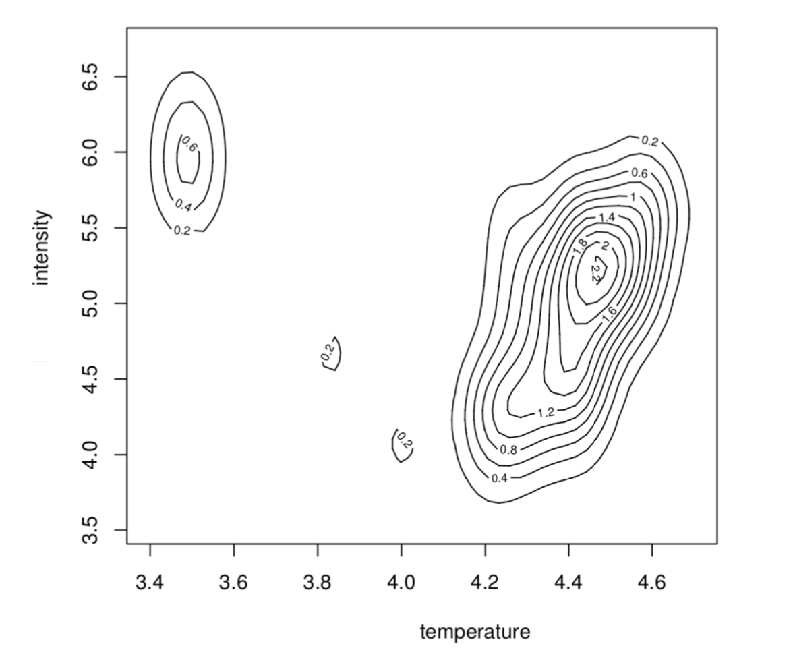

alias:: KDE, 核密度估计

- # **Definition**
	- one way to represent the distribution of some date
	- 使用histogram来表现distribution的时候, bar的x轴(beams)长度的改变会让distribution shape 改变, 所以使用KDE
	- KDE use shapes of 1/n area over each data point. These areas are added at each data point to create a curve with area = 1.0, the curve is called KDE
- Example
  collapsed:: true
	- ```r
	  plot(density(xi, width=1.2, n=28), col='red')
	  grid()
	  ```
		- 
		- 
		- 
	-
- **kernel density estimator bivariate data**
  collapsed:: true
	- 
	- 
- [[CheatSheet/R]] plot kernel density histogram
  collapsed:: true
	- **Plot density histogram**
		- ```r
		  waiting = geyser$waiting
		  hist(waiting, freq = F, col="grey95", main="")
		  lines(density(waiting), col="red". lwd=2)
		  ```
-