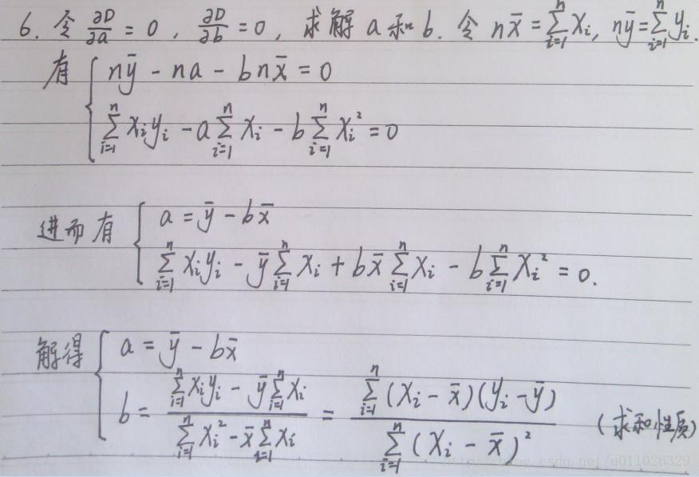
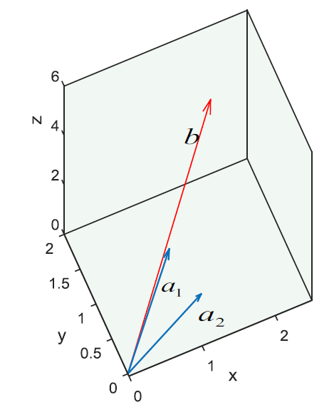
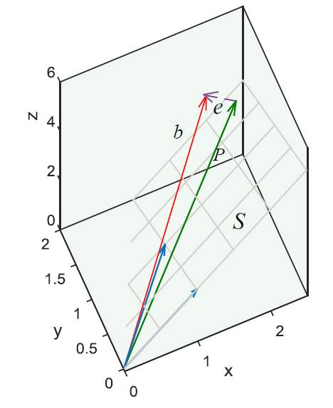

alias:: 最小二乘法, least square, OLS, ordinary least square

- **Definition**
	- 最小二乘法就是找到一组$$\theta\left(\theta_{0}, \theta_{1}, \theta_{2}, \ldots, \theta_{n}\right)$$, 使得$$\sum_{i=1}^{n}\left(h_{\theta}\left(x_{i}\right)-y_{i}\right)^{2}$$ (残差平方和 [SSR]([[RSS]]) ) 最小
	- Let  $$\hat{y}_{i}=\hat{\beta}_{0}+\hat{\beta}_{1} x_{i}$$
		- $$\mathrm{RSS}=e_{1}^{2}+e_{2}^{2}+\cdots+e_{n}^{2}$$
		- $$\mathrm{RSS}=\left(y_{1}-\hat{\beta}_{0}-\hat{\beta}_{1} x_{1}\right)^{2}+\left(y_{2}-\hat{\beta}_{0}-\hat{\beta}_{1} x_{2}\right)^{2}+\cdots+\left(y_{n}-\hat{\beta}_{0}-\hat{\beta}_{1} x_{n}\right)^{2}$$
		- $$
		  R S S=\sum\left(y_{i}-\hat{y}_{i}\right)^{2}=\sum e_{i}^{2}
		  $$
	- 最终 
	  \begin{aligned}
	  &\hat{\beta}_{1}=\frac{\sum_{i=1}^{n}\left(x_{i}-\bar{x}\right)\left(y_{i}-\bar{y}\right)}{\sum_{i=1}^{n}\left(x_{i}-\bar{x}\right)^{2}} \\
	  &\hat{\beta}_{0}=\bar{y}-\hat{\beta}_{1} \bar{x}
	  \end{aligned}
- **Algorithm**
	- 代数方法
	  collapsed:: true
		- $$
		  \min \varepsilon=\sum_{i=1}^{n}\left(f\left(x_{i}\right)-y_{i}\right)^{2}=\sum_{i=1}^{n}\left(a x_{i}+b-y_{i}\right)^{2}
		  $$
		- 需要求ab的值使得 $$\epsilon$$ 最小
		- 分别对a, b进行偏导, 让其等于0
		- $$
		  \begin{aligned}
		  &\frac{\partial \varepsilon}{\partial a}=2 \sum_{i=1}^{n}\left(a x_{i}+b-y_{i}\right) x_{i}=0 \\
		  &\frac{\partial \varepsilon}{\partial b}=2 \sum_{i=1}^{n}\left(a x_{i}+b-y_{i} \right) x_{i}=0
		  \end{aligned}
		  $$
		- **根据求和性质**
			- $$
			  \begin{aligned}
			  &\sum_{i=1}^{m}\left(x_{i}-\bar{x}\right)\left(y_{i}-\bar{y}\right) \\
			  &=\sum_{i=1}^{m}\left(x_{i} y_{i}-x_{i} \bar{y}-\bar{x} y_{i}+\bar{x} \bar{y}\right) \\
			  &=\sum_{i=1}^{m} x_{i} y_{i}-\sum_{i=1}^{m} x_{i} \bar{y}-\sum_{i=1}^{m} \bar{x} y_{i}+\sum_{i=1}^{m} \bar{x} \bar{y} \\
			  &=\sum_{i=1}^{m} x_{i} y_{i}-m \bar{x} \bar{y}-m \bar{x} \bar{y}+m \bar{x} \bar{y} \\
			  &=\sum_{i=1}^{m} x_{i} y_{i}-\bar{y} \sum_{i=1}^{m} x_{i}
			  \end{aligned}
			  $$ 分子得证
			- $$
			  \begin{aligned}
			  \sum_{i=1}^{m}\left(x_{i}-\bar{x}\right)^{2} &=\sum_{i=1}^{m}\left(x_{i}^{2}-2 x_{i} \bar{x}+\bar{x}^{2}\right) \\
			  &=\sum_{i=1}^{m} x_{i}^{2}-2 \bar{x} \sum_{i=1}^{m} x_{i}+\sum_{i=1}^{m} \bar{x}^{2} \\
			  &=\sum_{i=1}^{m} x_{i}^{2}-2 m \bar{x}^{2}+m \bar{x}^{2} \\
			  &=\sum_{i=1}^{m} x_{i}^{2}-m \bar{x}^{2}=\sum_{i=1}^{m} x_{i}^{2}-\bar{x} \sum_{i=1}^{m} x_{i}
			  \end{aligned}
			  $$ 分母得证
		- 
	- 矩阵方法 (几何解释)
	  collapsed:: true
		- 假设平面上三个点 (1,2),(0,2), (2,3), 用一条直线去拟合, 假设直线方程为Y= kx+b, 也就是要满足
		- $$
		  \left\{\begin{array}{l}
		  1 \times x_{1}+x_{2}=2 \\
		  0 \times x_{1}+x_{2}=2 \\
		  2 \times x_{1}+x_{2}=3
		  \end{array}\right.
		  $$
		- 写成矩阵的形式
			- $$
			  \begin{gathered}
			  {\left[\begin{array}{ll}
			  1 & 1 \\
			  0 & 1 \\
			  2 & 1
			  \end{array}\right]\left[\begin{array}{l}
			  x_{1} \\
			  x_{2}
			  \end{array}\right]=\left[\begin{array}{l}
			  2 \\
			  2 \\
			  3
			  \end{array}\right]} \\
			  \uparrow \\
			  A \times x=b
			  \end{gathered}
			  $$
			- $$
			  \begin{gathered}
			  {\left[\begin{array}{l}
			  1 \\
			  0 \\
			  2
			  \end{array}\right] \times x_{1}+\left[\begin{array}{l}
			  1 \\
			  1 \\
			  1
			  \end{array}\right] \times x_{2}=\left[\begin{array}{l}
			  2 \\
			  2 \\
			  3
			  \end{array}\right]} \\
			  \uparrow \\
			  \begin{array}{r}
			  \\
			  a_{1} \times x_{1}+a_{2} \times x_{2}=b
			  \end{array}
			  \end{gathered}
			  $$
			- 此时想到用向量表示
			- 
			- 要找到解，就要找到a1和a2的一个线性组合，使得组合的向量刚好等于b,可惜任何的a1和a2的线性组合，只能出现在a1和a2所在的平面s上
			- 找不到完美的解，就只能找到一个最接近的解，所以想在平面S上找到一个最接近向量b的向量来代替向量b,记这个替代品位向量p，我们知道最接近的肯定是它的投影，即过直线b的终点做平面S的垂线，垂足就是替代向量p的终点，p和b之间的误差$$e=b-p$$
			- 
			- $$
			  e=b-P=b-A \hat{x}
			  $$
			- 为了使得p 和b之间的误差e最小, 那么e一定垂直平面S, 也就是垂直a1, a2的, 也就是点乘为0
			- $$
			  e \bullet a_{1}=0, e \bullet a_{2}=0
			  $$
			- 矩阵表示
			- $$
			  a_{1}^{T} e=0, a_{2}^{T} e=0
			  $$
			- 也就是
			- $$A^T e = 0$$
			- 带入
			- $$
			  A^{T}(b-A \hat{x})=0
			  $$
			- 化简
			- $$
			  \hat{x}=\left(A^{T} A\right)^{-1} A^{T} b
			  $$
- Pros and cons
	- 最小二乘法需要计算 $$X^TX$$的逆矩阵, 有可能它的逆矩阵不存在, 就没法用最小二乘法, 但是[梯度下降法]([[gradient descent]])可以用
	- 样本特征n特别大的时候, 计算逆矩阵十分耗时
	- 如果拟合函数不是线性的, 就无法使用最小二乘法, 需要通过一些技巧转化为线性
	- 在多元回归模型中, 通常存在一个或多个预测变量与响应变量不存在线性关系的时候, 包括了一些增加了模型复杂性却和模型无关的变量, 通过将这些无关变量的系数设置为0的方式移除这些变量可以使模型更有解释力, 但是OLS不可以将系数缩减为0. 可以通过系数缩减(也叫正则化(regularization)), 减少方差
- Note
	- 训练集的 [[MSE]] 通常比测试集低, 这是因为OLS通过使训练数据的RSS尽可能低(而不是测试数据的 [[RSS]] )来估计回归模型系数