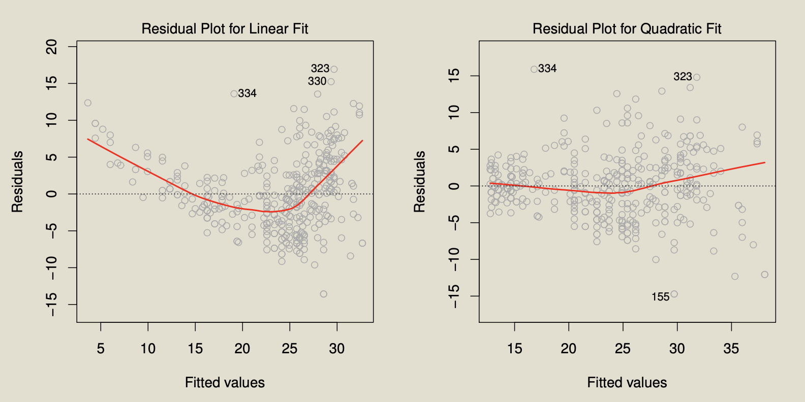
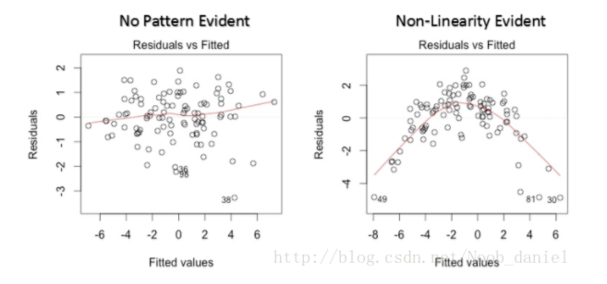
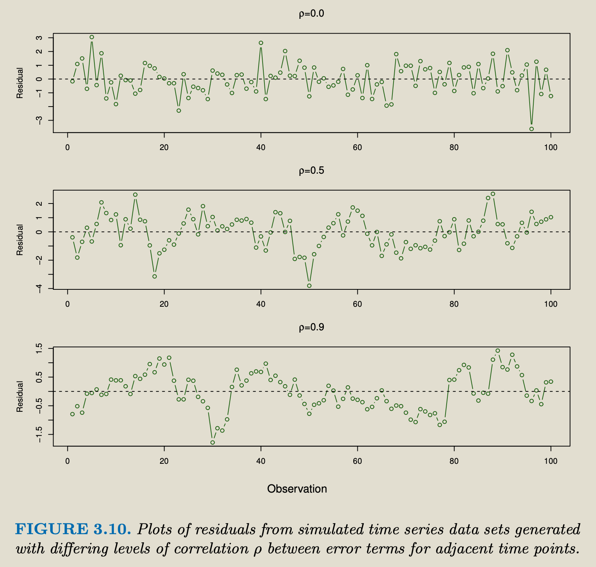
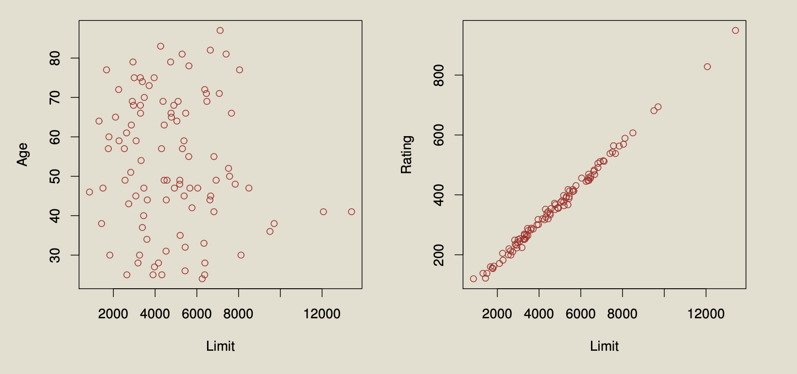
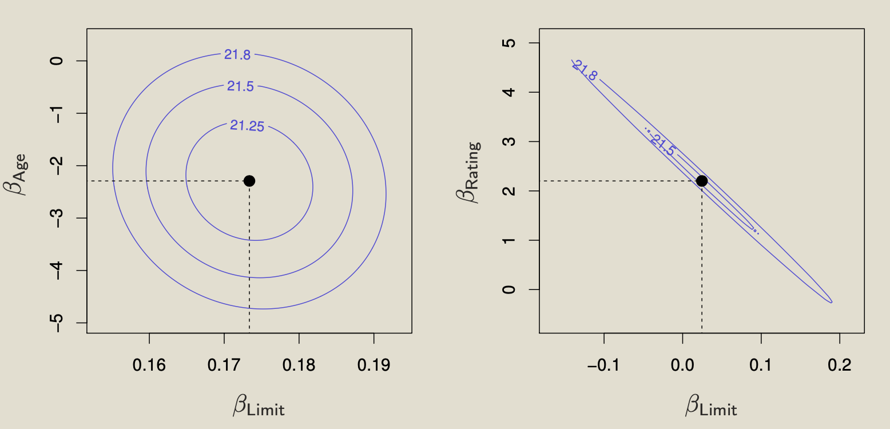
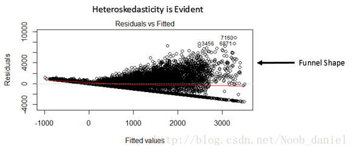
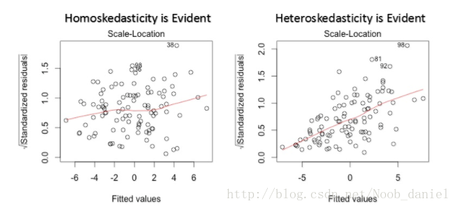
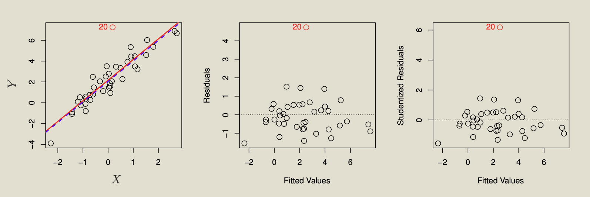
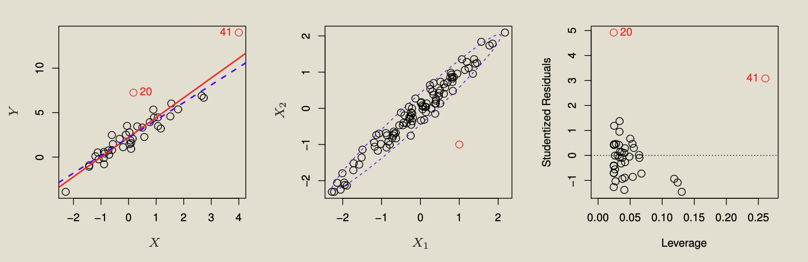

topic:: linear regression, LR, regression

- # Notes
	- **What is** [[simple linear regression]]
	  collapsed:: true
		- Definition
		- estimat coefficients
		- accessing the accuracy of coefficient estimates
		- accessing the accuracy of the model
	- **What is** [[multiple linear regression]]
	- **[[assumption]] of linear regression**
	  collapsed:: true
		- 线性性 & 可加性 (Straight-line relationship)
		  id:: a16d72a2-89e3-4c5c-a31f-de1f3db47b37
		  collapsed:: true
			- 假设因变量为$Y$，自变量为$X_1$，$X_2$，则回归分析的默认假设为
			  $Y=b+a_1X_1+a_2X_2+ε$。
			  线性性：$X_1$每变动一个单位，$Y$相应变动$a_1$个单位，与$X_1$的绝对数值大小无关。
			  可加性：$X_1$对$Y$的影响是独立于其他自变量()如$X_2$)的。
			- **如果不满足**
			  background-color:: #793e3e
			  collapsed:: true
				- 模型将无法很好的描述变量之间的关系，极有可能导致很大的泛化误差 (generalization error)
			- 假设检验方法
			  background-color:: #793e3e
			  collapsed:: true
				- 观察残差 /估计值(Fitted Value, $Ŷ$ )图。([[residual plot]])
					- 
						- 左图有U-shape, 有力说明了数据中的 non-linearity
						- 右图的**quadratic fit** 有 little pattern in residuals, 说明quadratic term improves the fit to the data
					- {:height 256, :width 546}
						- 相较于图一( residual 随机分布), 图二的残差明显呈现了某种二次型趋势, 说明回归模型没有抓住数据的某些非线性特征.
						- 为了克服非线性性的影响, 我们可以对自变量做一些非线性变换, 如$log(X),\sqrt{X},X^2..etc$
		- 误差项 $\epsilon$ 之间相互独立 (error terms uncorrelated)
		  id:: 06e8fb4e-e5ba-4495-931a-c113fc5f4d4c
		  collapsed:: true
			- 若不满足, 则模型有==自相关性== ([[Autocorrelation]])
			- 如果不满足
			  background-color:: #793e3e
			  collapsed:: true
				- 自相关性经常发生于[[时间序列]]数据集上,  后项会受到前项的影响. 当自相关性发生的时候，我们测得的**true standard errors 真实标准差**往往会偏小, 进而会导致 [[confidence interval]] 变窄. 比如计算得到的95%的置信区间往往会小于98%
					- observation that are obtained at adjacent time points will have positively correlated errors. 也是看 [[residual plot]] ==如果误差项正相关, 可以看到相邻的残差有相似的值==
					  collapsed:: true
						- 
						- 该图底部的图相邻误差的相关性为0.9, 残差图中相邻的点发现了明显的类似, 中间的图相邻误差相关性为0.5, 更温和
				- Example
				  collapsed:: true
					- 假设没有自相关性的情况下, 自变量X的系数为15.02 而标准差为 2.08。假设同一样本是有自相关性的, 测得的标准差可能会只有1.20, 所以[[置信区间]]也会从 (12.94,17.10) 缩小到 (13.82,16.22).
			- 假设检验方法
			  background-color:: #793e3e
			  collapsed:: true
				- [[durbin watson statistic]]
		- 自变量 $(X_1, X_2)$ 之间应相互独立
		  id:: f6d8abf4-e11d-4d2a-8253-d44296b923e2
		  collapsed:: true
			- 若不满足, 则模型有==多重共线性== ([[Multicollinearity]])
			- 如果不满足
			  background-color:: #793e3e
			  collapsed:: true
				- 如果我们发现本应相互独立的自变量们出现了一定程度(甚至高度)的相关性，那我们就很难得知自变量与因变量之间真正的关系了.
				  当多重共线性性出现的时候, 变量之间的联动关系会导致我们测得的**标准差**偏大, [[置信区间]] 变宽.
				- 采用[[ridge regression]] 或者 [[lasso regression]] 或者 [[elastic net regression]] 可以一定程度上减少方差, 解决多重共线性性问题. 
				  因为这些方法, 在 [[least square method]] 的基础上, 加入了一个与回归系数的模有关的惩罚项, 可以收缩模型的系数。
			- 假设检验方法
			  background-color:: #793e3e
			  collapsed:: true
				- [[variance inflation factor]]
				- 看 [[correlation]] matrix
				- 看单独的两个scatter plot
				  collapsed:: true
					- 
						- 左图没有 [[collinearity]], 右图有
				- 看 contour plots for the [[RSS]] value as the function of parameters $\beta$
				  collapsed:: true
					- 每个椭圆表示了所有RSS一样的点
					- 
						- In each plot, the black dots represent the coefficient values corresponding to the minimum RSS (least squares estimates)
						  左图: A contour plot of RSS for the regression of balance onto age and limit. The minimum value is well defined
						  右图: A contour plot of RSS for the regression of balance onto rating and limit. Because of the collinearity, there are many pairs ($\beta_{\text {Limit }}, \beta_{\text {Rating }}$) with a similar value for RSS
		- 误差项 $\epsilon$ 的方差应为常数 (constant variance of error terms)
		  id:: 69466df2-369f-4065-a0e7-b73e19e5b2a0
		  collapsed:: true
			- 若满足这一特性，称模型具有同方差性([[Homoscedasticity]])，若不满足，则为异方差性([[heteroscedasticity]])
			- 如果不满足
			  background-color:: #793e3e
			  collapsed:: true
				- [异方差性]([[heteroscedasticity]]) 的出现意味着误差项的方差不恒定, 这常常出现在有异常值 (Outlier) 的数据集上，如果使用标准的回归模型, 这些异常值的重要性往往被高估. 在这种情况下, **标准差**和 [[置信区间]] 不一定会变大还是变小. 
				  ==解决办法==也是对因变量做一些非线性变换比如$log(X),\sqrt{X},X^2..etc$
				- 如果误差项不呈正态分布, 意味着[[置信区间]]会变得很不稳定, 我们往往需要重点关注一些异常的点(误差较大但出现频率较高), 来得到更好的模型。
			- 异方差性假设检验方法
			  background-color:: #793e3e
			  collapsed:: true
				- 观察残差 /估计值(Fitted Value, $Ŷ$ )图。 [[residual plot]]
					- 
						- 若该图呈现如上图所示的“==漏斗形 (funnel shape)==”, 即随着$Ŷ$的变化, 残差有规律的变大或变小, 则说明存在明显的异方差性
				- 或者观察残差的标准差/估计值图 [[residual plot]]
					- 
						- 异方差数据集呈现出明显的趋势性
			- 误差项 $\epsilon$ 不是正态分布的检验方法
			  background-color:: #793e3e
			  collapsed:: true
				- [[qqplot]]
			- 解决办法
			  background-color:: #793e3e
			  collapsed:: true
				- [[weighted least squares]] to fit the model, with 权重与 [[inverse variance]] 成正比
	- **Linear Regression Potential Problems**
	  collapsed:: true
		- Non-linearity of the response-predictor relationships, 违反假设: ((a16d72a2-89e3-4c5c-a31f-de1f3db47b37))
		- Correlation of error terms, 违反假设: ((06e8fb4e-e5ba-4495-931a-c113fc5f4d4c))
		- Non-constant variance of error terms, 违反假设: ((69466df2-369f-4065-a0e7-b73e19e5b2a0))
		- Collinearity ((f6d8abf4-e11d-4d2a-8253-d44296b923e2))
		- Outliers
		  collapsed:: true
			- 如果是数据收集的错误值, 直接去掉, 但是要小心, 因为可能是表明了模型的不足, 比如缺少predictor
			- 典型的情况是一个没有异常预测值的离群点对最小二乘法的拟合影响很小(见下图), 但是既是一个离群点对拟合没什么影响, 比如对 [[RSE]], [[r2]], 又因为RSE用来计算 [[confidence interval]], 所以会对拟合的解释产生影响
			- 
				- 左图: 红色是全部的点的回归, 蓝色的是去掉outliers的回归
				  中图: residual plot clearly identifies the outlier
				  右图: The outlier has a [[studentized residual]] of 6. ==typically we expect values between −3 and 3==
		- High-leverage points
		  collapsed:: true
			- high-leverage points 对模型的结果影响更大, 在 [[simple linear regression]] 中, 可以简单寻找预测值超出观测值正常范围的观测值, 但是在 [[multiple linear regression]]中, 就不可以, 比如下图的第二个图红色的点, 不是点20也不是点41
			- 
				- 左图: 点41是 high leverage point, 20不是, 红线是全部点的回归, 蓝线是去掉41之后的回归
				  中图: 红色的点不是点20或者点41, 但是仍然离群, 所以也是 high leverage point
				  右图: 点41 有high leverage and high residual
			- 检测办法
				- 用 [[leverage statistic]]
- # Summary
	- 只用一个预测变量得到的结果可能与多个预测变量得到的结果完全不一样, 因为这些元素之间存在相关性. 这被称为 confounding (混淆现象), 看 ISLR 4.3.3 & ISLR 4.3.4
- # Other sources
	- [回归分析|笔记整理（1）——引入，一元线性回归（上） - 知乎](https://zhuanlan.zhihu.com/p/45149297)
	- [回归分析 - 台湾交通大学 - 黃冠華 教授_哔哩哔哩_bilibili](https://www.bilibili.com/video/BV1Ba4y1a7Kk?p=4)
	-