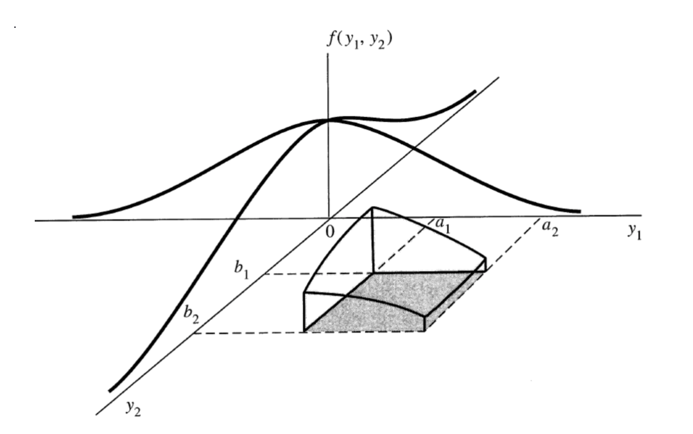

alias:: 多元高斯分布, 多元正态分布, n维正态分布, 多变量高斯分布, multivariate gaussian distribution, multivariable gaussian distribution, multivariable normal, multivariate normal, MVN distribution
related:: [[normal distribution]]

- Definition
	- ((61ee3c42-f8c0-49b4-b62d-ae0f0e475e82))
	- **表述方法1**
		- [[probability density function]] for [[multivariable normal distribution]]
			- $$
			  f(\vec{x})=\frac{1}{\sqrt{(2 \pi)^{n} \operatorname{det}\left(\sum\right)}} \exp \left(-\frac{1}{2}(\vec{x}-\vec{\mu})^{T} \sum^{-1}(\vec{x}-\vec{\mu})\right)
			  $$
			- 其中, $$\vec{x}=\left(x_{1}, x_{2}, \ldots, x_{n}\right)^{T}$$, $$x_i$$ 均为一维正态随机变量, $$x_i$$的期望为$$\mu_i$$, $$\vec{\mu}=\left(\mu_{1}, \mu_{2}, \ldots, \mu_{n}\right)^{T}$$, $$\sum$$ 是$$\vec{x}$$的[[covariance]] matrix (为positive semi-definite)
			- $$
			  \sum=\left[\begin{array}{cccc}
			  \operatorname{cov}\left(x_{1}, x_{1}\right) & \operatorname{cov}\left(x_{1}, x_{2}\right) & \ldots & \operatorname{cov}\left(x_{1}, x_{n}\right) \\
			  \operatorname{cov}\left(x_{2}, x_{1}\right) & \operatorname{cov}\left(x_{2}, x_{2}\right) & \ldots & \operatorname{cov}\left(x_{2}, x_{n}\right) \\
			  \vdots & \vdots & \ddots & v d o t s \\
			  \operatorname{cov}\left(x_{n}, x_{1}\right) & \operatorname{cov}\left(x_{n}, x_{2}\right) & \ldots & \operatorname{cov}\left(x_{n}, x_{n}\right)
			  \end{array}\right]
			  $$
		-
	- **表述方法2**
	  collapsed:: true
		- If $$X \sim N\left(\mu, \sigma^{2}\right)$$
			- $$
			  f(x)=\frac{1}{\sqrt{2 \pi} \sigma} e^{-\frac{1}{2}\left[\frac{x-\mu}{\sigma}\right]^{2}} \quad-\infty<x<\infty
			  $$
		- If $$\underline{X} \sim N_{p}(\underline{\mu}, \Sigma)$$
			- $$
			  f(\underline{x})=\frac{1}{(\sqrt{2 \pi})^{p}|\Sigma|^{1 / 2}} e^{-\frac{1}{2}(\underline{x}-\underline{\mu})^{T} \Sigma^{-1}(\underline{x}-\underline{\mu})}
			  $$
			- $$
			  \underline{X}=\left[\begin{array}{c}
			  X_{1} \\
			  X_{2} \\
			  \vdots \\
			  X_{p}
			  \end{array}\right] \quad \underline{\mu}=\left[\begin{array}{c}
			  \mu_{1} \\
			  \mu_{2} \\
			  \vdots \\
			  \mu_{p}
			  \end{array}\right] \quad \Sigma=\left[\begin{array}{cccc}
			  \sigma_{1}^{2} & \sigma_{12} & \ldots & \sigma_{1 p} \\
			  & \sigma_{2}^{2} & \ldots & \sigma_{2 p} \\
			  \vdots & & \ddots & \\
			  & & & \sigma_{p}^{2}
			  \end{array}\right]
			  $$
		- if $$p=2$$ then $$\underline{X}$$ is called bivariate normal (二元正态分布)
			- 
	- **bivariate normal variable**
	  collapsed:: true
		- if $$p=2$$ then $$\underline{X}$$ is called bivariate normal with
			- $$
			  \underline{X}=\left[\begin{array}{c}
			  X_{1} \\
			  X_{2}
			  \end{array}\right] \quad \underline{\mu}=\left[\begin{array}{l}
			  \mu_{1} \\
			  \mu_{2}
			  \end{array}\right] \quad \Sigma=\left[\begin{array}{cc}
			  \sigma_{1}^{2} & \sigma_{12} \\
			  \sigma_{12} & \sigma_{2}^{2}
			  \end{array}\right]=\left[\begin{array}{cc}
			  \sigma_{1}^{2} & \rho \sigma_{1} \sigma_{2} \\
			  \rho \sigma_{1} \sigma_{2} & \sigma_{2}^{2}
			  \end{array}\right]
			  $$
		- if$$\underline{X} \sim N_{p}(\underline{\mu}, \Sigma)$$
			- $$
			  f(\underline{x})=\frac{1}{(\sqrt{2 \pi})^{p}|\Sigma|^{1 / 2}} e^{-\frac{1}{2}(\underline{x}-\underline{\mu})^{T} \Sigma^{-1}(\underline{x}-\underline{\mu})}
			  $$
			- $$
			  \underline{X}=\left[\begin{array}{l}
			  X_{1} \\
			  X_{2}
			  \end{array}\right] \quad \underline{\mu}=\left[\begin{array}{l}
			  \mu_{1} \\
			  \mu_{2}
			  \end{array}\right] \quad \Sigma=\left[\begin{array}{cc}
			  \sigma_{1}^{2} & \sigma_{12} \\
			  \sigma_{12} & \sigma_{2}^{2}
			  \end{array}\right]=\left[\begin{array}{cc}
			  \sigma_{1}^{2} & \rho \sigma_{1} \sigma_{2} \\
			  \rho \sigma_{1} \sigma_{2} & \sigma_{2}^{2}
			  \end{array}\right]
			  $$
			- $$
			  \begin{gathered}
			  |\Sigma|=\sigma_{1}^{2} \sigma_{2}^{2}-\rho^{2} \sigma_{1}^{2} \sigma_{2}^{2}=\sigma_{1}^{2} \sigma_{2}^{2}\left(1-\rho^{2}\right) \\
			  \Sigma^{-1}=\frac{1}{|\Sigma|}\left[\begin{array}{cc}
			  \sigma_{2}^{2} & -\rho \sigma_{1} \sigma_{2} \\
			  -\rho \sigma_{1} \sigma_{2} & \sigma_{1}^{2}
			  \end{array}\right]
			  =\frac{1}{1-\rho^{2}}\left[\begin{array}{cc}
			  \frac{1}{\sigma_{1}^{2}} & -\frac{\rho}{\sigma_{1} \sigma_{2}} \\
			  -\frac{\rho}{\sigma_{1} \sigma_{2}} & \frac{1}{\sigma_{2}^{2}}
			  \end{array}\right]
			  \end{gathered}
			  $$
			- if $$p = 0$$
				- $$
				  \begin{aligned}
				  f(\underline{x}) &=\frac{1}{2 \pi \sigma_{1} \sigma_{2}} e^{-\frac{1}{2}\left[\left(\frac{x_{1}-\mu_{1}}{\sigma_{1}}\right)^{2}+\left(\frac{x_{2}-\mu_{2}}{\sigma_{2}}\right)^{2}\right]} \\
				  &=\frac{1}{\sqrt{2 \pi} \sigma_{1}} e^{-\frac{1}{2}\left[\left(\frac{x_{1}-\mu_{1}}{\sigma_{1}}\right)^{2}\right]} \frac{1}{\sqrt{2 \pi} \sigma_{2}} e^{-\frac{1}{2}\left[\left(\frac{x_{2}-\mu_{2}}{\sigma_{2}}\right)^{2}\right]}
				  \end{aligned}
				  $$
			- $x_1, x_2$ are **indipendent**
		-